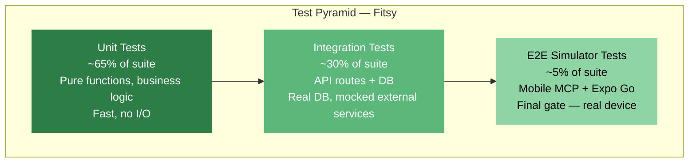

# Fitsy Testing Strategy

> **Status**: Draft
> **Author**: CTO
> **Date**: 2026-03-23

---

## 1. Philosophy

Testing in Fitsy serves two goals: **catch regressions** and **enforce
contracts**. The test suite should be fast, deterministic, and never require
live external API keys to run.

Core rule from CLAUDE.md: **mock only external services, never your own code.**
If you need to mock a `RestaurantService` to test an API route, the route is
doing too much — extract the logic, test it directly.

Danger zones (auth, nutrition accuracy) get the most coverage. Everything else
gets tested in proportion to its blast radius.

---

## 2. Test Pyramid



| Layer | What | Tools | Speed |
|-------|------|-------|-------|
| Unit | Pure functions, match scoring, macro math | Vitest | <1s |
| Integration | API routes + Prisma against test DB | Vitest + testcontainers | <30s |
| E2E Simulator | Critical mobile flows on local simulator | Mobile MCP + Expo Go | minutes |

---

## 3. What We Test (and What We Don't)

### Test

- **Macro match scoring**: deterministic math — every edge case
- **API route contracts**: request shape → response shape, error codes
- **Data model integrity**: foreign key violations, nullable fields, enum values
- **Auth flows**: token validation, expiry, invalid tokens (danger zone)
- **Confidence tier enforcement**: never show `low` at full precision
- **Preload pipeline logic**: restaurant filtering, skip conditions, cost tracking
- **Service layer**: `RestaurantService` query/filter/rank logic

### Don't Test

- **External API behavior**: we test our wrappers, not the APIs themselves
- **Prisma internals**: trust the ORM; test the queries our code writes
- **LLM output quality**: macro accuracy validation is a separate QA process, not unit tests
- **React Native rendering**: visual regression is post-MVP; test behavior not pixels
- **Third-party library internals**: if it's not our code, it's not our test

---

## 4. Mocking Strategy

**Rule: mock at the service boundary, not inside business logic.**

```
apps/api/
  services/
    restaurant.ts        ← test directly, no mocks
    claude.ts            ← mock in integration tests (Claude API)
  app/api/
    restaurants/route.ts ← integration test: mock claude.ts only
```

| What to mock | Why | How |
|---|---|---|
| Claude API (`claude.ts`) | Cost + latency | `vi.mock('../services/claude')` |
| Google Places API | Cost + quota | `vi.mock('../services/places')` |
| Firecrawl API | Cost + flakiness | `vi.mock('../services/firecrawl')` |
| PostgreSQL | Never mock | Use test DB via testcontainers |
| `RestaurantService` | Never mock | Test it directly |
| `MacroEstimationService` | Never mock | Test it directly |

**Never mock your own code.** If you find yourself mocking `RestaurantService`
to test an API route, the route has too much coupling. Refactor the route to
be thin; test the service logic in isolation.

---

## 5. Coverage Targets

| Area | Target | Rationale |
|------|--------|-----------|
| Macro match scoring | 100% | Math must be exact |
| Auth flows | 95% | Danger zone |
| API route contracts | 90% | External contract |
| Nutrition confidence tier display | 90% | Danger zone — false precision |
| RestaurantService query/filter | 85% | Core business logic |
| Preload script logic | 80% | Offline only — less critical |
| Overall | 80% | Minimum gate for CI |

Coverage is enforced in CI. PRs that drop below the threshold are blocked.

---

## 6. Test Structure

### File conventions

```
apps/api/
  services/
    restaurant.ts
    restaurant.test.ts      ← colocated unit test
  app/api/
    restaurants/
      route.ts
      route.test.ts         ← integration test (real DB)
```

Integration tests that need a database go in `*.test.ts` files alongside their
route. They use testcontainers to spin up a Postgres instance with the Prisma
schema applied.

### Test file template

```typescript
import { describe, it, expect, vi, beforeEach } from 'vitest';

describe('RestaurantService.rankByMacroMatch', () => {
  it('ranks restaurant with perfect match first', () => {
    // arrange
    // act
    // assert
  });

  it('ignores unset target dimensions', () => { ... });
  it('handles restaurants with no menu items', () => { ... });
});
```

---

## 7. Macro Accuracy Validation (Separate from Unit Tests)

LLM macro estimates cannot be unit-tested — the output is probabilistic.
Accuracy validation is a separate QA process:

1. **Chain validation dataset**: 50 menu items from LA chain restaurants with
   published nutrition data (McDonald's, Chipotle, etc.).
2. **Acceptance threshold**: estimates within ±20% of published values on
   calories. Flag and investigate any estimate >30% off.
3. **Regression check**: run validation dataset before each preload for a new
   area. If accuracy drops >5 percentage points, investigate prompt drift.
4. **Validation script**: `scripts/validate-accuracy.ts` — runs the 50-item
   dataset through the pipeline and reports per-item and aggregate deviation.

This is not automated in CI (LLM calls cost money). Run it manually before
each production preload.

---

## 8. Integration Test Setup

### Test database

Use testcontainers to spin up a real Postgres instance with PostGIS. Apply
Prisma migrations before tests, tear down after.

```typescript
// tests/setup/db.ts
import { PostgreSqlContainer } from '@testcontainers/postgresql';
import { PrismaClient } from '@prisma/client';
import { execSync } from 'child_process';

let prisma: PrismaClient;

export async function setupTestDb() {
  const container = await new PostgreSqlContainer('postgis/postgis:16-3.4')
    .start();
  process.env.DATABASE_URL = container.getConnectionUri();
  execSync('npx prisma migrate deploy', { env: process.env });
  prisma = new PrismaClient();
  return { prisma, container };
}
```

### Mock factory pattern

```typescript
// tests/factories/restaurant.ts
export function makeRestaurant(overrides = {}) {
  return {
    id: 'test-id',
    name: 'Test Restaurant',
    lat: 34.0522,
    lng: -118.2437,
    cuisineTags: ['italian'],
    chainFlag: false,
    ...overrides,
  };
}
```

Use factories everywhere. Never hardcode test data inline — it makes
test intent invisible.

---

## 9. E2E Tests (Mobile MCP + Expo Go Simulator)

E2E testing uses the **mobile MCP** (`@mobilenext/mobile-mcp`) to drive the
Expo Go simulator on the local machine. This replaces Playwright (which was
designed for web, not mobile) and Maestro.

### Why Mobile MCP

- Directly controls the iOS simulator — tap, swipe, type, screenshot
- Works with Expo Go — no native build required
- Agents can run E2E checks as part of their PR workflow
- No CI infra needed — runs on any Mac with Xcode + simulator

### Configuration

Already configured in `.mcp.json`:
```json
{
  "mcpServers": {
    "mobile-mcp": {
      "command": "npx",
      "args": ["-y", "@mobilenext/mobile-mcp@latest"]
    }
  }
}
```

### How to run

1. Start the Expo dev server: `npm run dev:mobile`
2. Boot the iOS simulator (Expo opens it automatically)
3. Use mobile MCP tools to interact with the app — tap elements, take
   screenshots, verify screen state

### Smoke test flows

Before opening a PR, agents should verify these flows via mobile MCP:

- **Welcome/onboarding**: screens render, navigation works
- **Auth**: register → login → lands on tabs
- **Search**: search screen loads, results appear (when DB is seeded)
- **Restaurant detail**: tap restaurant → menu with macros visible
- **Saved meals**: bookmark a meal → appears in Saved tab
- **Profile**: profile screen renders with macro targets

## 10. CI Gate

All of the following must pass before a PR can merge:

```
1. bash scripts/structural-tests.sh   → no violations
2. npx tsc --noEmit                   → no type errors
3. npm test                           → all tests pass
4. npm run test:coverage              → coverage ≥ 80%
5. npm run build                      → no build errors
6. Mobile MCP smoke tests via Expo Go  → E2E pass (pre-PR, local simulator)
```

CI runs these in parallel where possible. The structural test is fastest and
runs first to give quick feedback on obvious violations.

---

## 11. Pre-MVP Test Scope (What to Write Now)

Before any code exists, write tests for:

1. **Macro match scoring** (`packages/shared/matching.ts`)
   - `score(targets, menuItem) → number`
   - Edge cases: partial targets, exact match, zero macros

2. **Confidence tier rounding** (`packages/shared/confidence.ts`)
   - `roundForDisplay(value, tier) → number`
   - `low` → round to 5g; `medium`/`high` → round to 1g

3. **API contract tests** (once routes exist)
   - `GET /api/restaurants` — shape, pagination, filter params
   - Error responses: 400, 404, 500 shapes

Write these first. They define the contracts everything else builds to.
