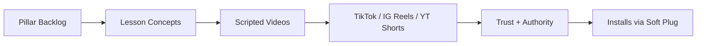
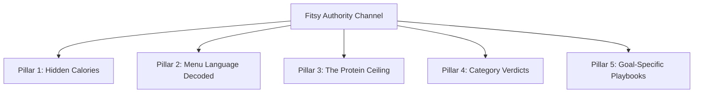

# Fitsy Brand Authority Channel — Spec

**Status**: DRAFT — DEFERRED. UGC takes priority for first 1,000 users (see `ugc-playbook.md`). Revisit after install funnel is validated. Near-term carve-out: hand-make 8-10 videos in CapCut as brand legitimacy / social proof for UGC creator outreach — no pipeline build yet.
**Owner**: CTO
**Last updated**: 2026-05-12

---

## Overview

A dedicated Fitsy-owned social channel (TikTok / Instagram Reels / YouTube
Shorts) that positions Fitsy as the authority on macro-aware restaurant
eating. Modeled on the Qoves Studio playbook: educational, mechanism-driven
content with a rigid visual identity, where the product is woven into the
lesson rather than pitched.

This channel is a **supplement** to UGC influencer deals
(see `ugc-playbook.md`), not a replacement. UGC drives breadth and installs
via creator audiences; this channel drives trust, retention, and brand
defensibility via owned content.

**Sequencing**: UGC first → validate install funnel → then build out this
channel. UGC converts 5-10× better per view in the cold-audience phase
because the creator's trust is doing the work. Authority content
compounds at 6-12 month timescales and only beats UGC on cost-per-install
once the channel reaches scale. Don't build the production pipeline below
until UGC has produced the first 1,000-10,000 users.

---

## Design Principles

1. **Visual consistency = authority.** Lock one backdrop, one camera angle,
   one plating language, one italic-serif title overlay, one VO/music sonic
   ID, one 30-60s structure. The feed grid is the brand — it should read as
   one publication, not a personal page.

2. **Mechanism over opinion.** Every video explains *why* (caloric density,
   protein ceiling, hidden oil, marketing language). Lists and rankings
   alone don't build authority — mechanism does.

3. **Lesson-led, not format-led.** Each video carries one load-bearing claim
   that, once internalized, changes how a viewer reads a menu forever. The
   six properties of a strong lesson: counterintuitive, mechanism-based,
   actionable, memorable (sticky number), repeatable (applies broadly),
   macro-relevant.

4. **One claim per video.** A single mechanism, single takeaway, single CTA.
   Multi-point videos lose retention and don't index in memory.

5. **Sophisticated, not hype.** No "WAIT FOR IT," no neon text, no screaming
   hook. Voice is measured, observational — closer to *Bon Appétit Test
   Kitchen* or *The Infatuation* than fitness-bro TikTok. Brand voice from
   `docs/design/design-brief.md` still applies: knowledgeable not preachy,
   practical not aspirational.

6. **Soft product weave (the Qoves rule).** Fitsy is the implicit tool the
   host already uses, never the subject. The app appears mid-explanation
   while the pain is being defined — not pitched at the end. "The salad was
   800 cal — this is the kind of thing I check before I sit down" plus a
   half-second of the screen.

7. **No misinformation budget.** Authority is fragile. Every claim has a
   citable source (USDA, brand nutrition page, peer-reviewed). Corrections
   go in comments, not silently deleted.

---

## Visual Signature (lock before first shoot)

Three irreversible decisions that gate every future video. Once locked,
these never change — the grid consistency is the brand.

| Decision | Options | Status |
|----------|---------|--------|
| Backdrop | Slate grey · linen · marble · warm grey | TBD |
| Camera angle | Top-down · 3/4 · eye-level | TBD |
| Title typography | Italic serif (Qoves-style) · editorial sans · monospaced numeric | TBD |

---

## The 5 Pillars

### Pillar 1 — Hidden Calories

**Core claim:** Most untracked calories live in things you don't think of as
food: oils, dressings, sauces, glazes, drinks.

Sample lessons:
- Salad dressing math (2 tbsp ranch = 280 cal; restaurant pour = 3-4 tbsp)
- Olive oil math (1 tbsp = 120 cal; avg "drizzled" bowl uses 2-3 tbsp)
- Cooking oil absorption ("grilled" chicken picks up 100+ cal from pan oil)
- The sauce tax (aiolis, glazes, spreads add 200-300 cal silently)
- Liquid calories (smoothies 600-900 cal, specialty coffees 400-700)
- The pre-meal pre-load (bread, chips, edamame = 300-500 cal before entrée)
- The cheese sprinkle (reliably 100-150 cal per bowl)

### Pillar 2 — Menu Language Decoded

**Core claim:** Menu language is marketing language, not nutritional
language.

Sample lessons:
- "Light" doesn't mean low-calorie — it's relative to the original item
- "Bowl" doesn't mean balanced — most are 60%+ carbs by calorie
- "Plant-based" doesn't mean low-cal (Beyond burger ≈ beef burger)
- "Veggie" doesn't mean healthy — often deep-fried or oil-loaded
- "Whole grain" reality (<20% whole grain by weight in most menu items)
- "High protein" without a number — restaurants market 22g as "high protein"
- "House-made" sauces have more cal than the packaged equivalents

### Pillar 3 — The Protein Ceiling

**Core claim:** Most restaurant entrées cap at ~25-30g of protein. Macro-
trackers need 40g+. Here's how to break the ceiling.

**The 10% rule** (channel-wide heuristic): grams of protein should equal
~10% of your daily calories. If you eat 2,000 cal, target 200g protein.
That's roughly 40% of calories from protein — high but not extreme, and
durable enough to anchor every Pillar 3 video.

Sample lessons:
- The 10% rule itself — sticky, simple, memorable
- The 25g ceiling — structural reason restaurant entrées can't hit your target
- Cooking method ranking (grilled > baked > sautéed > pan-fried > deep-fried)
- Double-protein hacks (Chipotle "double chicken", Cava "double whatever")
- Single-ingredient ordering (breast > sausage > nuggets per cal)
- Sashimi math — best protein-per-calorie play in casual dining
- Steakhouses as macro safe havens (counterintuitive but true)
- The fiber gap — most entrées <5g fiber, the hidden reason you don't satiate

### Pillar 4 — Category Verdicts

**Core claim:** Restaurant categories aren't created equal. Some are
systematically macro-friendly; some are traps wearing health costumes.

Sample lessons:
- The "health food" cafe paradox (acai/smoothie shops worse than fast food)
- Sashimi vs. sushi roll — same restaurant, different macro environment
- Mediterranean as the highest-quality macro environment
- Fast food vs. fast casual — the math is closer than people think
- The breakfast trap — granola is the most cal-dense "healthy" food anywhere
- Asian sweet-sauce problem (teriyaki, orange, sweet/sour = 30+g sugar)
- Pizza by cooking method (cheese load matters more than crust)

### Pillar 5 — Goal-Specific Playbooks

**Core claim:** The same menu reads completely differently depending on your
goal. Same dish, different lens, different video.

Sample lessons:
- The cutting menu — protein floor + calorie ceiling formula
- The bulking menu — hitting a surplus eating out without crashing
- The performance menu — pre- and post-workout fueling at common chains
- The recomp menu — protein-led, controlled carbs, restaurant-by-restaurant
- The volume play — feeling full without blowing your deficit
- The alcohol budget — what to remove from the food order when drinks are in

---

## Opening Salvo (First 7 Videos)

Lessons chosen for maximum counterintuitive payoff, universal relevance, and
recurring-format setup.

| # | Title | Pillar | Sticky number |
|---|-------|--------|---------------|
| 1 | The 800-Calorie Salad | 1 | 280 cal per 2 tbsp ranch |
| 2 | The Protein Ceiling | 3 | 25g cap on most entrées |
| 3 | Light Doesn't Mean Light | 2 | — |
| 4 | Olive Oil Math | 1 | 120 cal/tbsp |
| 5 | The Smoothie Trap | 1 | 700-900 cal |
| 6 | Sashimi vs. Sushi Roll | 4 | ~2× protein-per-cal |
| 7 | What 50g of Protein Looks Like at 5 LA Restaurants | 3 | 50g |

By video 7, viewers should have absorbed: hidden calories are everywhere,
menu language lies, protein is harder than it looks, some categories are
traps — and someone needs to teach them this. That's the authority position.

---

## Production Pipeline

TBD — to be specified in a follow-up section once stack decisions are
locked. Working draft questions:

- Image sourcing (manual download from restaurant IG / DoorDash vs. scraper)
- Script generation (Claude with locked slot template + brand voice prompt)
- Voiceover (ElevenLabs with one locked voice ID)
- Visual assembly (Remotion programmatic render vs. After Effects template)
- Cross-platform posting (direct platform APIs vs. Buffer/Later)
- Analytics pull-back into Fitsy admin

---

## Open Questions

- [ ] Lock the three visual signature decisions (backdrop, angle, type)
- [ ] Confirm the 5-pillar structure or adjust
- [ ] Pick the lead video for channel launch (Protein Ceiling vs. 800-Cal Salad)
- [ ] Decide whether the channel has a face/host or is pure VO over food
- [ ] Specify production pipeline (next section — see Logistics doc)
- [ ] Confirm posting cadence (3x/week recommended)
