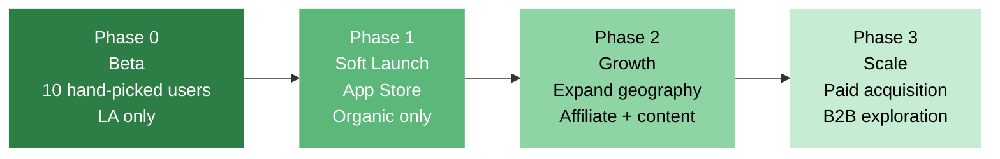

# Fitsy GTM Strategy

> **Status**: Draft
> **Author**: GTM
> **Date**: 2026-03-23

---

## 1. Overview

Fitsy's go-to-market strategy is built around a tight geography (Los Angeles),
a specific persona (macro-trackers who eat out), and organic trust-building
before any paid acquisition. The goal: 10 real users who use Fitsy weekly
before we spend a dollar on ads.

**Launch sequence:**

This document covers Phase 0 and Phase 1 in depth. Phases 2–3 are directional
until we have user data to inform decisions.

---

## 2. Target Audience

### Primary Persona: Macro-Tracking Regular

- Tracks protein, carbs, and fat daily. Uses MyFitnessPal, Cronometer, or
  similar.
- Eats out 2–4 times per week. High frustration: spends 10+ minutes per meal
  trying to estimate macros for restaurant food.
- Most likely to convert to Pro immediately upon seeing Fitsy work. Will tell
  other macro-trackers in their gym or Discord server.
- **Where to find them**: r/Fitness, r/bodybuilding, r/loseit, r/gainit,
  MyFitnessPal community forums, gym Discord servers, fitness TikTok.

### Secondary Persona: Health-Conscious Explorer

- Doesn't rigidly track but wants meals "in the ballpark" (high-protein,
  under 600 cal). Explores new restaurants frequently.
- **Where to find them**: Yelp, Instagram food accounts, LA food blogs,
  r/LosAngeles.

### Not our target at launch

- Casual restaurant-goers (no nutrition interest)
- Dietitians and clinical nutrition professionals (different use case)
- Non-LA users (no data coverage yet)

---

## 3. Positioning

**Core message**: *"Find restaurants near you that actually fit your macros."*

**What makes Fitsy different:**
- Discovery + macros in one product. No other app does this.
- Works for independent restaurants, not just chains.
- Transparent confidence tiers — we tell you how reliable each estimate is.

**What to avoid saying:**
- "AI-powered" (vague, overused)
- Claims of exact accuracy (our estimates are approximate by design)
- Medical or clinical language ("track your nutrition for health")

**Tone**: practical, knowledgeable, a bit nerdy about macros. Like a friend
who's really into fitness and also knows every restaurant in LA.

---

## 4. Phase 0: Beta (10 Users)

**Goal**: Validate the core loop. Do real users find useful macro matches?
Do they trust the estimates? Do they use it again?

**Timeline**: Before any public launch. ~2 weeks after MVP preload is complete.

### 4.1 Recruitment

Recruit 10 beta users from personal and professional network:

| Source | Target count | Approach |
|--------|-------------|----------|
| Personal gym contacts | 3–4 | Direct message; offer free Pro for life |
| Fitness-focused friends/colleagues | 3–4 | Personal ask; explain the product |
| LA-based fitness community | 2–3 | Post in local gym Discord / Facebook group |

**Screening criteria**: must be an active macro-tracker who eats out at least
twice a week in LA. Not looking for positive reviews — looking for honest use.

### 4.2 Beta Onboarding

- Personal onboarding call (15 min) with each beta user.
- Share a TestFlight link (iOS) or APK (Android).
- Ask them to use Fitsy for their next 3 restaurant meals and report back.
- Provide a simple feedback form (Notion or Typeform).

### 4.3 Beta Success Criteria

- [ ] All 10 users complete at least 1 search with macro targets set
- [ ] At least 7 users complete 3+ searches over 2 weeks
- [ ] NPS ≥ 30 (at least some "would recommend")
- [ ] No critical bugs blocking core flow
- [ ] At least 3 users report finding a restaurant they actually went to

---

## 5. Phase 1: Soft Launch (App Store, Organic Only)

**Goal**: 100–500 MAU. Validate organic growth. Identify the best acquisition
channels before spending money.

**Prerequisites**: Beta success criteria met. App Store + Play Store approved.

### 5.1 App Store Optimization (ASO)

ASO is free and has compounding returns. The App Store ranking algorithm
rewards installs, ratings, and keyword relevance.

**Target keywords (primary):**
- "macro restaurant finder"
- "restaurant nutrition tracker"
- "restaurant macro calculator"
- "find restaurants by macros"

**Target keywords (secondary):**
- "healthy restaurant finder LA"
- "macro friendly restaurants"
- "restaurant calorie finder"

**Screenshot strategy:**
1. "Find restaurants that fit your macros" — macro target input screen
2. "Grilled Salmon Bowl — P: 38g C: 42g F: 14g · 82% match" — result card
3. "Works for every restaurant, not just chains" — diverse restaurant list
4. "Honest confidence levels — never false precision" — confidence badge detail

### 5.2 Content Marketing (Organic)

Fitsy's core feature is inherently shareable: "I found a grilled chicken bowl
near the airport with 42g of protein and only 520 calories." These are the
posts that drive installs.

**Content types:**

| Format | Platform | Cadence | Who creates |
|--------|----------|---------|------------|
| "Macro find of the week" | Instagram, TikTok | 2x/week | Founder |
| Reddit posts: real Fitsy searches | r/Fitness, r/bodybuilding | 1x/week | Founder |
| LA restaurant macro breakdowns | TikTok | 1x/week | Founder |
| App behind-the-scenes (how we scrape) | Twitter/X | 1x/week | Founder |

**Reddit strategy**: Post real search results, not ads. Example:
> "I was near DTLA tonight and used Fitsy to find somewhere to eat. Ended up at
> [Restaurant] — their [item] has 41g protein and hit my macros within 10%.
> Here's what the estimate looked like: [screenshot]."

Do not post promotional content ("check out my app!"). Post useful, specific,
shareable information. The app link goes in the profile.

### 5.3 Referral Loop

Build a simple referral mechanism into the product:

- Every meal detail screen has a "Share" button that generates a deep link:
  `fitsy://meals/[id]` → opens in Fitsy, shows the macro breakdown
- If the recipient doesn't have Fitsy, deep link opens App Store
- Track installs from deep links to measure viral coefficient

**Goal**: viral coefficient > 0.3 (30 installs per 100 users). This alone
won't drive growth but reduces effective CAC.

### 5.4 Waitlist (Pre-Launch)

Before App Store approval:

- Simple landing page (one screen): headline, 2-sentence description, email
  capture, one screenshot
- Drive traffic via Reddit posts, Twitter/X bio, personal network
- Target: 200 emails before launch
- On launch day: email the list with "Fitsy is live — here's your access link"

---

## 6. Phase 2: Growth (Post-100 MAU)

Trigger: 100+ MAU and NPS ≥ 40. This means the product is working and users
are recommending it.

### 6.1 Expand Geography

- Add SF Bay Area as second coverage area (~5,000 restaurants, ~$25 cost)
- Post on SF-specific subreddits and Bay Area fitness communities
- Announce in-app to all users: "Now covering San Francisco!"

### 6.2 Affiliate Revenue (Delivery Integration)

- Add "Order via DoorDash" / "Order via Uber Eats" deep link on matching meals
- Affiliate rate: ~3–5% of order value (~$1–2 per order)
- Only for restaurants where we have macro data — don't recommend without data

### 6.3 Content Partnerships

- Identify LA-based fitness influencers (10k–100k followers, macro-tracking
  audience) for product review partnerships
- Offer: free Pro account + first look at new features
- Don't pay for promotion until ROI is measurable

### 6.4 B2B Exploration

- Corporate wellness: pitch Fitsy Pro to companies with wellness stipends
  (target HR/benefits managers)
- Meal prep services: offer data licensing (macro dataset for LA restaurants)
  to meal delivery apps that want to add restaurant options
- Low-priority until consumer product is proven

---

## 7. Success Metrics by Phase

| Metric | Phase 0 Target | Phase 1 Target | Phase 2 Target |
|--------|---------------|----------------|----------------|
| Total users | 10 (beta) | 500 MAU | 5,000 MAU |
| Weekly active search rate | >50% | >40% | >35% |
| NPS | ≥30 | ≥40 | ≥50 |
| Pro conversion | — | 3–5% | 5–8% |
| Monthly revenue | $0 | $100–350 | $1,000+ |
| Restaurant coverage | 500 LA | 5,000 LA | LA + SF |
| CAC | $0 | <$5 (organic) | <$15 |

---

## 8. What We Will Not Do at Launch

- Paid ads (Instagram, Google, TikTok): too early. CAC without product-market
  fit is money lost. Organic channels first.
- PR / media outreach: Fitsy is not a press story yet. Wait until we have
  metrics worth sharing (500+ MAU, 3+ NPS data points).
- Influencer paid promotions: performance is unpredictable pre-PMF.
- Expansion outside LA: data coverage is the product. Diluting focus risks
  sub-par experiences in both markets.
- Restaurant partnerships or verified data deals: complexity without proven
  user demand. Revisit at 1k MAU.

---

## 9. Launch Checklist

**2 weeks before launch:**
- [ ] Beta feedback incorporated; no P0 bugs
- [ ] App Store and Play Store listings submitted and approved
- [ ] Landing page live with email capture
- [ ] Deep link / share functionality working
- [ ] Analytics in place (track: search, restaurant tap, meal tap, share, install source)

**Launch day:**
- [ ] Email waitlist with launch announcement
- [ ] Post on r/Fitness, r/loseit, r/bodybuilding with real search results
- [ ] Post on Instagram and TikTok
- [ ] Personal DMs to beta users: "we're live, please leave a review"

**Week 1 post-launch:**
- [ ] Monitor App Store reviews daily
- [ ] Fix any critical bugs within 24 hours
- [ ] Reply to every review (positive and negative)
- [ ] Report: installs, DAU, searches, conversion to Pro
