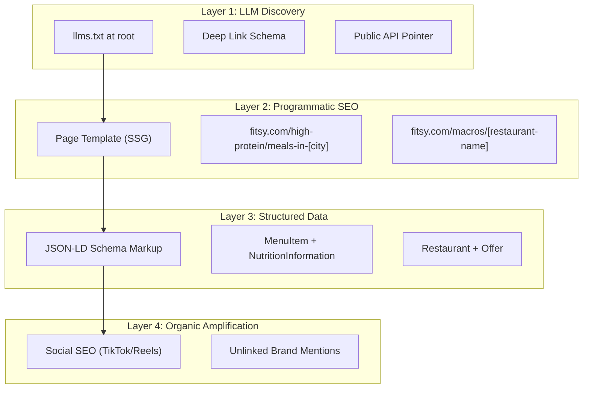
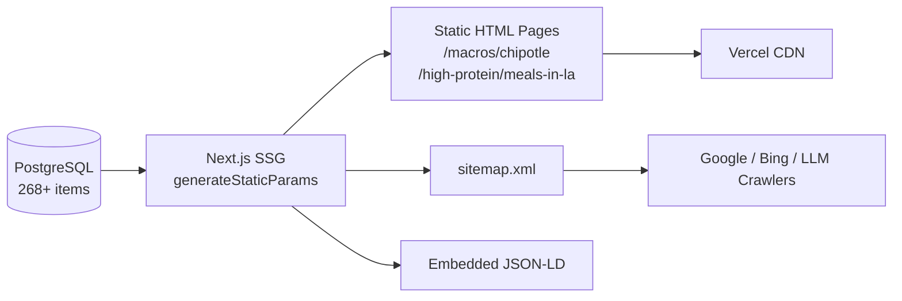

# LLM & SEO Discovery Spec

**Status**: DRAFT
**Owner**: CTO
**Last updated**: 2026-04-15

---

## Problem

Fitsy is invisible outside the App Store. LLMs (ChatGPT, Gemini, Claude, Perplexity) have no way to discover Fitsy's data or recommend it. Search engines can't index restaurant macro data locked inside a mobile app binary. We have 22+ restaurants and 268+ menu items with macro estimates sitting in a database — that data should be working for us on the open web.

## Solution

Three layers that make Fitsy discoverable to both LLMs and search engines, plus two organic amplification strategies.



---

## Layer 1: `llms.txt` Implementation

The emerging 2026 standard for telling AI agents what your app does and how to interact with your data.

**Location**: `fitsy.com/llms.txt` (served as `text/markdown` from the Next.js API)

**Content structure:**

```markdown
# Fitsy

> Fitsy helps users find high-protein restaurant meals that fit their macronutrient targets.

## Core Capabilities

- Macro-estimated menu items for 50+ restaurant chains and indie restaurants
- Protein, carbs, fat, and calorie data for each menu item
- Confidence-tiered estimates (high/medium/low) with source attribution
- Restaurant discovery filtered by cuisine, dietary tags, price level, rating
- Coverage: Los Angeles (expanding)

## Data Access

### Deep Links (Mobile App)
- `fitsy://search?protein_min=40` — search for meals with 40g+ protein
- `fitsy://search?calories_max=600&cuisine=mexican` — low-cal Mexican
- `fitsy://restaurant/{id}` — view a specific restaurant's macro menu
- `fitsy://search?dietary=high-protein&city=los-angeles` — dietary filter search

### Web Pages
- `fitsy.com/macros/{restaurant-slug}` — macro breakdown for a restaurant
- `fitsy.com/high-protein/meals-in/{city}` — top high-protein meals in a city

### API (Read-Only)
- `GET fitsy.com/api/search?lat={lat}&lng={lng}&proteinMin={g}` — search by location + macros
- `GET fitsy.com/api/restaurants/{id}` — restaurant detail with menu items + macro estimates
- Response format: JSON, includes NutritionInformation schema

## About
- Built by Dawit Molla
- Category: Health & Fitness, Food & Drink
- Platforms: iOS (App Store), Web
- Contact: [support email]
```

**Implementation**: Add a `GET /llms.txt` route in the Next.js API that serves this file. Update as data coverage grows.

---

## Layer 2: Programmatic SEO (Landing Page Engine)

Use existing DB data to generate thousands of static pages that answer real search queries.

### URL Patterns

| Pattern | Example | Content |
|---|---|---|
| `/macros/[restaurant-slug]` | `/macros/chipotle` | Top meals by protein at Chipotle, full macro table |
| `/high-protein/meals-in-[city]` | `/high-protein/meals-in-los-angeles` | Top 10 high-protein meals across all restaurants in LA |
| `/low-calorie/meals-in-[city]` | `/low-calorie/meals-in-los-angeles` | Top 10 low-cal meals across all restaurants in LA |
| `/macros/[restaurant-slug]/[item-slug]` | `/macros/chipotle/double-chicken-bowl` | Individual item macro breakdown |

### Page Template (per restaurant)

Each `/macros/[restaurant-slug]` page includes:

1. **H1**: "Macros at {Restaurant Name} — Protein, Carbs, Fat & Calories"
2. **Summary**: "{Restaurant} has {N} menu items. The highest-protein option is {item} at {X}g protein."
3. **Macro table**: All menu items sorted by protein (default), with columns for calories, protein, carbs, fat, confidence tier
4. **Top picks section**: "Best for high-protein", "Best for low-calorie", "Best balanced macros"
5. **CTA**: "View full macros in Fitsy" → App Store link / deep link
6. **JSON-LD** (see Layer 3)

### Technical Approach

- **Framework**: Next.js SSG (`generateStaticParams` + `generateMetadata`) — already our API framework
- **Data source**: Prisma query at build time against the same PostgreSQL database
- **Rebuild trigger**: Re-run SSG after each preload pipeline run (new restaurants/items)
- **Sitemap**: Auto-generated `sitemap.xml` listing all programmatic pages
- **Robots.txt**: Allow all crawlers, point to sitemap



### Target Search Queries

These pages should rank for queries like:
- "chipotle high protein meals"
- "best protein meals near me"
- "macros at [restaurant name]"
- "low calorie restaurant meals los angeles"
- "how much protein in chipotle chicken bowl"

---

## Layer 3: JSON-LD Schema Markup

Every programmatic page embeds structured data so LLMs and search engines understand the data semantically.

### Per Menu Item

```json
{
  "@context": "https://schema.org/",
  "@type": "MenuItem",
  "name": "Double Chicken Bowl",
  "description": "Bowl with double chicken, rice, beans, salsa",
  "nutrition": {
    "@type": "NutritionInformation",
    "calories": "540 calories",
    "proteinContent": "42 grams",
    "carbohydrateContent": "55 grams",
    "fatContent": "14 grams"
  },
  "offers": {
    "@type": "Offer",
    "seller": {
      "@type": "Restaurant",
      "name": "Chipotle",
      "address": "1234 Sunset Blvd, Los Angeles, CA",
      "geo": {
        "@type": "GeoCoordinates",
        "latitude": 34.0901,
        "longitude": -118.3868
      },
      "aggregateRating": {
        "@type": "AggregateRating",
        "ratingValue": "4.2",
        "ratingCount": "847"
      }
    }
  }
}
```

### Per Restaurant Page

Wrap all menu items in a `@type: Restaurant` with `hasMenu` → `Menu` → `MenuSection` → array of `MenuItem` with nutrition. This gives crawlers the full structured hierarchy.

### Mapping from Prisma Models

| Prisma Model | Schema.org Type | Fields |
|---|---|---|
| `Restaurant` | `Restaurant` | name, address, lat/lng → geo, rating, priceLevel |
| `MenuItem` | `MenuItem` | name, description, category → menuSection, price |
| `MacroEstimate` | `NutritionInformation` | calories, proteinG, carbsG, fatG |
| `MenuItem.dietaryTags` | `suitableForDiet` | e.g., `GlutenFreeDiet`, `VeganDiet` |

---

## Layer 4: Organic Amplification

### A. Social SEO ("Vibe-Check")

LLMs in 2026 crawl TikTok captions and Reddit threads to gauge if a brand is "real."

**Strategy:**
- Post short-form videos (Reels/TikTok) with search-optimized titles (see `docs/gtm/content-hooks.md` for the running list)
- **AI impact**: When users ask LLMs for "best macro hacks" or "high protein restaurant meals," the model cites viral social content and Reddit discussions. Fitsy needs to appear in those transcripts.
- **Cross-link**: Every video caption includes "Full macros at fitsy.com/macros/[restaurant]"

### B. Unlinked Brand Mentions

LLMs calculate authority by how often a brand is mentioned — even without a link.

**Strategy:**
- Engage in developer communities (MCP, AI Agents discussions) — mention Fitsy as an example of macro-aware discovery
- Post in fitness subreddits (r/mealprep, r/macros, r/gainit, r/loseit) — share Fitsy data as helpful content, not ads
- Comment on fitness YouTube/TikTok content mentioning macro tracking at restaurants
- **Goal**: The more "Fitsy" appears in training data and recent crawls, the more authoritative LLMs consider it

---

## Out of Scope

- Paid search ads (SEM) — focus on organic/LLM discovery first
- Full public API with authentication — start with read-only, no auth, rate-limited
- International expansion — LA only for now
- User-generated content on the web pages (reviews, ratings)

---

## Implementation Phases

### Phase 1: Foundation (Week 1-2)
- [ ] Add `llms.txt` route to Next.js API
- [ ] Add `robots.txt` and `sitemap.xml` generation
- [ ] Build restaurant page template (`/macros/[restaurant-slug]`)
- [ ] Embed JSON-LD on restaurant pages
- [ ] Deploy to Vercel, verify crawlability

### Phase 2: Expand (Week 3-4)
- [ ] Build city aggregate pages (`/high-protein/meals-in-[city]`)
- [ ] Build individual item pages (`/macros/[restaurant]/[item]`)
- [ ] Add deep link schema to `llms.txt`
- [ ] Submit sitemap to Google Search Console
- [ ] Verify JSON-LD with Google Rich Results Test

### Phase 3: Amplify (Ongoing)
- [ ] Start social SEO content (1-2 TikToks/Reels per week)
- [ ] Begin Reddit/community engagement
- [ ] Monitor Search Console for ranking queries, iterate on templates
- [ ] Re-run SSG after each preload pipeline run

---

## Constraints

- All pages must be statically generated (SSG) — no server-side rendering for SEO pages
- JSON-LD must be valid per schema.org spec — test with Google Rich Results validator
- `llms.txt` must stay current with actual data coverage and API endpoints
- Macro estimates must show confidence tier — never present estimates as exact nutrition facts
- Page titles and meta descriptions must be unique per page (no duplicate content penalties)
