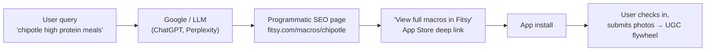
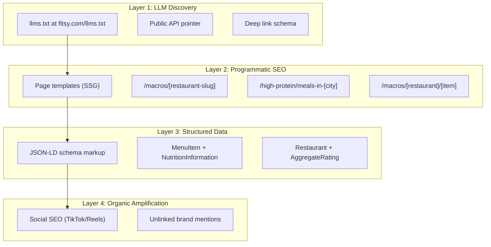
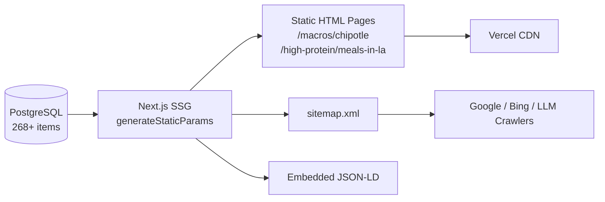

# Organic + LLM Discovery

> **Status:** Active spec — largely **unimplemented** · **Last verified:** 2026-06-12
>
> All four layers described here require Next.js routes and/or SSG pages. These live on the `fitsy` landing project (Vercel). Data source is the preloaded Postgres (restaurants + menu items + MacroEstimates). None are live as of this writing.

---

## The Problem

Fitsy is invisible outside the App Store. LLMs (ChatGPT, Gemini, Claude, Perplexity) have no way to discover Fitsy's data or recommend it. Search engines can't index restaurant macro data locked inside a mobile app binary. We have 22+ restaurants and 268+ menu items with macro estimates sitting in a database — that data should be working for us on the open web.

---

## How a Query Becomes an Install



---

## Four-Layer Architecture



---

## Layer 1 — `llms.txt` (LLM Discovery)

**What it is**: The emerging 2026 standard for telling AI agents what your app does and how to interact with your data.

**Location**: `fitsy.com/llms.txt` — served as `text/markdown` from the Next.js landing project.

**Implementation**: Add a `GET /llms.txt` route. Update as data coverage grows (new cities, new restaurants).

**Content to serve** (update with real endpoint URLs and coverage numbers before deploying):

```markdown
# Fitsy

> Fitsy helps users find high-protein restaurant meals that fit their macronutrient targets.

## Core Capabilities

- Macro-estimated menu items for 50+ restaurant chains and indie restaurants
- Protein, carbs, fat, and calorie data for each menu item
- Confidence-tiered estimates (high/medium/low) with source attribution
- Restaurant discovery filtered by cuisine, dietary tags, price level, rating
- Coverage: Los Angeles (expanding)

## Data Access

### Deep Links (Mobile App)
- `fitsy://search?protein_min=40` — search for meals with 40g+ protein
- `fitsy://search?calories_max=600&cuisine=mexican` — low-cal Mexican
- `fitsy://restaurant/{id}` — view a specific restaurant's macro menu
- `fitsy://search?dietary=high-protein&city=los-angeles` — dietary filter search

### Web Pages
- `fitsy.com/macros/{restaurant-slug}` — macro breakdown for a restaurant
- `fitsy.com/high-protein/meals-in/{city}` — top high-protein meals in a city

### API (Read-Only)
- `GET fitsy.com/api/search?lat={lat}&lng={lng}&proteinMin={g}` — search by location + macros
- `GET fitsy.com/api/restaurants/{id}` — restaurant detail with menu items + macro estimates
- Response format: JSON, includes NutritionInformation schema

## About
- Built by Dawit Molla
- Category: Health & Fitness, Food & Drink
- Platforms: iOS (App Store), Web
- Contact: [support email]
```

### Layer 1 Execution Checklist

- [ ] Add `GET /llms.txt` route to Next.js landing project
- [ ] Serve content as `text/markdown` content type
- [ ] Add deep link schema block
- [ ] Update coverage numbers after each preload pipeline run
- [ ] Verify with `curl fitsy.com/llms.txt` after deploy

**Current status**: NOT IMPLEMENTED

---

## Layer 2 — Programmatic SEO Pages

**What it is**: Use existing DB data to generate thousands of static pages that answer real search queries.

**Technical approach**:
- Framework: Next.js SSG (`generateStaticParams` + `generateMetadata`) — already the API framework
- Data source: Prisma query at build time against the PostgreSQL database
- Rebuild trigger: Re-run SSG after each preload pipeline run (new restaurants/items)
- Auto-generated `sitemap.xml` listing all programmatic pages
- `robots.txt`: Allow all crawlers, point to sitemap

**Note on Vercel project**: There are two Vercel projects — `fitsy` (the landing/marketing site at fitsy.org) and `fitsy-api` (the API). These programmatic SEO pages live on the `fitsy` landing project, not `fitsy-api`.

### URL Patterns

| Pattern | Example | Content |
|---|---|---|
| `/macros/[restaurant-slug]` | `/macros/chipotle` | Top meals by protein at Chipotle, full macro table |
| `/high-protein/meals-in-[city]` | `/high-protein/meals-in-los-angeles` | Top 10 high-protein meals across all restaurants in LA |
| `/low-calorie/meals-in-[city]` | `/low-calorie/meals-in-los-angeles` | Top 10 low-cal meals in LA |
| `/macros/[restaurant-slug]/[item-slug]` | `/macros/chipotle/double-chicken-bowl` | Individual item macro breakdown |

### Page Template (per restaurant page)

Each `/macros/[restaurant-slug]` page includes:

1. **H1**: "Macros at {Restaurant Name} — Protein, Carbs, Fat & Calories"
2. **Summary**: "{Restaurant} has {N} menu items. The highest-protein option is {item} at {X}g protein."
3. **Macro table**: All menu items sorted by protein (default), with columns for calories, protein, carbs, fat, confidence tier
4. **Top picks section**: "Best for high-protein", "Best for low-calorie", "Best balanced macros"
5. **CTA**: "View full macros in Fitsy" → App Store link / deep link
6. **JSON-LD** (see Layer 3)
7. **Important**: Always show confidence tier — never present estimates as exact nutrition facts

### Data Flow



### Target Search Queries (pages should rank for)

- "chipotle high protein meals"
- "best protein meals near me"
- "macros at [restaurant name]"
- "low calorie restaurant meals los angeles"
- "how much protein in chipotle chicken bowl"
- "macro friendly restaurants los angeles"
- "highest protein fast food meal"

### Layer 2 Execution Checklist

**Phase 1 — Foundation**
- [ ] Build restaurant page template (`/macros/[restaurant-slug]`)
- [ ] Wire `generateStaticParams` to Prisma query (fetch all restaurant slugs)
- [ ] Wire `generateMetadata` for unique title/description per restaurant
- [ ] Embed JSON-LD on restaurant pages (see Layer 3)
- [ ] Add `robots.txt` pointing to sitemap
- [ ] Generate `sitemap.xml` from all restaurant slugs
- [ ] Deploy to Vercel landing project, verify crawlability with `curl -I`

**Phase 2 — Expand**
- [ ] Build city aggregate pages (`/high-protein/meals-in-[city]`)
- [ ] Build individual item pages (`/macros/[restaurant]/[item]`)
- [ ] Submit sitemap to Google Search Console
- [ ] Verify JSON-LD with Google Rich Results Test
- [ ] Add deep link CTA ("Open in Fitsy") per page

**Phase 3 — Maintain**
- [ ] Trigger SSG rebuild after each preload pipeline run
- [ ] Monitor Search Console for ranking queries; iterate on page templates
- [ ] Add new city pages as pipeline expands beyond LA

**Current status**: NOT IMPLEMENTED — requires Next.js routes in the `fitsy` landing project

---

## Layer 3 — JSON-LD / Schema Markup

**What it is**: Structured data embedded on every programmatic page so LLMs and search engines understand the data semantically.

### Per Menu Item

```json
{
  "@context": "https://schema.org/",
  "@type": "MenuItem",
  "name": "Double Chicken Bowl",
  "description": "Bowl with double chicken, rice, beans, salsa",
  "nutrition": {
    "@type": "NutritionInformation",
    "calories": "540 calories",
    "proteinContent": "42 grams",
    "carbohydrateContent": "55 grams",
    "fatContent": "14 grams"
  },
  "offers": {
    "@type": "Offer",
    "seller": {
      "@type": "Restaurant",
      "name": "Chipotle",
      "address": "1234 Sunset Blvd, Los Angeles, CA",
      "geo": {
        "@type": "GeoCoordinates",
        "latitude": 34.0901,
        "longitude": -118.3868
      },
      "aggregateRating": {
        "@type": "AggregateRating",
        "ratingValue": "4.2",
        "ratingCount": "847"
      }
    }
  }
}
```

### Per Restaurant Page

Wrap all menu items in a `@type: Restaurant` with `hasMenu` → `Menu` → `MenuSection` → array of `MenuItem` with nutrition. This gives crawlers the full structured hierarchy.

### Prisma → Schema.org Mapping

| Prisma Model | Schema.org Type | Fields |
|---|---|---|
| `Restaurant` | `Restaurant` | name, address, lat/lng → geo, rating, priceLevel |
| `MenuItem` | `MenuItem` | name, description, category → menuSection, price |
| `MacroEstimate` | `NutritionInformation` | calories, proteinG, carbsG, fatG |
| `MenuItem.dietaryTags` | `suitableForDiet` | e.g., `GlutenFreeDiet`, `VeganDiet` |

### Layer 3 Execution Checklist

- [ ] Build JSON-LD generator from Prisma models (utility function)
- [ ] Embed JSON-LD in `<script type="application/ld+json">` on each restaurant page
- [ ] Include confidence tier in description (never present estimates as exact facts)
- [ ] Validate with [Google Rich Results Test](https://search.google.com/test/rich-results)
- [ ] Validate JSON-LD spec compliance at schema.org
- [ ] Test: does Google Search Console show "Menu items" rich results?

**Current status**: NOT IMPLEMENTED — blocked on Layer 2 (pages must exist first)

### Constraints

- JSON-LD must be valid per schema.org spec — always test with Google Rich Results validator
- Macro estimates must show confidence tier — never present estimates as exact nutrition facts
- Page titles and meta descriptions must be unique per page (no duplicate content penalties)
- All pages must be statically generated (SSG) — no server-side rendering for SEO pages

---

## Layer 4 — Organic Amplification

### A. Social SEO

LLMs in 2026 crawl TikTok captions and Reddit threads to gauge if a brand is "real." This layer amplifies the programmatic SEO pages.

**Strategy:**
- Post short-form videos (Reels/TikTok) with search-optimized titles. See the Content Hook Library in `docs/gtm/ugc-playbook.md` for the running list of hooks.
- Every video caption includes: "Full macros at fitsy.com/macros/[restaurant]" — cross-links to the programmatic SEO pages and builds backlinks.
- When users ask LLMs for "best macro hacks" or "high protein restaurant meals," models cite viral social content. Fitsy needs to appear in those transcripts.

**Cadence**: 1–2 Reels/TikToks per week, even before the app is on the App Store (build brand recognition ahead of launch).

### B. Unlinked Brand Mentions

LLMs calculate authority by how often a brand is mentioned — even without a link.

**Strategy:**
- Engage in developer communities (MCP, AI Agents discussions) — mention Fitsy as an example of macro-aware discovery.
- Post in fitness subreddits (r/mealprep, r/macros, r/gainit, r/loseit) — share Fitsy data as helpful content, not ads.
- Comment on fitness YouTube/TikTok content mentioning macro tracking at restaurants.
- Goal: The more "Fitsy" appears in training data and recent crawls, the more authoritative LLMs consider it.

### Layer 4 Execution Checklist

- [ ] Post first Reel/TikTok with `fitsy.com/macros/[restaurant]` in caption (even pre-launch, link to coming-soon page)
- [ ] Post in r/MacroFriendlyRecipes and r/gainit with Fitsy data as helpful content
- [ ] Comment on 5 high-traffic fitness YouTube videos mentioning macro tracking
- [ ] Engage in 2–3 developer community threads mentioning Fitsy as an example
- [ ] Track brand mentions via Google Alerts for "Fitsy"

**Current status**: NOT IMPLEMENTED — no pages to link to yet; start social presence pre-launch

---

## Out of Scope

- Paid search ads (SEM) — focus on organic/LLM discovery first
- Full public API with authentication — start with read-only, no auth, rate-limited
- International expansion — LA only for now
- User-generated content on the web pages (reviews, ratings) — Phase 2+

---

## Implementation Phases (Summary)

| Phase | Work | Blocker |
|---|---|---|
| **Phase 1** (1–2 weeks) | `llms.txt` route, restaurant page template, JSON-LD, `robots.txt`, `sitemap.xml` | Requires `fitsy` landing project Next.js routes |
| **Phase 2** (weeks 3–4) | City aggregate pages, individual item pages, Google Search Console submission | Phase 1 done |
| **Phase 3** (ongoing) | Social SEO cadence, Reddit/community engagement, SSG rebuild after each pipeline run | Phase 1 done; App Store launch |
