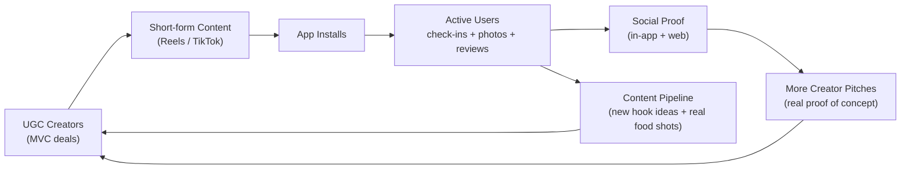

# GTM Strategy — Fitsy

> **Status:** Active · **Last verified:** 2026-06-12

---

## Positioning

**What Fitsy does**: Fitsy is the macro-aware restaurant discovery app for fitness-conscious eaters — it shows you which nearby meals fit your protein/carb/fat targets right now, across chains and indie restaurants, before you ever walk in the door.

**Target user**: The person who tracks macros and eats out regularly. They're not on a clinical diet — they're a gym-goer, a busy professional, someone doing a cut or a bulk. They know what macros are, they hate guessing, and they know every "healthy-looking" menu item is a potential macro bomb. They are in Los Angeles (LA-only launch).

**Positioning statement**:
> Fitsy is the macro-aware restaurant finder for fitness-conscious eaters that estimates meal macros for any nearby restaurant — including indie spots no other app covers — so you can eat out without breaking your targets.

**Differentiation from Cal AI / MyFitnessPal**:
- Cal AI scans your plate *after* the fact. Fitsy answers *before* you choose where to eat.
- MyFitnessPal covers chains. Fitsy covers the indie restaurant on your block via the preloaded pipeline.
- Fitsy is a *discovery* app first, not a logging app.

---

## Channel Portfolio

Three motions, in priority order for a solo founder at pre-launch:

| Channel | Type | When to run | Flywheel role |
|---|---|---|---|
| **UGC creators** | Paid-ish (MVC-gated) | Run now — first dollars should go here | Drives installs → users → in-app UGC |
| **Organic / LLM SEO** | Free, compounding | Build now (passive infrastructure), harvest over 6–18 months | Programmatic pages + llms.txt → long-tail installs |
| **Merchant partnerships** | Revenue + distribution | Phase 2–3, post product–market fit | Verified data + promoted placement → merchant revenue |

---

## The Growth Flywheel

**How the flywheel tightens over time:**
- Phase 1 (now): UGC creators seed installs; users check in and submit photos.
- Phase 2: The Local Legend feature (neighborhood leaderboard) turns power users into a second tier of organic UGC — they share their leaderboard standing on social.
- Phase 3: Creator pitches get easier because real user activity (reviews, photos, check-ins) is visible proof the app is alive.

---

## North-Star Metric & KPIs

| Metric | Target | Notes |
|---|---|---|
| **Monthly Active Users (MAU)** | North star — measures real product engagement | Goal: 500 MAU by end of Month 3 post-launch |
| CAC via CPM (UGC channel) | < RPM (target $2–3 CPM) | CPM must stay below revenue-per-install |
| Install → Trial → Paid funnel | Track each drop-off step | 7-day trial → `pro` entitlement (RevenueCat) |
| Organic installs (SEO/LLM) | Track source in PostHog | Measures compounding return on SEO build |
| Creator outreach → deal close rate | Target > 3% | Baseline from first 500 outreach DMs |

---

## Sequencing for a Solo Founder at Pre-Launch

**Now (pre-launch):**
1. Build SEO infrastructure passively — `llms.txt`, programmatic pages, JSON-LD. This is a one-time build with compounding returns. Do it once, right. (See `docs/gtm/seo-discovery.md`.)
2. Warm 3 branded IG accounts; hire one VA on OnlineJobs.ph. Don't start outreach until the app is live on the App Store — you need a real, public download link to convert. (No TestFlight beta gate — light user testing was sufficient; the next milestone is the public App Store release.)

**Month 1 (post-App Store launch):**
3. Begin VA outreach at 100–150 DMs/day across 3 accounts.
4. Founder personally DMs the top 10% of targets from their real account.
5. Close first 3–5 UGC deals using MVC structure.
6. Measure CPM on first deals; adjust targeting and rate ceilings.

**Month 2–3:**
7. Scale outreach to 500/week if first deals perform (CPM < $3).
8. Begin local Reddit / fitness community presence (r/loseit, r/gainit, r/MacroFriendlyRecipes).
9. Monitor Search Console for organic traction; iterate page templates.

**Phase 2 (post-PMF signal):**
10. Activate merchant partnership motion — use phone-column + `matchRestaurant()` from multi-source matcher as the claim-matching key.
11. Promoted placement as first non-subscription revenue line.

---

## Execution Calendar (link-out view)

| Playbook | Doc | Status |
|---|---|---|
| UGC creator deals (end-to-end) | `docs/gtm/ugc-playbook.md` | Draft — ready to run at App Store launch |
| Organic + LLM SEO discovery | `docs/gtm/seo-discovery.md` | Draft — unimplemented; build pre-launch |
| Merchant partnerships | TBD (`docs/product/specs/merchant-dashboard.md`) | Future — Phase 2–3 |

---

## Merchant Partnerships (Future Motion)

Not a launch-day channel, but worth designing now because it affects product architecture:

- Merchants claim their restaurant listing via the claim flow (phone-column + `matchRestaurant()` dedupe key).
- Verified merchant-submitted nutrition data overrides pipeline LLM estimates — needs a `source`/`verified` tier on `MacroEstimate` and a UI trust badge.
- Promoted placement is the first non-subscription revenue line; reference from `business-model.md` v2 under "Merchant revenue (future)".
- Distribution upside: merchants who claim their listing will share Fitsy with their customers.
