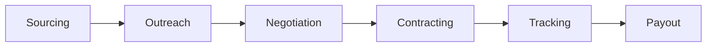
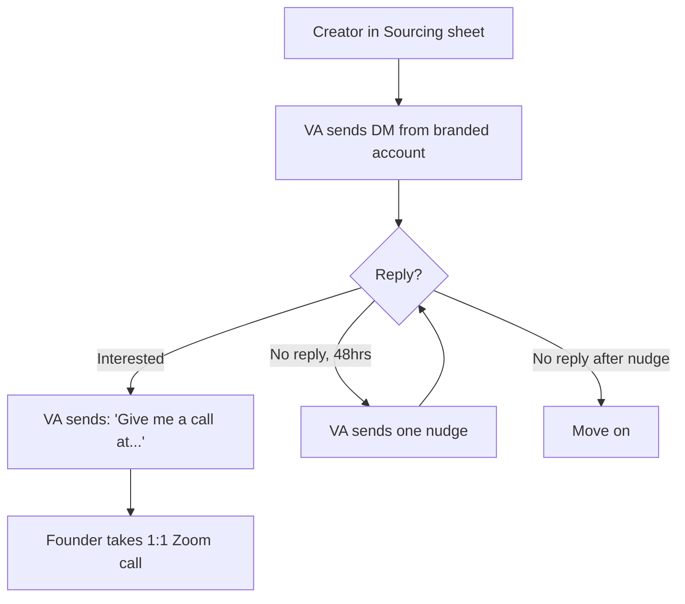
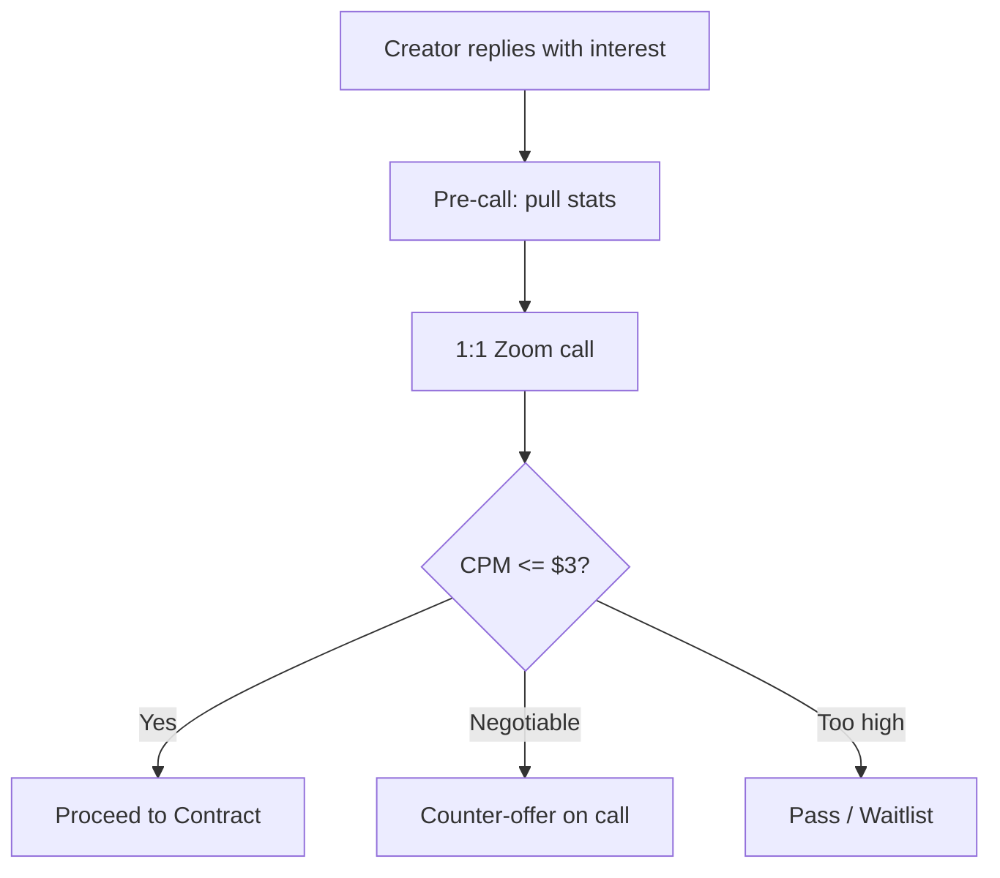
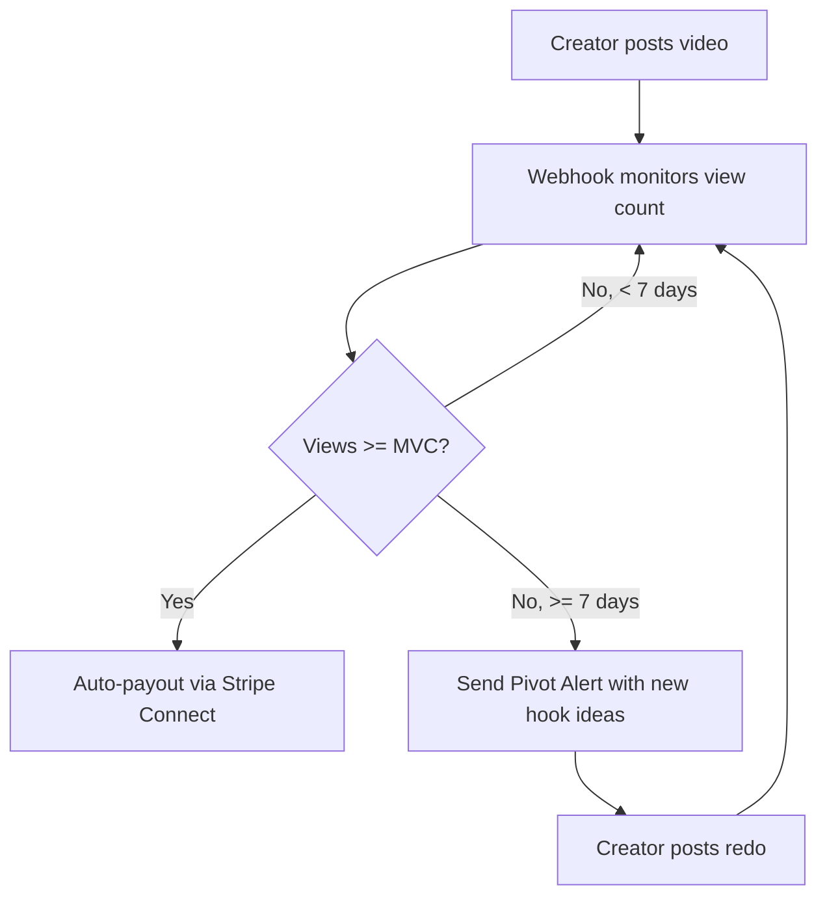

# UGC Marketing Pipeline Spec

**Status**: DRAFT
**Owner**: CTO
**Last updated**: 2026-04-15

---

## Overview

Hybrid pipeline for UGC influencer deals — automate the commodity work (sourcing, outreach, contracting, tracking, payouts) but keep negotiation human. Relationship-building with creators is the moat; everything else is plumbing.

---

## Pipeline Stages

### 1. Automated Sourcing (The "Alpha" Scraping Layer)

Instead of scrolling through Reels, use tools like Modash, Influee, or a custom scraper via Apify to find "Unmanaged Alphas."

**Filter Logic:**

| Filter | Value | Rationale |
|---|---|---|
| Followers | 50k-500k | The "Sweet Spot" for MVC deals |
| Keywords | "High Protein," "Weight Loss Journey," "Gym Rat," "Macro Friendly" | Niche alignment |
| Bio exclusion | Regex: `mgmt\|agency\|enquiries` | No-agency filter — unmanaged creators only |
| Engagement rate | >3% | Avoids bot-boosted accounts |

**Tooling options**: Modash, Influee, Apify (custom scraper)

---

### 2. Outreach — Outsourced VA + Manual DM

#### Why Not Automate DMs?

Cold IG DMs at scale are adversarial to Meta's platform — no compliant tool sends unsolicited DMs to strangers. Every automation tool (IGdm, Apify actors, custom Playwright) impersonates a real session and risks action blocks or permabans.

| Approach | Safe Volume | Ban Risk | Maintenance |
|---|---|---|---|
| IGdm Pro (session hijack) | 20-40/day | **High** — IG detects patterns | Medium |
| Apify IG Actors | 10-30/day | **High** — headless browser | High (actors break often) |
| Custom Playwright + stealth | 10-30/day per account | **Very high** without anti-detection infra | **Very high** (10-20 hrs/mo) |
| ManyChat | Opt-in only (not cold) | Very low | Low |
| Official IG Messaging API | User must initiate | None | Medium |

Bottom line: IG DM automation requires residential proxies, warmed burner accounts, stealth plugins, and constant maintenance as Meta updates detection. Time better spent building Fitsy.

#### The Solution: Hire Overseas VAs for Manual DM Outreach

Pay VAs via OnlineJobs.ph (or Upwork/Fiverr) to send DMs manually from branded accounts. Human-sent, no automation, no ban risk beyond normal IG limits.

**VA Platform Comparison:**

| Platform | Typical Rate | Model | Best For |
|---|---|---|---|
| **OnlineJobs.ph** | $3-5/hr | Direct hire | Ongoing daily work (winner) |
| **Upwork** | $5-10/hr | Hourly/fixed | Escrow while testing someone |
| **Fiverr** | $50-150/gig | Fixed price batch | One-off tasks, awkward for daily work |
| **FreeUp** | $5-8/hr | Hourly, pre-vetted | Pre-vetted convenience |

**Recommended**: OnlineJobs.ph at $4/hr, 4-6 hrs/day, 5 days/week.

**Volume & Cost Math:**

| Hours/Day | DMs/Hr | Daily DMs | Weekly (5 days) | Weekly Cost ($4/hr) |
|---|---|---|---|---|
| 4 | 25 | 100 | 500 | $80 |
| 6 | 25 | 150 | 750 | $120 |
| 8 | 25 | 200 | 1,000 | $160 |

Cost per DM: ~$0.13-0.16.

#### Account Setup

**3-5 branded accounts per VA.** Names like "fitsy.collabs" or "fitsy.partnerships". Each needs:
- Real Fitsy logo as avatar
- Bio with one-liner + website link
- **9-12 real posts** (app screenshots, food/macro content, creator reposts)

Don't buy followers — creators check your grid and bio, not follower count. A 200-follower account with 12 polished posts and a real website outperforms a 10k-follower account with a bare grid.

**Account Warming (7-14 days per account before any outreach):**

| Days | Activity |
|---|---|
| 1-3 | Follow 10-15 niche accounts, like 20-30 posts, watch stories |
| 4-7 | Ramp to 20-30 follows/day, start genuine comments on creator posts |
| 7-14 | DM people who followed back, interact with targets |
| 14+ | Begin cold outreach at 5-10/day, ramp to 15-20/day max per account |

**IG limits**: ~15-20 cold DMs/day per account. One VA runs 3-5 accounts across 2-3 devices (different IP per device — cheap mobile hotspot per phone).

#### The Two-Message Playbook

The VA sends exactly two messages:

1. **Opener**:
   > "Paid promo? Hey, hope you're doing well. I'm the founder of Fitsy, a macro-aware restaurant finder. Would you be down to get a deal going?"

2. **If interested**:
   > "Awesome, give me a call at (XXX)..." or "Ok let me know when you're free"

Then the founder takes the call. If no reply in 48-72 hours, one manual nudge. If still nothing, move on.

#### Tracking

VA logs every outreach in a shared Google Sheet:

| Column | Example |
|---|---|
| Creator handle | @jeremiahjonesfitness |
| Platform | IG |
| Followers | 1.5M |
| Engagement rate | 4.2% |
| DM sent date | 2026-04-15 |
| Response (Y/N) | Y |
| Response text | "Let me know the details" |
| Call scheduled (Y/N) | Y |
| Call date | 2026-04-18 |
| Notes | Great content, brand-aligned |

#### Your Personal Account

Use your real founder account for the **top 10% of targets**. Personal accounts with a real face get 2-4x reply rates. But if it gets action-blocked, you lose your presence — reserve for high-value creators only.

#### Outreach Flow

**Important**: Keep all messages looking like they were typed on a phone. No fancy formatting, no professional signatures. The vibe is high-speed, low-friction.

---

### 3. Negotiation & Alignment (Manual — 1:1 Zoom)

This stage is intentionally **not automated**. Building real relationships with creators produces better content and long-term partnerships.

**When a creator replies with interest:**

1. **Pre-call prep**: Pull their profile stats into a quick sheet — average views, engagement rate, content style, estimated CPM at their rate.
2. **Schedule a 1:1 Zoom** to go over the partnership:
   - Align on Fitsy's positioning (macro-aware restaurant discovery, not a generic fitness app)
   - Walk through the Creative Brief (see Stage 4) — the product must be framed as a solution to a problem, not a toy
   - Negotiate rate and MVC terms
   - Gut-check brand fit and content quality
3. **CPM sanity check** (use during or after the call):
   - Calculate: `CPM = Rate / (Average Views / 1000)`
   - Target: CPM $2-3 (must be below RPM)
   - If CPM is too high, negotiate down or pass

**No tooling needed** — this is founder-to-creator, relationship-first.

---

### 4. Self-Serve Onboarding & Legal

Stop doing manual contracts. Use Pandadoc or Deel API integrations.

**The "MVC" Automation:**

1. Once a creator passes negotiation, **automatically generate a contract** with the Minimum View Clause (MVC) pre-filled based on their average views and agreed rate.
2. Include a **"Creative Brief" PDF** that is dynamically generated:
   - Auto-pulls the latest "Top Performing Hooks" from the content hooks doc
   - Since Fitsy is a macro-focused app, the brief should frame the product as a solution (e.g., "finding food that fits your macros when eating out") not a toy
3. Creator e-signs and they're onboarded.

**Tooling options**: Pandadoc API, Deel API

---

### 5. Automated Creative Review & Performance Tracking

Use a tool like Bylined or a custom Zapier/Make.com workflow to track video performance without manually checking profiles.

**The Performance Tracker:**

- **Webhooks**: Use TikTok/IG API tracker to pull view counts for the specific video link provided by the creator.
- **The Payout Trigger**: When `View Count >= MVC`, trigger an automated payout via Stripe Connect or PayPal Payouts.
- **The "Pivot" Alert**: If `Views < MVC` after 7 days, trigger an automated email:
  > "Hey [Name], looks like we haven't hit the MVC yet. Here are 3 new hook ideas to try for the redo!"

**Tooling options**: Bylined, Make.com + Google Sheets, TikTok/IG API

---

## Full Stack Summary

| Stage | Tool | Automation Action |
|-------|------|-------------------|
| Sourcing | Modash / Apify | Scrape creators with no agency tags |
| Outreach | Overseas VA (OnlineJobs.ph) + branded IG accounts | Manual DMs at $0.13-0.16/DM, 300-500/week |
| Negotiation | 1:1 Zoom (manual) | Relationship-building, brand alignment, rate negotiation |
| Contracting | Pandadoc API | Send MVC contract upon acceptance |
| Tracking | Make.com + Google Sheets | Monitor view count via API |
| Payout | Stripe Connect / Deel | Release funds only when MVC is met |

---

## Open Questions

- [ ] Which sourcing tool to start with? (Modash vs Apify custom scraper — cost/flexibility tradeoff)
- [ ] RPM calculation methodology — derive from paid ads baseline or organic install rate?
- [ ] Stripe Connect vs PayPal Payouts for the auto-payout trigger
- [ ] Creative brief template — what "Top Performing Hooks" data to pull and how to structure the PDF
- [ ] How many VA accounts to warm up in the first batch? (3 vs 5)
