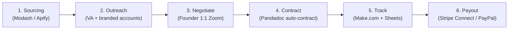
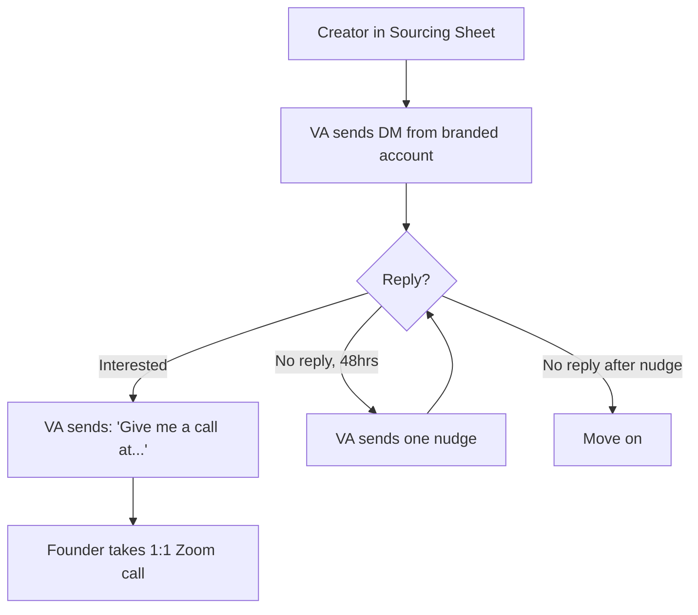
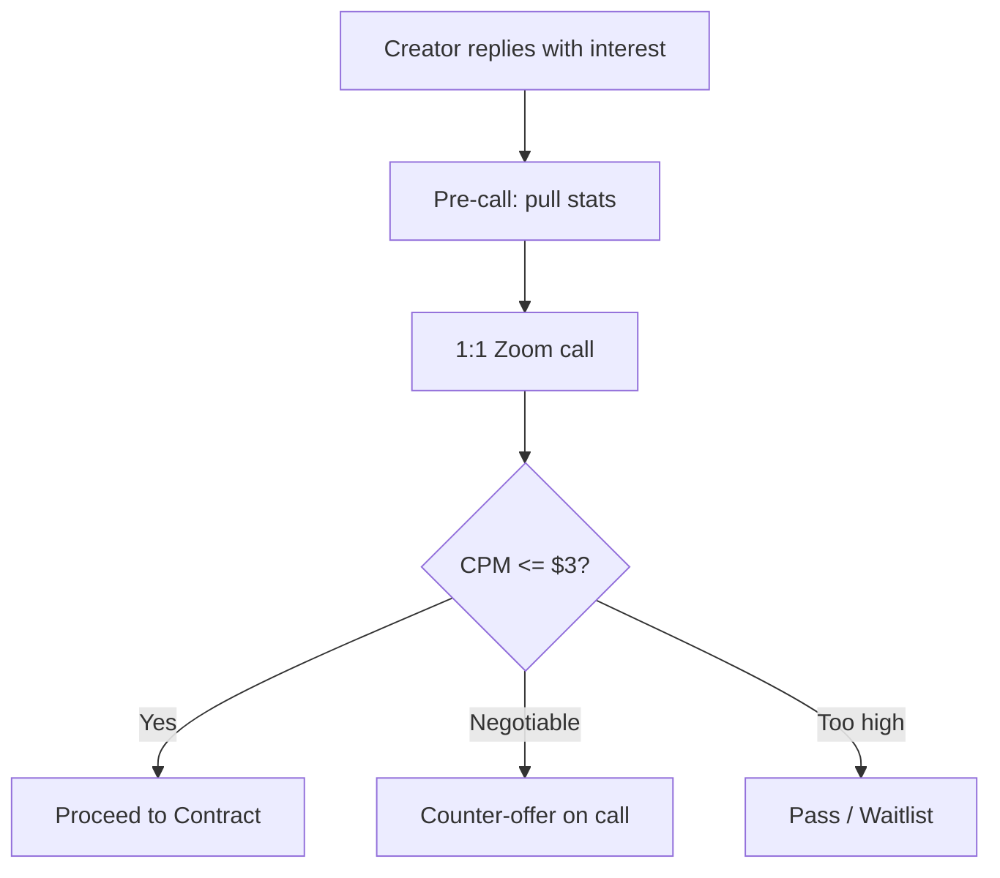
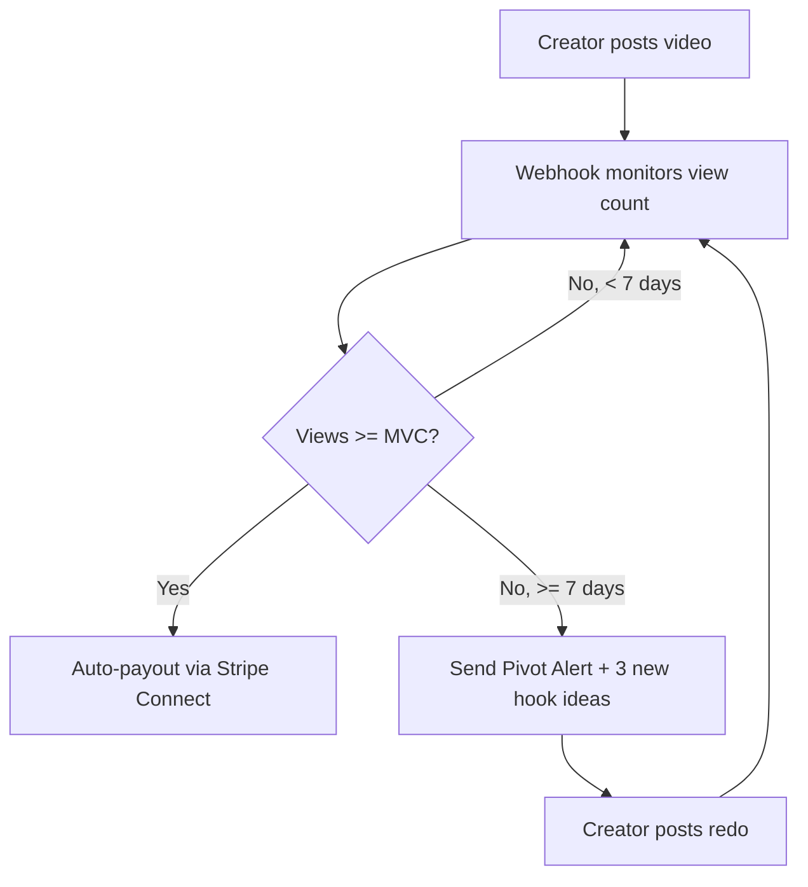

# UGC Playbook — End-to-End Creator Deals

> **Status:** Draft · **Last verified:** 2026-06-12
>
> This is the single runnable playbook for UGC influencer acquisition: sourcing → outreach → negotiation → contracting → tracking → payout. Relationship-building is the moat; everything else is plumbing that should be automated.

---

## Pipeline Overview



---

## Deal Model

**Why UGC is the right channel pre-revenue:**
UGC deals at sub-RPM CPMs are the highest-leverage paid acquisition channel for a fitness app. The Locked app case study (gamified health/fitness, 1.5M-follower Instagram deals) shows this works: deals at $800 for 600k guaranteed views = ~$1.33 CPM on a ~$2–3 RPM baseline.

**The Minimum View Clause (MVC) structure:**
- Creator does NOT get paid until views hit the agreed floor.
- If the video underperforms after 7 days, send pivot alert with new hook ideas; creator posts a redo until MVC is hit.
- Only then is payout triggered automatically.

**CPM targets:**

| Metric | Value | Notes |
|---|---|---|
| Target CPM | $2–3 | Must be below RPM to be profitable |
| RPM baseline | $2–3 | Derived from paid ads baseline or organic install CAC — **see Open Question #1 below** |
| Example deal | $800 / 600k MVC | ~$1.33 CPM — target range |
| Deal range | $200–$1,500 | Scales with follower tier and average views |

**No agency rule:** If a creator has "mgmt," "agency," or "enquiries" in their bio, skip them. Agency-represented creators eliminate all CPM alpha.

---

## Stage 1 — Creator Sourcing

### The "Unmanaged Alpha" Filter

Use Modash, Influee, or a custom Apify scraper to build a sourcing list. **Recommendation for launch**: Start with Modash (faster setup, no scraper maintenance). Switch to Apify custom scraper if cost becomes a constraint.

| Filter | Value | Rationale |
|---|---|---|
| Followers | 50k–500k | Sweet spot for MVC deals — enough reach, not yet agency-managed |
| Keywords | "High Protein," "Weight Loss Journey," "Gym Rat," "Macro Friendly" | Niche alignment |
| Bio exclusion | Regex: `mgmt\|agency\|enquiries` | Unmanaged creators only |
| Engagement rate | > 3% | Avoids bot-boosted accounts |
| Platform | Instagram (primary), TikTok (secondary) | IG DMs are the primary outreach vector |

### Creator Vetting Criteria

Before adding to the outreach queue, verify manually:

1. **Conversion quality over view count** — a 100k creator with passionate engagement beats a 500k creator with dead comments.
2. **Engagement check** — real comments from real people (not generic emoji spam). Check engagement % relative to average views.
3. **Brand alignment** — creator's content and audience must overlap with fitness/health/macro tracking.
4. **No agency** — bio check per above.
5. **Content framing** — creator should be able to present Fitsy as a solution to a problem ("I finally figured out what to eat"), not a toy ("cool new app!").

### Open Question #1 — RPM Calculation Methodology

> **Unresolved.** CPM must be priced below RPM to be profitable. Two approaches:
> - **Option A**: Derive RPM from paid ads baseline — run $500 in IG/TikTok paid ads to measure cost-per-install, then back-calculate revenue per 1,000 impressions.
> - **Option B**: Derive from organic install rate — track organic installs in PostHog, attribute to content, estimate revenue per install from subscription conversion rate.
>
> **Recommended starting point**: Option A. Run a small paid ad test ($300–500) in Month 1 to establish a baseline CPM → install → trial → paid funnel. Use this to set the ceiling for UGC deals. Revisit after 5 closed deals.

---

## Stage 2 — Outreach (VA Model)

### Why Not Automate IG DMs?

Cold IG DMs at scale are adversarial to Meta's platform — no compliant tool sends unsolicited DMs to strangers. Every automation tool impersonates a real session and risks action blocks or permabans.

| Approach | Safe Volume | Ban Risk | Verdict |
|---|---|---|---|
| IGdm Pro (session hijack) | 20–40/day | High | Avoid |
| Apify IG Actors | 10–30/day | High | Avoid |
| Custom Playwright + stealth | 10–30/day per account | Very high | Avoid |
| ManyChat | Opt-in only | Very low | Not useful for cold |
| **VA manual DMs** | **15–20/day per account** | **None** | **Use this** |

### Hiring a VA

Platform recommendation: **OnlineJobs.ph at $4/hr, 4–6 hrs/day, 5 days/week.**

| Platform | Typical Rate | Best For |
|---|---|---|
| **OnlineJobs.ph** | $3–5/hr | Ongoing daily work (winner) |
| Upwork | $5–10/hr | Testing someone with escrow |
| Fiverr | $50–150/gig | One-off batches — awkward for daily work |
| FreeUp | $5–8/hr | Pre-vetted, slightly pricier |

**Volume and cost math:**

| Hours/Day | DMs/Hr | Daily DMs | Weekly (5 days) | Weekly Cost ($4/hr) |
|---|---|---|---|---|
| 4 | 25 | 100 | 500 | $80 |
| 6 | 25 | 150 | 750 | $120 |
| 8 | 25 | 200 | 1,000 | $160 |

Cost per DM: ~$0.13–0.16.

### Branded Account Setup

Create 3–5 branded accounts per VA. Names like `fitsy.collabs` or `fitsy.partnerships`. Each needs:
- Real Fitsy logo as avatar
- Bio with one-liner + website link
- **9–12 real posts** (app screenshots, food/macro content, creator reposts)

Do NOT buy followers. Creators check your grid and bio, not follower count. A 200-follower account with 12 polished posts and a real website outperforms a 10k-follower account with a bare grid.

### Account Warming Protocol (7–14 days before any outreach)

| Days | Activity |
|---|---|
| 1–3 | Follow 10–15 niche accounts, like 20–30 posts, watch stories |
| 4–7 | Ramp to 20–30 follows/day, start genuine comments on creator posts |
| 7–14 | DM people who followed back, interact with targets |
| 14+ | Begin cold outreach at 5–10/day, ramp to 15–20/day max per account |

**IG limits**: ~15–20 cold DMs/day per account. One VA runs 3–5 accounts across 2–3 devices (different IP per device — cheap mobile hotspot per phone).

### The Two-Message Playbook

The VA sends exactly **two messages**:

**Message 1 (Opener):**
> "Paid promo? Hey, hope you're doing well. I'm the founder of Fitsy, a macro-aware restaurant finder. Would you be down to get a deal going?"

**Message 2 (If interested):**
> "Awesome, give me a call at (XXX)..." or "Ok let me know when you're free"

Then the **founder takes the call**. If no reply in 48–72 hours, one manual nudge. If still nothing, move on.

Keep all messages looking like they were typed on a phone. No fancy formatting, no professional signatures. High-speed, low-friction.

### Founder's Personal Account

Use your real founder account for the **top 10% of targets** only. Personal accounts with a real face get 2–4× reply rates. But if it gets action-blocked, you lose your personal presence — reserve for high-value creators.

### Outreach Flow



### Outreach Tracking Sheet

VA logs every outreach in a shared Google Sheet:

| Column | Example |
|---|---|
| Creator handle | @jeremiahjonesfitness |
| Platform | IG |
| Followers | 1.5M |
| Engagement rate | 4.2% |
| DM sent date | 2026-04-15 |
| Response (Y/N) | Y |
| Response text | "Let me know the details" |
| Call scheduled (Y/N) | Y |
| Call date | 2026-04-18 |
| Notes | Great content, brand-aligned |

---

## Stage 3 — Negotiation (Founder 1:1 Zoom)

This stage is intentionally **not automated**. Relationships with creators produce better content and long-term partnerships.

**Pre-call prep:** Pull their profile stats — average views, engagement rate, content style, estimated CPM at their rate.

**On the call:**
1. Align on Fitsy's positioning (macro-aware restaurant discovery, not a generic fitness app).
2. Walk through the Creative Brief — the product must be framed as a solution to a problem, not a toy.
3. Negotiate rate and MVC terms.
4. Gut-check brand fit.

**CPM sanity check** (run during or after the call):
```
CPM = Rate / (Average Views / 1000)
```
Target: CPM $2–3. If too high, counter-offer or pass.



---

## Stage 4 — Contracting (Pandadoc Auto-Contract)

Stop doing manual contracts. Use Pandadoc (or Deel) API integrations.

**Steps:**
1. Once a creator passes negotiation, auto-generate a contract with the MVC pre-filled based on their average views and agreed rate.
2. Include a **Creative Brief PDF** dynamically generated with:
   - The current top-performing hooks from the Content Hook Library (below).
   - Positioning reminder: frame Fitsy as a solution ("finding food that fits your macros when eating out"), not a toy.
3. Creator e-signs → onboarded.

**Open Question #2 — Contracting tool**: Pandadoc vs. Deel API for auto-contracts. Pandadoc is simpler for document generation; Deel handles international payments natively but is heavier. Recommendation: Start with Pandadoc for contracts + Stripe Connect for payouts.

---

## Stage 5 — Tracking (Make.com + Google Sheets)

Use Make.com (or Zapier) + TikTok/IG API to track video performance without manually checking profiles.

**Performance tracker setup:**
- Webhook monitors view count on the specific video link provided by the creator.
- When `View Count >= MVC` → trigger payout.
- When `Views < MVC after 7 days` → trigger Pivot Alert email.

**Pivot Alert template:**
> "Hey [Name], looks like we haven't hit the MVC yet. Here are 3 new hook ideas to try for the redo: [hooks from Content Hook Library]"



---

## Stage 6 — Payout (Stripe Connect / PayPal)

**Open Question #3 — Payout method:** Stripe Connect vs PayPal Payouts. Stripe Connect is better if Fitsy already has a Stripe account; PayPal Payouts is simpler for international creators. Recommendation: Use Stripe Connect if RevenueCat billing is already on Stripe; use PayPal Payouts if creators prefer it.

---

## Full Pipeline Summary

| Stage | Tool | Automation |
|---|---|---|
| Sourcing | Modash / Apify | Scrape creators with no agency tags |
| Outreach | VA (OnlineJobs.ph) + branded IG accounts | Manual DMs at $0.13–0.16/DM, 300–500/week |
| Negotiation | 1:1 Zoom (manual) | None — relationship-first |
| Contracting | Pandadoc API | Auto-generate MVC contract on acceptance |
| Tracking | Make.com + Google Sheets | Monitor view count via API |
| Payout | Stripe Connect / PayPal | Release funds only when MVC is met |

---

## Content Hook Library

These hooks feed the Creative Briefs generated in Stage 4. Feed new hooks back here after each campaign. Built from research into Cal AI and similar fitness apps — same "scan and reveal" energy applied to restaurant discovery.

### Hook + Demo Format

Open with a relatable problem, then demo the app as the answer:

- "If you're eating out today, find the restaurants that fit your macros on Fitsy and watch your summer body come to life"
- "POV: you track macros but hate meal prep" → open Fitsy → instant ranked meals
- "I never know what to eat — so I open this and it just tells me"
- "I'm in [neighborhood], I need 40g protein — here's what Fitsy found within walking distance"

### Listicle / Reveal Format

Surprising macro truths about familiar restaurants. The "no way" moment drives shares:

- "How to get 100g protein at DoorDash for $20"
- "The best macro-friendly meals at Chipotle"
- "I found a 50g protein meal for $8 — here's where"
- "What 50g protein looks like at every restaurant near me"
- "The highest protein meal at every fast food chain, ranked"
- "That salad is actually 900 calories — here's what to order instead"

### Challenge / Series Format

Multi-part content that builds a following:

- "I let Fitsy pick my meals for a week"
- "Eating out every day and still hitting my macros — day [X]"
- "Can you bulk on restaurant food? Week [X] update"

### Food-First / Soft Plug Format

Inverts the hook structure — lead with the meal, plug the app at the end. Best for indie/mom-and-pop spots where the food itself is the hook:

- Creator opens at an indie restaurant with a healthy-looking plate already in front of them.
- Talk through the meal — what's in it, why it hits macros, why it actually tastes good.
- Close with the plug: "I only found this place because of Fitsy" → quick app screen showing how it surfaced.

### Research / Inspiration

- Copy Cal AI content formats/hooks. Study top-liked Cal AI UGC content and adapt to Fitsy — same "scan and reveal" energy but applied to restaurant discovery instead of plate scanning.

### Content Production Notes

- Every video should show the app screen — the ranked list with real restaurant names + macro numbers is the visual proof.
- Creative must frame Fitsy as a solution to a problem ("I didn't know what to eat"), not a toy ("look at this cool app").
- Captions should include "fitsy.com/macros/[restaurant]" where relevant (cross-links to SEO pages).
- Keep the vibe casual/authentic — filmed on phone, no polished production.

---

## Execution Checklist

### Pre-Launch Setup (before App Store launch)
- [ ] Create 3 branded IG accounts (`fitsy.collabs`, `fitsy.partnerships`, `fitsy.nutrition`)
- [ ] Post 9–12 real content pieces on each account (app screenshots, food photos, creator reposts)
- [ ] Begin account warming protocol (14 days)
- [ ] Hire one VA on OnlineJobs.ph ($4/hr, 4–6 hrs/day)
- [ ] Build sourcing list (200+ creators) in Modash or Apify
- [ ] Filter out agency-represented creators
- [ ] Set up shared Google Sheet for outreach tracking

### Month 1 (post-App Store launch)
- [ ] Begin VA outreach at 100–150 DMs/day
- [ ] Founder personally DMs top 10% of targets
- [ ] Run small paid ad test ($300–500) to establish RPM baseline (see Open Question #1)
- [ ] Close first 3–5 UGC deals using MVC structure
- [ ] Set up Pandadoc auto-contracts with Creative Brief template
- [ ] Set up Make.com + view count tracking
- [ ] Wire Stripe Connect or PayPal Payouts for MVC-triggered payout

### Month 2+
- [ ] Measure CPM on first deals; adjust rate ceilings based on actual RPM
- [ ] Scale to 500 DMs/week if first deals perform (CPM < $3)
- [ ] Update Content Hook Library with top-performing hooks from first round
- [ ] Rotate Creative Briefs to avoid hook fatigue
