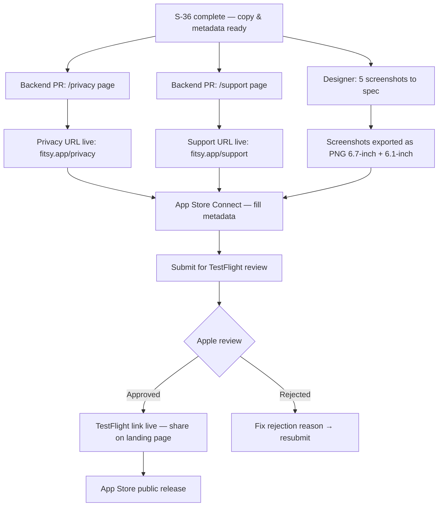
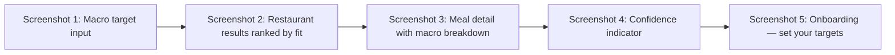

# App Store Listing Prep — S-36

> **Status:** Approved
> **Author:** Product Manager
> **Sprint:** Sprint 6 (Get Users)
> **Date:** 2026-03-24

---

## Problem

Fitsy is ready for TestFlight beta distribution and App Store submission.
Before either can happen, Apple requires:

1. App name, subtitle, description, and keywords
2. At least one screenshot per supported device class
3. A publicly accessible privacy policy URL
4. A publicly accessible support URL
5. Age rating, category, and content declarations

Without these assets, the app cannot be submitted to App Store Connect
and the TestFlight beta link used on the landing page remains broken.

---

## Solution

Produce all copy, metadata, and asset specifications in the product domain
so that the backend engineer can build the required web pages (`/privacy`
and `/support`) and the designer can produce screenshots to spec.

Deliverables in this PR (product domain only):

- `docs/product/app-store-listing-spec.md` — this file
- `docs/product/app-store-listing.md` — all copy and metadata

Deliverables requiring follow-up PRs in other domains:

- **Backend PR** — `apps/api/app/privacy/page.tsx` and
  `apps/api/app/support/page.tsx` (see Cross-Domain Tickets below)

---

## Diagrams

### App Store Submission Flow

### Screenshot Content Flow

---

## Approach

### Copy ownership

All App Store copy lives in `docs/product/app-store-listing.md`. Copy is
the source of truth — the backend engineer pastes it verbatim into App
Store Connect. No copy changes are made during implementation.

### Privacy and support pages

These are minimal Next.js pages in `apps/api/app/`. They must be live at
public URLs before submission. The backend engineer owns these. See
Cross-Domain Tickets below.

### Screenshots

5 screenshots at 6.7-inch (iPhone 15 Pro Max, 1290×2796 px) and
6.1-inch (iPhone 15 Pro, 1179×2556 px). Captions are defined in
`docs/product/app-store-listing.md`. The designer produces the actual
images.

### Age rating

4+ — no objectionable content. The nutrition data shown is AI-estimated
and is explicitly presented with a confidence range, reducing the risk of
misuse.

---

## Interface

### Pages required (backend domain)

| Route | Purpose | Content |
|-------|---------|---------|
| `GET /privacy` | Privacy policy | GDPR/CCPA minimal policy |
| `GET /support` | Support contact | Email contact + FAQ stub |

Both pages must render static HTML at build time (Next.js static export).
No auth required. No dynamic data.

### App Store Connect fields

All field values are defined in `docs/product/app-store-listing.md`.

---

## Edge Cases

1. **App name taken** — "Fitsy" may conflict with an existing App Store
   listing. If Apple rejects the name, fall back to "Fitsy: Macro
   Restaurant Finder". The subtitle does not change.
2. **Keyword limit** — Apple allows 100 characters for keywords. If the
   keyword string exceeds 100 characters after editing, drop lower-priority
   terms from the end (those listed last in the keywords field).
3. **Screenshot device class changes** — Apple periodically changes
   required device classes. If submission fails due to a missing class,
   the designer produces additional sizes from the same design.
4. **Privacy policy URL unreachable at submission time** — the `/privacy`
   page must be deployed before App Store Connect submission. Do not submit
   until the backend PR is merged and deployed to production.
5. **Age rating edge case — nutrition data** — Apple's age rating tool asks
   about medical/health data. Answer "no unrestricted web access" and
   "no" to medical data collection since Fitsy does not store personal
   health records. AI macro estimates are informational, not medical advice.

---

## Out of Scope

- Actual screenshot image files (designer deliverable)
- Custom App Store product page experiments (A/B screenshots)
- In-app purchase setup in App Store Connect (separate task, S-billing)
- Google Play Store listing (separate task — same copy can be reused)
- App Review Information / demo account setup (separate task)
- Localization into non-English languages

---

## Cross-Domain Tickets

The following work is out of scope for this PR and requires separate PRs
in the backend domain:

### Backend Ticket: Privacy and Support Pages

**Assignee:** Backend engineer
**Files:** `apps/api/app/privacy/page.tsx`, `apps/api/app/support/page.tsx`
**Depends on:** S-36 (this spec) merged

**Privacy page requirements:**
- Route: `/privacy`
- Static Next.js page (no dynamic data)
- Content: data collection (none sold to third parties), account deletion
  instructions, contact email `privacy@fitsy.app`
- Must be live at `https://fitsy.app/privacy` before App Store submission
- Minimal, legally sensible for MVP — modeled on Cal.ai / similar indie apps

**Support page requirements:**
- Route: `/support`
- Static Next.js page
- Content: email `support@fitsy.app`, link to TestFlight beta, brief FAQ
  (3–5 questions about macro accuracy, data sources, subscription)
- Must be live at `https://fitsy.app/support` before App Store submission

---

## Acceptance Criteria

- [ ] `docs/product/app-store-listing.md` exists with all fields populated
- [ ] App name is exactly "Fitsy — Macro-Aware Restaurant Finder"
- [ ] Subtitle is exactly 30 characters or fewer
- [ ] Short description is exactly 80 characters or fewer
- [ ] Full description is 4000 characters or fewer
- [ ] Keywords string is 100 characters or fewer
- [ ] 5 screenshot descriptions are written with captions and device spec
- [ ] Privacy policy URL placeholder is `https://fitsy.app/privacy`
- [ ] Support URL placeholder is `https://fitsy.app/support`
- [ ] Cross-domain ticket for backend pages is documented in this spec
- [ ] Structural tests pass

---

## Success Metrics

- App submitted to TestFlight within one sprint after this spec merges
- Zero App Store Connect metadata validation errors on first submission
- Privacy and support pages live before submission deadline
