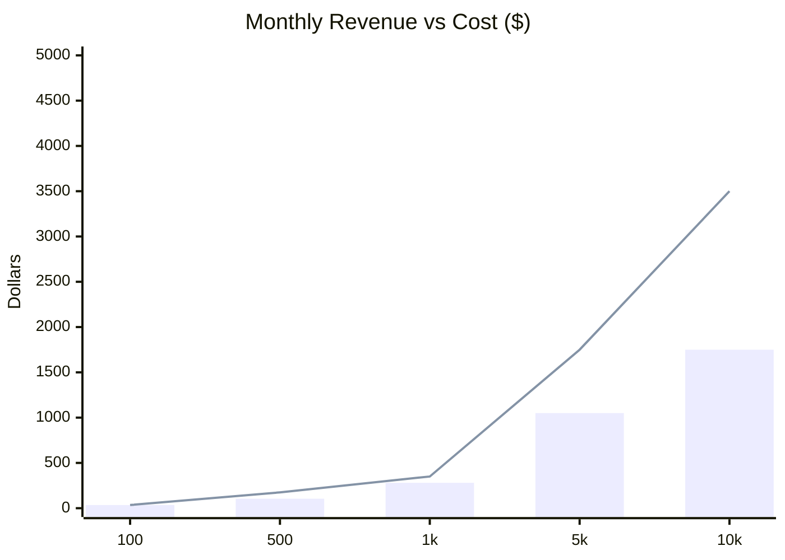

# Fitsy Business Model

> **Status**: Draft
> **Author**: Product Manager
> **Date**: 2026-03-23

---

## 1. Value Proposition

Fitsy solves a problem no existing product addresses: *"Where can I eat nearby
that fits my macros?"* The value is threefold:

- **For users**: saves 10+ minutes per meal trying to estimate restaurant
  macros, removes anxiety about eating out while tracking nutrition goals.
- **For the market**: operates in a gap between calorie-tracker apps (no
  discovery) and restaurant discovery apps (no nutrition data).
- **Network effect potential**: every restaurant preloaded benefits all users
  searching in that area — cost is paid once, value compounds.

---

## 2. Revenue Model

### 2.1 Primary: Freemium Subscription

Fitsy is free to download with a core free tier. A paid subscription unlocks
power features.

| Feature | Free | Pro ($6.99/mo or $49.99/yr) |
|---------|------|-------------------------------|
| Restaurant search by location | ✓ | ✓ |
| Macro match results (top 5 per search) | ✓ | ✓ |
| Full restaurant list (unlimited results) | — | ✓ |
| Ingredient breakdown (tap any meal) | — | ✓ |
| Saved restaurants and meal history | — | ✓ |
| Advanced filters (cuisine, chain/indie) | — | ✓ |
| Distance radius customization | — | ✓ |
| Coverage notifications (new areas added) | — | ✓ |

**Rationale:** The core loop (search → see best matches) is free and demonstrates
value immediately. Pro converts users who are actively using Fitsy and want
depth. The paywall sits after the value is demonstrated, not before.

### 2.2 Secondary (Post-MVP): Affiliate / Partner Integrations

- **Delivery integration**: deep-link to DoorDash / UberEats for a matching meal
  at a restaurant. Affiliate revenue per order.
- **Restaurant spotlight**: restaurants can pay to be featured when they have
  verified nutrition data. Clearly labeled as sponsored.
- **API licensing**: sell the macro dataset or API access to nutrition apps,
  corporate wellness platforms, or meal-prep services.

**Note:** Affiliate and partnership revenue are not pursued until the user base
is large enough to matter (>10k MAU). Pre-launch focus is purely on the
subscription model.

---

## 3. Cost Model

### 3.1 Data Pipeline Costs (One-Time per Coverage Area)

| Coverage | Estimated Cost |
|----------|----------------|
| MVP-0: ~500 restaurants (few LA zip codes) | ~$5 |
| Full LA: ~25k restaurants | ~$114 |
| USA: ~750k restaurants | ~$1,640–$3,408 (one-time) |

- These are one-time preload costs. Serving from cache costs $0.
- At USA scale, a single annual preload ($1,640–$3,408) covers the entire
  data asset. Refreshing the data annually is feasible.

### 3.2 Ongoing Infrastructure Costs (Monthly)

| Item | Cost |
|------|------|
| PostgreSQL (managed, e.g., Neon/Supabase free tier → paid) | $0–$25/mo |
| Next.js API hosting (Vercel/Railway) | $0–$20/mo |
| On-demand ingredient breakdown (Claude API, per-call) | ~$0.001/call |
| **Total at MVP scale (<1k MAU)** | **~$20–50/mo** |

At 1,000 monthly active users making ~10 ingredient breakdowns/month:
- Ingredient breakdown cost: 1k × 10 × $0.001 = $10/mo
- Hosting: ~$25/mo
- **Total**: ~$35/mo

### 3.3 Unit Economics

**Break-even analysis:**

| Metric | Value |
|--------|-------|
| Monthly Pro subscription price | $6.99 |
| Monthly infrastructure cost per user (1k MAU scale) | ~$0.04 |
| Gross margin per Pro subscriber | ~$6.95 (99%) |
| Pro subscribers needed to cover $35/mo infra | 6 |

Even at a 5% conversion rate (free → Pro), Fitsy reaches profitability at
~120 total users. At 1,000 MAU with 5% conversion (50 Pro users):
- Revenue: 50 × $6.99 = $349/mo
- Costs: ~$35/mo
- **Net: ~$314/mo**

> Note: bars = infrastructure cost, line = revenue at 5% Pro conversion.
> Revenue overtakes costs almost immediately (break-even at ~120 users).

### 3.4 LTV / CAC Targets

- **Target LTV**: annual Pro ($49.99) × average 2-year retention = ~$100
- **Target CAC**: <$20 (organic/word-of-mouth at launch, paid performance post-traction)
- **Target LTV:CAC ratio**: >5:1

---

## 4. Pricing Rationale

**$6.99/mo** — positioned as:
- Less than one coffee. Less than one meal. Less than the mental overhead of one
  macro-estimation session.
- Below the "subscription fatigue" threshold for health apps (~$10–$15/mo
  for MFP Premium, Cronometer Gold).
- Annual discount ($49.99/yr = ~$4.17/mo) rewards commitment and improves
  retention, reduces churn risk.

**Why not $0 (fully free)?**
- Ad-supported nutrition apps create a conflict of interest (restaurant/food
  brand ads). Fitsy's value is unbiased macro data; ads corrupt that.
- At target unit economics, even modest paid conversion makes Fitsy profitable
  fast. No need for ads.

**Why not $10+/mo?**
- At launch, no brand trust. $6.99 reduces friction for first-time conversions.
- Can raise pricing post-traction once NPS and retention are validated.

---

## 5. Growth Strategy

### 5.1 Pre-Launch (Phase 0)

- Build in public: post dataset stats, accuracy comparisons, scraping
  methodology on fitness forums (r/Fitness, r/bodybuilding, MyFitnessPal
  community).
- Waitlist: simple landing page capturing emails from macro-trackers.
- Seed users: recruit 10 beta users from personal network before public launch.

### 5.2 Launch (Phase 1: First 10 Users → 1k MAU)

- Primary channels: organic App Store / Google Play search (ASO for "macro
  restaurant finder", "restaurant nutrition tracker").
- Content: share real searches ("found a grilled chicken bowl near LAX that
  hits 40g protein under 500 cal") on Instagram, TikTok, fitness Reddit.
- Referral: Pro users can share a "macro match link" (deep link to a meal).
  Viral loop tied to the product's unique feature.
- GTM details in `docs/gtm/`.

### 5.3 Scale (Phase 2: 1k → 10k MAU)

- Expand coverage geographically (LA → SF → NYC → USA).
- Add delivery integration (affiliate revenue stream).
- Explore B2B: corporate wellness programs, meal-prep services.

---

## 6. Risks and Mitigations

| Risk | Impact | Mitigation |
|------|--------|------------|
| Low conversion rate (<3% free → Pro) | Revenue doesn't cover infra | Lower paywall; make more free; test pricing |
| Data accuracy complaints damage trust | Churn, bad reviews | Confidence tier display, user correction flow, clear disclaimer |
| Google Places / Firecrawl cost spikes | Unit economics break at scale | Abstract scraping behind interface; swap to Crawl4AI at scale |
| Competitor copies the model | Margin compression | Speed of coverage expansion, community trust, brand differentiation |
| App Store approval issues | Launch delay | Review guidelines early; no medical/prescription language |

---

## 7. Success Metrics

| Metric | MVP Target | 6-Month Target |
|--------|-----------|----------------|
| Total users | 10 (beta) | 1,000 MAU |
| Pro conversion rate | — | 5% |
| Monthly recurring revenue | — | $350/mo |
| Restaurant coverage (LA) | 500 restaurants | 5,000 restaurants |
| Macro estimation accuracy | ±20% vs published data | ±15% |
| Weekly active search rate | 3 searches/user/week | 3 searches/user/week |
