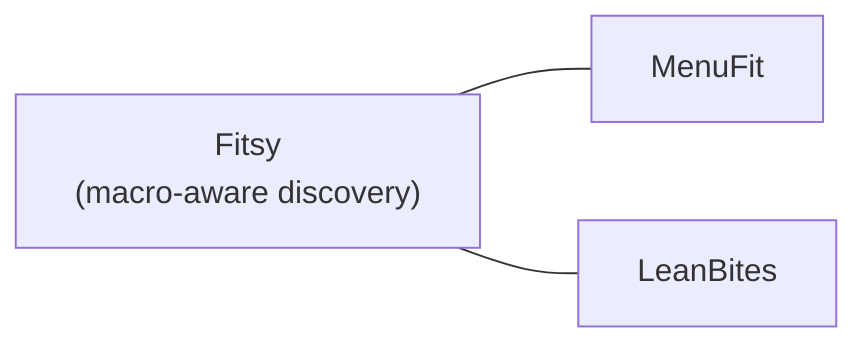

# Competitors

Macro-aware restaurant discovery apps tracked for product differentiation.

## MenuFit

| Field | Details |
|-------|---------|
| **Name** | MenuFit |
| **Category** | Macro/nutrition restaurant finder |
| **Revenue** | ~$300K MRR (significant validation of the market) |
| **Onboarding** | Clean and well-executed flow |
| **UI** | Immature and basic despite revenue scale |
| **Nutrition data** | Reliable for chain restaurants — pulls from a nutrition API |
| **Indie restaurant data** | Unreliable — menus appear to be fabricated (verified one restaurant with entirely made-up menu) |
| **DoorDash integration** | Has "Order with DoorDash" button — unverified if functional, but worth watching as a potential revenue integration |
| **AI feature** | ChatGPT-style nutrition assistant ("high protein near me" etc.) — doesn't work well in practice |
| **App Store** | Many reviews — distribution and retention are working despite data quality issues |
| **Key weakness** | Indie restaurant data is wrong, AI assistant is weak, UI is basic |
| **Key threat** | $300K MRR proves the market exists; could fix data quality with more investment |
| **Opportunity for Fitsy** | Win on accurate indie restaurant data (our preload pipeline) + better UX

## LeanBites

| Field | Details |
|-------|---------|
| **Name** | LeanBites |
| **Category** | Macro/nutrition restaurant finder |
| **Notes** | TBD — add app store link, key differentiators, pricing, weaknesses |

---

*Update this file whenever a new competitor is identified or a known competitor ships a significant feature.*
