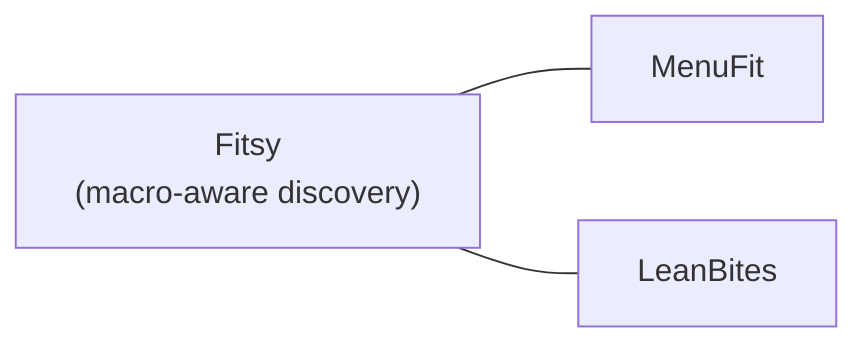

# Competitors

Macro-aware restaurant discovery apps tracked for product differentiation.

## MenuFit

| Field | Details |
|-------|---------|
| **Name** | MenuFit |
| **Category** | Macro/nutrition restaurant finder |
| **Notes** | TBD — add app store link, key differentiators, pricing, weaknesses |

## LeanBites

| Field | Details |
|-------|---------|
| **Name** | LeanBites |
| **Category** | Macro/nutrition restaurant finder |
| **Notes** | TBD — add app store link, key differentiators, pricing, weaknesses |

---

*Update this file whenever a new competitor is identified or a known competitor ships a significant feature.*
