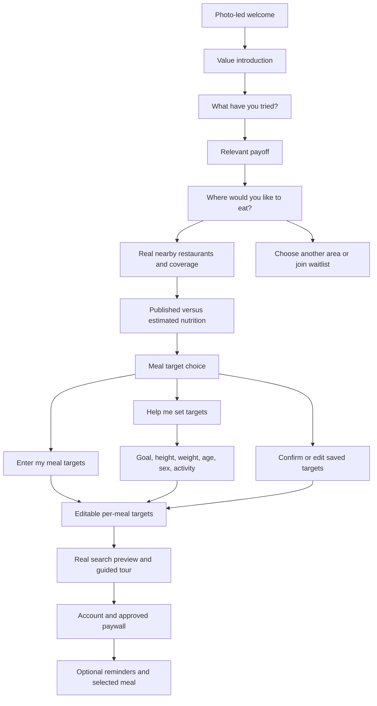

# Original onboarding with targeted personalization

Restore the original photo-led introduction and real search preview while keeping the approved paywall and navigation recovery.
The launch baseline uses a hard paywall after explicit decline; post-decline preview remains controlled by the existing live offering experiment.

## What each answer changes

| Prior approach | Relevant promise | First preview tip |
|---|---|---|
| Meal prep | Find meals for days when plans change | Craving search |
| Calorie apps | Use your targets before deciding what to order | Edit meal targets |
| Checking menus online | Reduce menu hunting; distinguish published and estimated numbers | Restaurant and nutrition source |
| Nothing yet | Start with the next meal and editable targets | Meal targets |

The answer is saved and restored when going Back or reopening onboarding.
Optional macros help returns to target choice.
Saved targets are never a reason to silently bypass that choice.
Body questions appear only after choosing an estimate.
Both target editors preserve calories independently of protein, carbs and fat.

## Proof and preview boundaries

The local proof screen uses actual restaurant names and photos, with a neutral fallback when a photo is unavailable.
Its count is the number of dishes with nutrition within three miles, before personal targets or a craving filter.
It does not claim that every dish matches the user.
The preview reuses the subscribed discovery component with the bounded preview endpoint.
Three dish names and nutrition numbers are visible.
The user can edit targets, change area and search multiple cravings.
Full menus and further results lead to plans with clear value-oriented labels.
The three-tip tour remains available and its first tip reflects the earlier answer.

Back traverses the actual welcome history.
An abandoned menu intent is cleared on return to preview.
Purchase continuation preserves the selected restaurant or craving query.
The existing live trial terms, eligibility, decline, restore and notification behavior remain in place.

## Removed repetition

The separate broad eating-out pitch and late payoff page lead to the personalized response.
The global catalog-counter page leads to real local coverage.
The duplicate macros sales page leads to target choice.
The old waiting page remains a direct preview alias.
No new occasion or obstacle questionnaire is added in this launch change.

## Required local evidence

`onboarding-guided-preview` covers the manual path, repeated cravings, independently edited targets, three visible picks, menu gating, Back, abandoned intent, saved-target confirmation and restart.
`onboarding-assisted-targets` covers personalization persistence, optional help, all six profile questions, editable estimates and Back preserving those edits.
The canonical local product-flow gate also requires actual Mobile MCP primary and recovery observations for every affected category.
RevenueCat Test Store evidence is recorded separately from Apple sandbox and production configuration.
