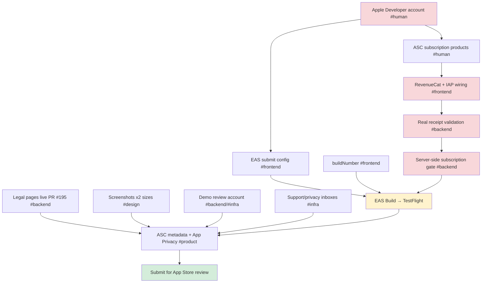

# Pre-Launch Action Items — App Store

> **Status:** Active tracker
> **Created:** 2026-06-07
> **Owner:** Product Manager (coordination); per-item owners tagged below
> **Related:** `docs/product/archive/launch-plan.md`, `docs/product/app-store-listing.md`, `docs/product/archive/app-store-listing-spec.md`

Single checklist of everything still required before Fitsy can ship to the
App Store. Derived from the launch-readiness audit. Items are tagged with the
owning domain (`#backend`, `#frontend`, `#product`, `#design`, `#cto`,
`#infra`, `#human`) — cross-domain work must be split per CLAUDE.md.

Legend: 🔴 hard blocker · 🟡 needs attention · ✅ done

---

## Critical path

The two long poles are **(1) payments** (Apple Developer account → ASC
products → RevenueCat → validation → server gate) and **(2) the build/submit
chain** (account → EAS submit + buildNumber → EAS Build → TestFlight). Legal,
screenshots, metadata, and the demo account feed the final ASC submission.

---

## 🔴 Blockers — must ship before submission

### Payments / subscriptions

- [ ] **Apple Developer Program account + signing** `#human`
  Enroll, accept agreements, set up App Store Connect app record, certificates
  & provisioning. Blocks the entire build + IAP chain. _Currently the #1 gate._
- [ ] **Create auto-renewing subscription products in App Store Connect** `#human`
  e.g. `fitsy_monthly`, `fitsy_annual`, both with a free trial. Prices must
  match the finalized pricing (see pricing item below).
- [ ] **Install + wire RevenueCat (`react-native-purchases`)** `#frontend`
  Replace the UI-only `apps/mobile/app/welcome/payment.tsx` "Start Free Trial"
  button (today it just sets `onboardingComplete` in AsyncStorage) with a real
  purchase flow. Set up the `pro` entitlement + offering.
- [ ] **Real receipt validation on the API** `#backend`
  `apps/api/app/api/subscriptions/verify/route.ts` is a stub (returns 503 in
  prod behind `ALLOW_STUB_SUBSCRIPTIONS`; `TODO (S-103b)`). Validate against
  Apple App Store Server API or RevenueCat REST; persist real `expiresAt`.
- [ ] **Server-side subscription gate** `#backend`
  No `requireSubscription()` guard today — `/api/restaurants` checks auth but
  not entitlement, so the paywall can be bypassed by setting a local flag. Gate
  protected routes on active/non-expired subscription.

### Build & submission plumbing

- [ ] **Add `buildNumber` / `ios.buildNumber`** `#frontend`
  `apps/mobile/app.config.ts` has `version: "1.0.0"` but no build number.
- [ ] **EAS submit configuration** `#frontend`
  `eas.json` has build profiles but no `submit` block (no `ascAppId`,
  `appleId`, ASC API key / team). Required to push to TestFlight / App Store.
- [ ] **EAS Build → TestFlight** `#human` + `#frontend`
  Run the production build and upload. Runbooks already exist:
  `docs/engineering/devops/testflight-runbook.md`.

### Store listing assets

- [ ] **App Store screenshots** `#design` / `#product`
  5 screens × 2 sizes (6.7" 1290×2796, 6.1" 1179×2556) with the marketing
  caption overlays specified in `app-store-listing.md` §Screenshots. Requires
  the app running with Silver Lake demo data. Raw simulator grabs are a
  starting point, not submission-ready.

### Auth

- [ ] **Configure Google Sign-In credentials — or remove it** `#frontend` + `#infra`
  `EXPO_PUBLIC_GOOGLE_IOS_CLIENT_ID` is missing; the app shows a "Not
  Configured" alert. Either provision the OAuth client or pull the button
  before review. (Sign in with Apple is already implemented.)

---

## 🟡 Needs attention before submission

- [ ] **Merge PR #195 to deploy legal pages to production** `#backend`
  Approved (backend + CTO), CI green. Until merged, `/privacy`, `/terms`,
  `/support` aren't live on `fitsy.app`.
- [ ] **Support / privacy email inboxes** `#infra`
  `support@fitsy.app` + `privacy@fitsy.app` must deliver (or alias both to
  `admin@fitsy.app`). Apple email-tests the support URL during review.
- [ ] **App Privacy "nutrition label" in App Store Connect** `#product`
  Enter disclosures from `app-store-listing.md` §Content Declarations
  (location: precise/foreground; tracking: no; IDFA: no). Confirm whether
  PostHog analytics requires `NSUserTrackingUsageDescription` in `app.config.ts`. `#frontend`
- [ ] **Demo / review account** `#backend` + `#infra`
  Create `review@fitsy.app` with an active subscription pre-loaded so reviewers
  bypass the paywall (per `app-store-listing.md` §App Review Information).
- [ ] **Finalize pricing — single source of truth** `#product`
  Inconsistent today: listing says $30/yr · $5/mo; `payment.tsx` shows
  $29.99/yr · $8.99/mo; launch plan mentions $4.99/mo. Pick final numbers; they
  must match the ASC products exactly.
- [ ] **Link legal pages from the mobile app** `#frontend`
  Mobile doesn't reference `/privacy`, `/terms`, or `/support` yet. Add links
  in Profile/Settings (and ideally the paywall, which Apple expects for
  subscriptions).
- [ ] **Enter ASC metadata** `#product`
  Paste name, subtitle, description, keywords, age rating, content declarations
  from `app-store-listing.md`; upload screenshots in order.

---

## Harness / follow-ups (non-blocking)

- [ ] **Structural test guarding legal-page presence** `#cto`
  These pages are submission-blocking; add a check so they can't silently
  regress. (Raised in the CTO review of PR #195.)

---

## ✅ Already done

- ✅ Legal pages built — `/privacy`, `/terms`, `/support` (PR #195, approved, CI green) `#backend`
- ✅ Account deletion — `DELETE /api/user` (transactional) + Profile UI `#backend` `#frontend`
- ✅ Sign in with Apple — implemented end-to-end `#frontend`
- ✅ App icon — 1024×1024 + adaptive icon + iOS asset catalog `#design`
- ✅ Listing copy — name, subtitle, description, keywords, age rating (4+), health disclaimer `#product`
- ✅ Location permission — `NSLocationWhenInUseUsageDescription` + priming screen `#frontend`
- ✅ Bundle ID `app.fitsy.mobile` + EAS project configured `#frontend`
- ✅ Marketing site / landing page live at `fitsy.app` `#backend`
- ✅ TestFlight runbooks written `#cto`

---

## Quick status

| Area | Blockers remaining |
|------|--------------------|
| Payments / IAP | 5 |
| Build & submit | 3 |
| Assets | 1 (screenshots) |
| Auth | 1 (Google or remove) |
| Listing / compliance | 7 (🟡) |
| **Total open** | **17** |
