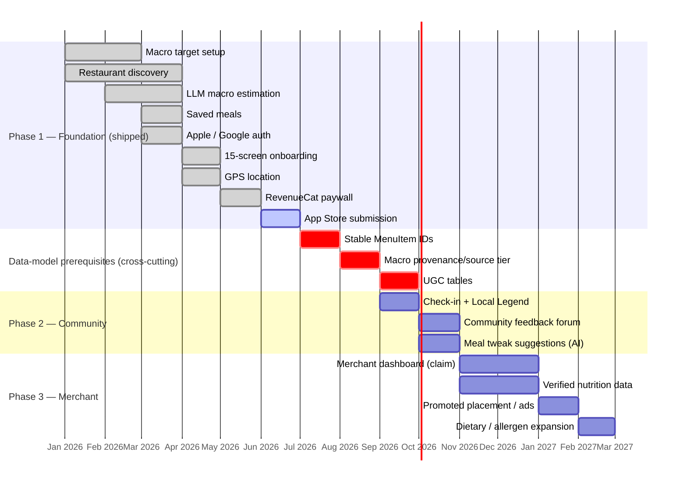
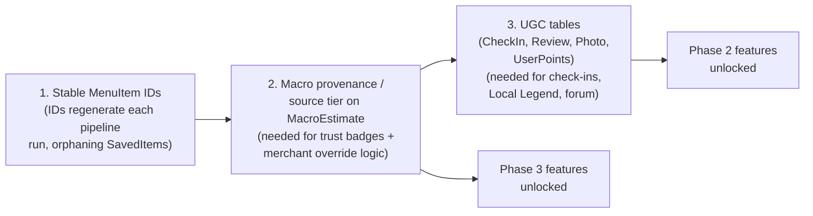

# Fitsy — Product Roadmap

> **Status:** Living document · **Last verified:** 2026-06-12

---

## Overview

Fitsy ships in three phases. Phase 1 is the foundation (shipped). Phases 2 and
3 are community + merchant layers that build on it. Each phase has a cross-
cutting data-model prerequisite that gates the features above it — see the
prerequisite track below.

---

## Phase timeline

---

## Phase 1 — Foundation (shipped)

These features are built and shipping. App Store submission is in progress.

| Feature | Spec / Reference | Status |
|---------|-----------------|--------|
| Macro target setup + presets (Cut/Maintain/Bulk) | `docs/product/archive/vision-prd.md` | Shipped |
| Restaurant discovery ranked by macro fit | `docs/product/archive/vision-prd.md` | Shipped |
| LLM macro estimation pipeline (Claude Haiku, preload-time) | `docs/engineering/pipeline/ue-first-pipeline.md` | Shipped |
| Saved meals | — | Shipped |
| Apple Sign-In + Google Sign-In | — | Shipped |
| 15-screen editorial onboarding | — | Shipped |
| GPS location (`apps/mobile/lib/useLocation.ts`) | — | Shipped |
| RevenueCat + Apple IAP paywall (Test Store) | `docs/product/business-model.md` | Shipped (prod blocked) |
| Landing page at fitsy.app | `docs/product/specs/landing-page.md` | Shipped |
| Out-of-area screen | — | Shipped |

**Phase 1 exit:** App Store submission → public launch. Remaining blockers
tracked in `docs/product/pre-launch-action-items.md`.

---

## Cross-cutting: data-model prerequisites

These are not features — they are database refactors that unlock Phase 2 and 3
features. They must land in order.

**Why in this order:**
1. **Stable MenuItem IDs** — SavedItems currently orphan when the pipeline
   re-runs and regenerates IDs. Must fix before UGC tables reference
   `menuItemId` as a foreign key.
2. **Macro provenance / source tier** — `MacroEstimate` is currently a 1:1 row
   with no audit log. Merchant-verified nutrition requires a `source` field
   (`llm_estimate | fatsecret | merchant_verified`) and a precedence model.
   Also needed for the trust badge the merchant dashboard exposes.
3. **UGC tables** — `CheckIn`, `Review`, `Photo`, `UserPoints` don't exist yet.
   All Phase 2 social features depend on them.

Also planned (related): `phone` column + `matchRestaurant()` deduplication
function on `Restaurant` — needed as the merchant claim-matching key for Phase 3.

---

## Phase 2 — Community

Target: ~2–3 months post-launch (Q3/Q4 2026). Requires data-model prerequisites 1–3.

| Feature | Spec | Prerequisites |
|---------|------|---------------|
| Post-meal check-in (macro accuracy, rating, photo) | `docs/product/specs/check-in-local-legend.md` | UGC tables |
| Local Legend per-neighborhood leaderboard | `docs/product/specs/check-in-local-legend.md#local-legend` | UGC tables, homeHex on Restaurant |
| Community feedback forum (flag estimates, discuss meals) | `docs/product/specs/community-feedback-forum.md` | UGC tables |
| Meal tweak suggestions ("swap fries → salad: −38g carbs") | `docs/product/specs/meal-tweak-suggestions.md` | Macro provenance tier |

**GTM note:** Local Legend is the UGC flywheel — neighborhood legends produce
the photos and reviews the content pipeline wants. Cross-reference
`docs/gtm/strategy.md` for the UGC motion.

---

## Phase 3 — Merchant layer

Target: Q1 2027. Requires data-model prerequisites 1–2 and phone column /
matchRestaurant() dedupe.

| Feature | Spec | Prerequisites |
|---------|------|---------------|
| Merchant claim + verification flow | `docs/product/specs/merchant-dashboard.md` | matchRestaurant() dedupe, Macro provenance tier |
| Verified nutrition data (overrides LLM estimates) | `docs/product/specs/merchant-dashboard.md` | Macro provenance tier |
| Promoted placement / advertising | `docs/product/specs/merchant-dashboard.md` | Merchant auth + claim flow |
| Dietary / allergen filter expansion | — (future spec) | Stable MenuItem IDs |

**Revenue note:** Promoted placement is Fitsy's first non-subscription revenue
line — the first that does not pass through Apple's 30% commission. See
`docs/product/business-model.md#merchant-revenue-future`.

---

## Deferred / under discussion

| Idea | Notes |
|------|-------|
| Android / Google Play | iOS-only at launch; Android after proving the model |
| Web app | Post-launch; mobile is the primary surface |
| Micronutrient tracking (vitamins, minerals) | Out of scope for current product definition |
| Ordering / reservation integration | Possible long-term; no near-term plans |
| Offline mode | Deferred post-MVP |
| Family / team plans | Out of scope for current subscription model |
