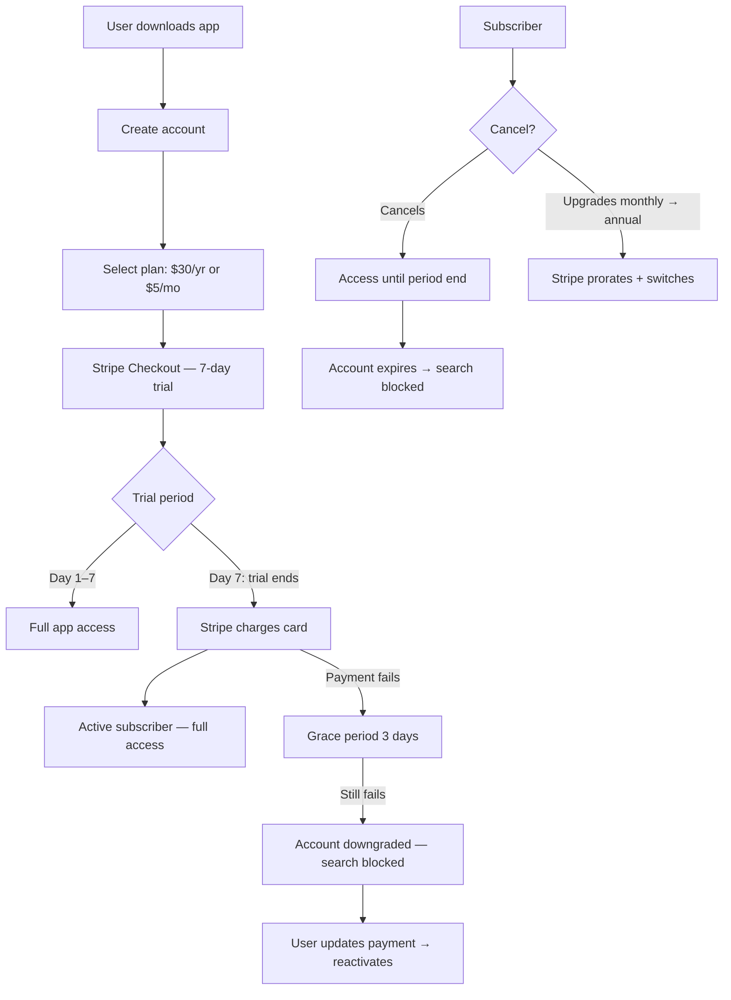

# Business Model & Pricing

> **Status:** Draft — under review
> **Author:** Product Manager
> **Date:** 2026-03-24

---

## Problem

Fitsy needs a monetization model that:
1. Converts free users to paying subscribers at a viable rate
2. Keeps pricing low enough to compete with MFP/Cronometer ($10–$20/yr or free)
3. Does not require a freemium tier that permanently dilutes revenue
4. Can be implemented with minimal backend complexity for MVP

---

## Solution

**Paid subscription only — no freemium.**

Two plans:
- **Annual**: $30/year (~$2.50/month) — default, surfaced prominently
- **Monthly**: $5/month — fallback for users not ready to commit annually

This mirrors Cal.ai's model: a single low price that removes the cost-as-objection, no free tier to cannibalise conversions.

### Why no freemium

Freemium defers revenue and permanently segments the user base into a large free cohort that does not convert. At MVP scale, every user who signs up should be a paying user. This also keeps auth/gating logic simple — one entitlement check, no feature flags per tier.

### Trial strategy

7-day free trial on both plans (Stripe supports this natively). The trial starts on payment method capture, not on account creation. This filters out non-serious signups.

---

## Diagrams



---

## Approach

### Payment integration: Stripe

- **Products**: Two Stripe Products — `fitsy_annual` and `fitsy_monthly`
- **Prices**: $30/yr (one-time interval = year) and $5/mo
- **Trial**: 7-day `trial_period_days` on both
- **Checkout**: Stripe Payment Links for MVP — no custom checkout UI
- **Webhooks**: `customer.subscription.created`, `customer.subscription.updated`, `customer.subscription.deleted`, `invoice.payment_failed`

### Database changes needed (S-34)

Add to `User` model in Prisma:
```
stripeCustomerId  String?  @unique
subscriptionId    String?
subscriptionStatus  SubscriptionStatus  @default(TRIALING)
subscriptionPeriodEnd DateTime?
```

`SubscriptionStatus` enum: `TRIALING | ACTIVE | PAST_DUE | CANCELED | EXPIRED`

### Auth gating

API middleware reads `subscriptionStatus`. Allowed for `TRIALING` and `ACTIVE`. Returns `402` for all others with `{ "error": "Subscription required" }`.

Mobile client shows paywall screen on `402`.

### Upgrade / downgrade flows

| Flow | Behavior |
|------|----------|
| Monthly → Annual | Stripe prorates remaining monthly days as credit, switches to annual |
| Annual → Monthly | Switch takes effect at next renewal (no mid-period downgrade) |
| Cancel | Access until period end, then `EXPIRED` |
| Reactivate after cancel | New subscription — 7-day trial does NOT restart |
| Payment failure | 3-day grace period (Stripe Smart Retries), then `PAST_DUE` → `EXPIRED` after 7 days |

---

## Interface

### New API routes (S-34)

```
POST /api/billing/create-checkout-session
  → creates Stripe Checkout session, returns { url }

POST /api/billing/portal
  → creates Stripe Customer Portal session, returns { url }

POST /api/billing/webhook
  → receives Stripe webhook events, updates DB
```

### Mobile screens (S-35)

- **Paywall screen** — shown on app launch if no active subscription; shown on 402 response
- **Manage subscription** — links to Stripe Customer Portal (web)
- **Settings > Subscription** — shows current plan, next renewal date, cancel option

---

## Constraints

- MVP uses Stripe Payment Links, not a custom checkout UI — reduces implementation scope
- No annual-to-monthly mid-period downgrade at MVP — too many edge cases
- Stripe Customer Portal handles all subscription management — no custom UI for cancel/upgrade
- App Store in-app purchases are explicitly out of scope for MVP — Stripe web flow only

## Edge Cases

1. **User cancels during trial (before Day 7)** — subscription status transitions to `CANCELED` immediately; access revoked at `subscriptionPeriodEnd` which equals trial end date (Day 7). No charge is made.
2. **Multi-device subscription state sync** — `subscriptionStatus` is server-side; every API request re-checks DB. No client-side caching of subscription state — stale state is not possible.
3. **Stripe webhook arrives out of order** — e.g., `subscription.updated` arrives before `subscription.created`. Webhook handler must be idempotent: upsert on `subscriptionId`, never assume prior state. `subscription.created` can safely overwrite `subscription.updated` state because Stripe guarantees the event reflects current state at time of dispatch.
4. **User deletes account while subscription is active** — account deletion must call `stripe.subscriptions.cancel({ prorate: false })` and then delete the DB record. Do not leave orphan Stripe subscriptions.
5. **Reactivation after cancellation** — treated as a new subscription. Trial does NOT restart (Stripe handles this via `trial_end: 'now'` on new subscription creation for existing customers). Implement by checking `stripeCustomerId` existence before creating checkout session.
6. **Payment method update during grace period** — Stripe Smart Retries handle retrying. If user updates payment method in Stripe Portal, a retry is triggered immediately. No separate handling needed.

---

## Acceptance Criteria

- [ ] User can complete Stripe Checkout and reach `TRIALING` subscription state in DB
- [ ] API returns `402` with `{ "error": "Subscription required" }` for `PAST_DUE`, `CANCELED`, and `EXPIRED` statuses
- [ ] API allows access for `TRIALING` and `ACTIVE` statuses
- [ ] Mobile client shows paywall screen on `402` response
- [ ] Webhook handler correctly transitions subscription status for each event: `created` → `TRIALING/ACTIVE`, `updated` → reflect new state, `deleted` → `CANCELED`, `payment_failed` → `PAST_DUE`
- [ ] Upgrade (monthly → annual) prorates correctly and switches plan; user remains `ACTIVE`
- [ ] Downgrade (annual → monthly) defers until period end; user remains `ACTIVE` until then
- [ ] After grace period exhausted (7 days past due), status transitions to `EXPIRED`
- [ ] Reactivation after cancellation creates a new subscription without restarting the 7-day trial
- [ ] Account deletion cancels the Stripe subscription (no orphan subscriptions)

---

## Out of Scope

- In-app purchases (IAP) via App Store / Play Store
- Team/family plans
- Lifetime license
- Usage-based pricing
- Referral / affiliate programs
