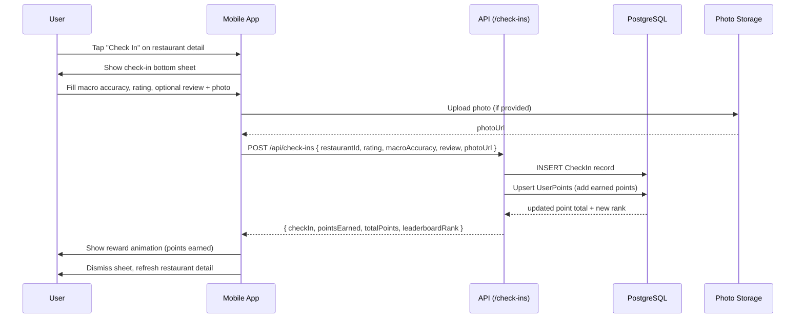
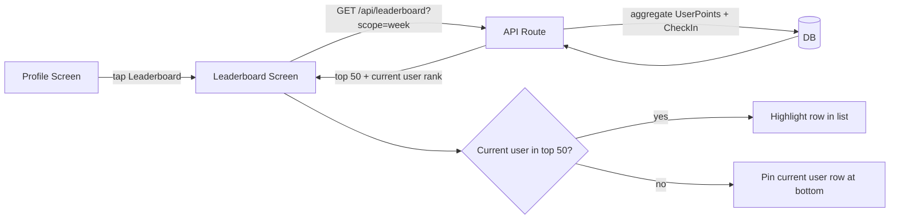

# Check-In

**Status:** Draft
**Date:** 2026-04-27
**Owner:** Product / Mobile + Backend

## Problem

Users discover restaurants and meals through Fitsy, but the app has no post-meal feedback loop. There is no way to confirm whether estimated macros matched reality, share an experience with other users, or build any community layer around meals. This means Fitsy loses the moment of highest engagement (eating the food) and has no user-generated signal to improve macro estimates or surface crowd-validated meals.

## Solution

A post-meal check-in flow. After eating, a user taps "Check In" from a restaurant detail or saved meal screen. They log a macro accuracy rating, optionally write a short review and attach a photo, then submit. On submission they earn reward points and their check-in counts toward the leaderboard.

### User flows

1. **Trigger** — "Check In" CTA on the restaurant detail screen and on saved meals.
2. **Check-in sheet** — bottom sheet with four fields:
   - Macro accuracy: single-select ("Spot on", "Close enough", "Way off")
   - Rating: 1–5 stars
   - Review text: optional, 280-character limit
   - Photo: optional, single image from camera roll or camera
3. **Submit** — creates a check-in record, awards points, updates the leaderboard.
4. **Confirmation** — brief reward animation (points earned + new total), then dismissal.

### Rewards

| Action | Points |
|--------|--------|
| First check-in at a restaurant | 20 |
| Subsequent check-ins (same restaurant) | 10 |
| Check-in with photo | +5 bonus |
| Check-in with review (≥ 20 chars) | +5 bonus |

Points accumulate on a user profile. No redemption mechanic for MVP — points are a social signal only.

### Leaderboard

Two boards, accessible from the Profile screen:

| Board | Scope | Sort key |
|-------|-------|----------|
| This Week | last 7 days | total points |
| All Time | lifetime | total points |

Leaderboard shows top 50 users with display name, avatar initial, and point total. The current user's rank is pinned at the bottom when outside the top 50.

## Edge Cases

1. User checks in twice at the same restaurant on the same day — allowed, but the "first check-in" bonus only applies once per restaurant lifetime.
2. Photo upload fails (network error) — check-in saves without photo; user sees a non-blocking toast.
3. User deletes account — check-ins are anonymized (userId set to null), points removed from leaderboard.
4. Macro accuracy reported as "Way off" — flagged in the DB for future macro quality review. No immediate change to displayed macros.
5. Check-in submitted without a restaurant (e.g. deep-link to a since-deleted restaurant) — return 404 at the API, show error state in the sheet.
6. Leaderboard tie — sort by earliest points milestone (first to reach that total ranks higher).

## Out of Scope

- Macro estimate corrections from user feedback (flagged for future review queue, not auto-applied)
- Social graph / following other users
- Commenting on or liking another user's check-in
- Push notification triggers ("You haven't checked in for 7 days")
- Moderation tools for photo or review content
- Redeeming points for discounts or rewards
- Check-ins for home-cooked meals (restaurant check-ins only for MVP)

---

## Diagrams

### Check-in submission flow



### Leaderboard read path



---

## Approach

### Data model (Prisma additions)

```prisma
model CheckIn {
  id             String      @id @default(cuid())
  userId         String?
  user           User?       @relation(fields: [userId], references: [id], onDelete: SetNull)
  restaurantId   String
  restaurant     Restaurant  @relation(fields: [restaurantId], references: [id])
  menuItemId     String?
  menuItem       MenuItem?   @relation(fields: [menuItemId], references: [id])
  rating         Int         // 1-5
  macroAccuracy  MacroAccuracy
  review         String?
  photoUrl       String?
  pointsEarned   Int
  createdAt      DateTime    @default(now())

  @@index([userId])
  @@index([restaurantId])
  @@index([createdAt])
}

model UserPoints {
  id          String   @id @default(cuid())
  userId      String   @unique
  user        User     @relation(fields: [userId], references: [id], onDelete: Cascade)
  total       Int      @default(0)
  weeklyTotal Int      @default(0) // reset via weekly cron
  updatedAt   DateTime @updatedAt
}

enum MacroAccuracy {
  SPOT_ON
  CLOSE_ENOUGH
  WAY_OFF
}
```

### New API endpoints

| Method | Path | Auth | Description |
|--------|------|------|-------------|
| `POST` | `/api/check-ins` | JWT required | Create a check-in, award points |
| `GET` | `/api/check-ins?restaurantId=` | JWT required | List check-ins for a restaurant (paginated, most-recent first) |
| `GET` | `/api/leaderboard?scope=week\|all` | JWT required | Top 50 users + current user rank |

### Points calculation (server-side)

```
isFirstAtRestaurant = no prior CheckIn for (userId, restaurantId)
base = isFirstAtRestaurant ? 20 : 10
bonus = (hasPhoto ? 5 : 0) + (review.length >= 20 ? 5 : 0)
pointsEarned = base + bonus
```

Points are written in the same transaction as the CheckIn insert to prevent partial award.

### Photo storage

- Client uploads directly to a pre-signed S3 (or Supabase Storage) URL obtained via `GET /api/check-ins/photo-upload-url`.
- API stores only the resulting `photoUrl` string — no binary content in PostgreSQL.
- Bucket is public-read for MVP (no signed read URLs needed).
- Max file size: 5 MB. Accepted types: `image/jpeg`, `image/png`, `image/heic`.

### Leaderboard staleness

- Weekly total is reset by a nightly cron that zeroes `UserPoints.weeklyTotal` every Monday 00:00 UTC.
- Leaderboard query runs directly against `UserPoints` — no separate materialized view for MVP.
- If query exceeds 200 ms p95, add a Redis cache with 60-second TTL.

### Mobile entry points

- Restaurant Detail screen — "Check In" button in the action bar (below Save).
- Saved Meals screen — swipe-left action on a saved meal row reveals "Check In".
- Post-check-in: Profile screen shows updated point total and a "View Leaderboard" shortcut.

## Interface

### `POST /api/check-ins`

Request body:
```json
{
  "restaurantId": "cuid",
  "menuItemId": "cuid | null",
  "rating": 4,
  "macroAccuracy": "SPOT_ON",
  "review": "Great portion size, macros were accurate.",
  "photoUrl": "https://..."
}
```

Success `201`:
```json
{
  "checkIn": { "id": "...", "createdAt": "..." },
  "pointsEarned": 30,
  "totalPoints": 130,
  "leaderboardRank": 12
}
```

Error `404` — restaurant not found.
Error `400` — invalid `macroAccuracy` value or `rating` out of range.

### `GET /api/leaderboard?scope=week`

Success `200`:
```json
{
  "scope": "week",
  "entries": [
    { "rank": 1, "displayName": "Alex M.", "points": 340 },
    ...
  ],
  "currentUser": { "rank": 47, "points": 80 }
}
```

## Constraints

- Photo upload must be non-blocking — check-in can submit with no photo if upload fails or is skipped.
- Points are write-once per check-in; no retroactive adjustments.
- Leaderboard shows display name only (no email, no full name) — privacy constraint.
- `macroAccuracy: WAY_OFF` entries are flagged in the DB but cause no automated macro changes for MVP.
- Weekly leaderboard reset must be idempotent (safe to re-run if cron misfires).
