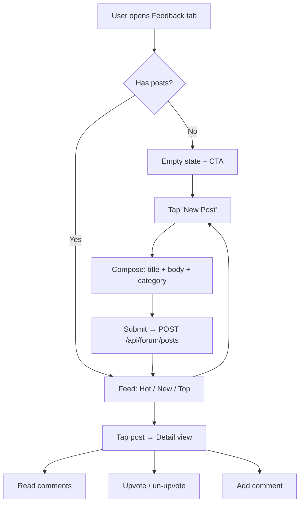
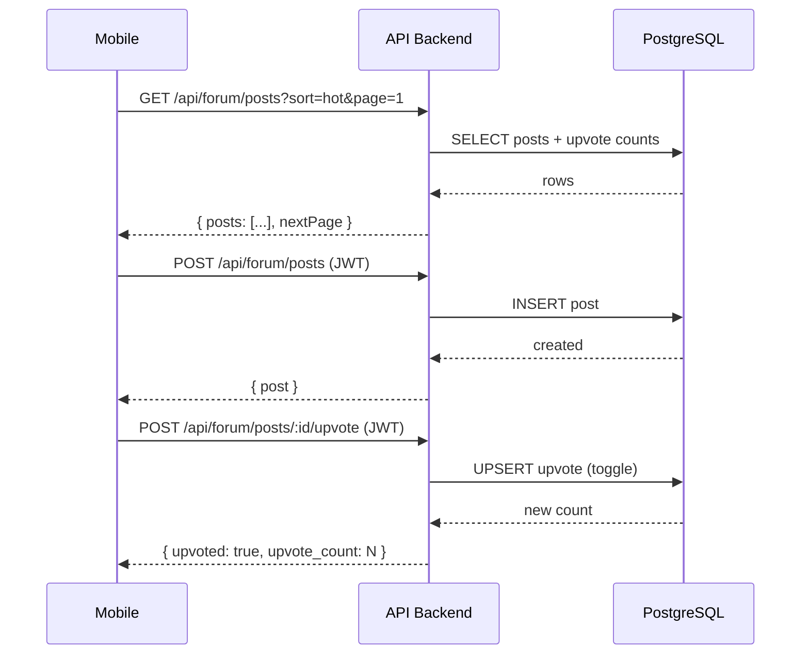

# Community Feedback Forum

## Problem

The current feedback loop (mailto: button → email triage) is one-directional
and invisible to users. Testers don't see what others are asking for, can't
rally behind shared pain points, and get no signal that their feedback matters.
This creates duplicate reports, low engagement, and zero community effect.

A public, in-app forum lets users see they're not alone — and lets us
crowdsource priority from real demand signals instead of guessing.

## Solution

A **Feedback** tab in the main app where any authenticated user can:

1. **Post** a feedback item (bug, feature request, or general comment)
2. **Browse** all posts, sorted by Hot (default), New, or Top
3. **Upvote** posts (one vote per user per post, toggle on/off)
4. **Comment** on posts (flat, single-level — no threading)

### Reward: "Founder's Voice" Badge

Users whose posts reach the **Top 3 most-upvoted of the month** earn a
permanent "Founder's Voice" badge on their profile. This is cosmetic
only — no monetary reward, no free subscription. The badge signals
that this person shaped the product early.

### Post Structure

| Field | Type | Required | Constraints |
|-------|------|----------|-------------|
| title | string | yes | 5–120 chars |
| body | string | yes | 10–2000 chars |
| category | enum | yes | `bug`, `feature`, `general` |
| author | User ref | auto | from JWT |
| upvote_count | int | auto | starts at 0 |
| created_at | timestamp | auto | |

### Comment Structure

| Field | Type | Required | Constraints |
|-------|------|----------|-------------|
| body | string | yes | 1–1000 chars |
| author | User ref | auto | from JWT |
| post | Post ref | auto | |
| created_at | timestamp | auto | |

## Edge Cases

1. **Spam / abuse** — Rate-limit: max 5 posts and 20 comments per user per day. No moderation UI in v1; flag-and-hide via direct DB update.
2. **Self-upvote** — Posts do NOT auto-upvote. Author can upvote their own post like anyone else (simpler UX, no edge case).
3. **Deleted account** — Posts/comments remain but author shows as "[deleted]".
4. **Empty state** — First-time view with zero posts: illustration + "Be the first to share feedback" CTA.
5. **Offensive content** — v1: no filter. If abuse appears pre-launch, add keyword blocklist. Post-launch: add report button (separate spec).
6. **Badge timing** — Evaluated on the 1st of each month for the previous month. Ties: all tied users get the badge.

## Out of Scope

- Threading / nested comments (flat only in v1)
- Image/screenshot attachments
- Admin moderation panel (use direct DB for now)
- Push notifications for replies or upvote milestones
- Search within forum
- Rich text / markdown in posts
- Official response / staff flair

---

## Diagrams





---

## Approach

### Database (3 new tables)

```
ForumPost        — id, title, body, category, authorId, upvoteCount, createdAt
ForumComment     — id, body, postId, authorId, createdAt
ForumUpvote      — id, postId, userId, createdAt  (unique: postId + userId)
```

`upvoteCount` is denormalized on `ForumPost` for fast sorting. Updated
via transaction on upvote toggle.

### API Endpoints

| Method | Path | Auth | Description |
|--------|------|------|-------------|
| GET | `/api/forum/posts` | no | List posts (query: `sort`, `page`, `category`) |
| POST | `/api/forum/posts` | JWT | Create post |
| GET | `/api/forum/posts/:id` | no | Single post + comments |
| POST | `/api/forum/posts/:id/upvote` | JWT | Toggle upvote |
| POST | `/api/forum/posts/:id/comments` | JWT | Add comment |

**Sort algorithms:**
- `hot` — Wilson score (upvotes vs age), recalculated on read
- `new` — `ORDER BY createdAt DESC`
- `top` — `ORDER BY upvoteCount DESC`

Pagination: cursor-based, 20 posts per page.

### Mobile Screens

1. **Forum Feed** (`/(tabs)/feedback`) — New tab with category pills + sort toggle + post cards
2. **Post Detail** (`/feedback/[id]`) — Full post + comments + upvote button
3. **Compose Post** (`/feedback/compose`) — Form: title, body, category picker

### Rollout

Ship behind a feature flag (`FORUM_ENABLED`). Enable for TestFlight
testers first, then all users after one week with no critical bugs.

## Interface

### Post Card (Feed)

```
┌─────────────────────────────────┐
│ ▲  12   Feature Request         │
│      "Filter restaurants by     │
│       cuisine type"             │
│      @maria · 2h · 3 comments  │
└─────────────────────────────────┘
```

### Post Detail

```
┌─────────────────────────────────┐
│ ← Back                         │
│                                 │
│ Feature Request                 │
│ Filter restaurants by cuisine   │
│ type                            │
│                                 │
│ I'd love to be able to filter   │
│ by Mexican, Thai, etc. Right    │
│ now I have to scroll through    │
│ everything.                     │
│                                 │
│ ▲ 12 upvotes    @maria · 2h    │
│─────────────────────────────────│
│ Comments (3)                    │
│                                 │
│ @josh · 1h                      │
│ Yes! Especially for dietary     │
│ restrictions.                   │
│                                 │
│ [Add a comment...]              │
└─────────────────────────────────┘
```

## Constraints

- Posts are read-public, write-authenticated (JWT required for create/upvote/comment)
- No edit or delete for users in v1 (simplifies moderation surface)
- Rate limits enforced server-side: 5 posts/day, 20 comments/day per user
- Badge evaluation is a manual or cron script, not real-time
- Forum data lives in the same PostgreSQL instance (no separate service)
- Must not slow down restaurant search — forum queries are independent
