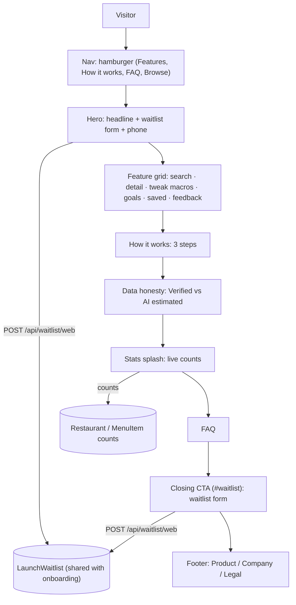

# Landing Page

> **Status:** Shipped - live · **Last verified:** 2026-09-07 (waitlist CTA replaces the App Store CTA until the listing is live)
> **Author:** Frontend
> **Date:** 2026-03-24 (spec); shipped ~Sprint 8

---

## Problem

Fitsy needs a public-facing web page that:
1. Explains what Fitsy is in 10 seconds
2. Drives downloads when the app is live on the App Store
3. Gives the project a credible URL for launch announcements and early-access signups

Currently the root URL (`fitsy-api.vercel.app`) returns a 404. Any link to Fitsy lands nowhere.

---

## Solution

A single-page Next.js marketing site at `/` in the API project. The existing Next.js backend already handles routing — adding a root `page.tsx` makes it serve a landing page without any additional infrastructure.

Sections, top to bottom (v3, 2026-09-06):
1. **Nav** - shared `Nav`: wordmark and a hamburger. Section links (Features, How it works, FAQ) and Browse Restaurants live in the hamburger on every viewport; the bar itself holds no inline links.
2. **Hero** - headline, sub-headline, waitlist form (email + "Join the waitlist"), floating phone with the search screenshot.
   The form posts to `POST /api/waitlist/web`, which writes to the same `LaunchWaitlist` table as the app's out-of-area "Notify me at launch" screen, so the website and onboarding feed one launch list (`docs/engineering/backend/launch-waitlist.md`).
   At App Store launch the form becomes the store CTA again (`apps/api/lib/appLinks.ts`).
   The launch date and city shown in the badge, form note, closing section, and footer come from `apps/api/lib/launch.ts` (currently September 11, 2026, Los Angeles).
3. **Feature grid** - six tiles (text search, restaurant detail, tweak macros, goals, saved, feedback), each a mono eyebrow + serif headline + a CSS-built slice of the real app UI bleeding off the bottom.
   The search tile cycles example queries.
   The macro stepper recomputes per-meal kcal and re-sorts the detail tile's dishes using the app's own match formula (mirrored in `apps/api/lib/landingDemo.ts`).
   The feedback tile shows illustrative example posts only; real board posts are not rendered on the public page because the board is auth-gated in the app and users were not told their posts would appear here.
4. **How it works** - the three steps from the onboarding flow; step 3 is tagged as the only one the user does.
5. **Data honesty** - Verified (chains, published nutrition) vs AI estimated (independents) cards with one real example each.
6. **Stats splash** - live restaurant and dish counts; its CTA links to `#waitlist`.
7. **FAQ** - coverage, accuracy, logging, price.
   Prices and trial length come from App Store Connect (`apps/api/lib/pricing.ts`, cached daily) with the decision-record values as fallback.
8. **Closing CTA** (`#waitlist`) - "Eat out. Stay on plan." with the waitlist form; every "Join the waitlist" link on the site (stats splash, footer, restaurant pages) lands here.
9. **Footer** - brand, Product / Company / Legal columns, estimate disclaimer.

The `/restaurants` directory is an SEO surface, not core UX: it is reachable from the hamburger and the footer but never presented as a feature.

---

## Diagrams


---

## Approach

### Tech
- Next.js App Router, TypeScript, CSS Modules (no Tailwind — not in the project)
- No JS-only animations — pure CSS transitions for accessibility
- Mobile-responsive: single column on small screens, constrained max-width on desktop

### Colors (from design brief)
- Primary: `#2D9E6B` (teal-green)
- Accent/CTA: `#F97316` (amber-orange)
- Background: `#F9FAFB` (off-white)
- Text: `#111827` (near-black)

### Copy
- **Headline**: "Find food that fits your macros"
- **Sub-headline**: "Fitsy finds restaurants near you with meals that match your protein, carb, and fat targets — so you can eat out without blowing your plan."
- **CTA**: "Get Early Access" → App Store link (email capture placeholder until live)

---

## Interface

### New files

```
apps/api/app/
├── globals.css                  # Global CSS reset (box-sizing, margin, padding)
├── layout.tsx                   # Root HTML shell (required for Next.js App Router)
├── page.tsx                     # Landing page (server component; fetches counts + top feedback posts)
├── landing.module.css           # Hero, stats, phone frame, palette tokens on .page
└── landing-sections.module.css  # Feature grid fragments, how it works, trust, FAQ, closing, footer
apps/api/components/landing/
├── FeatureGrid.tsx              # Client component: six tiles, live search + macro stepper
└── Sections.tsx                 # Server components: HowItWorks, Trust, Faq, Closing, FooterCols
apps/api/public/landing/         # Dish photos used by the search tile (from apps/mobile/assets/dishes)
```

### Route
`GET /` → renders landing page HTML

---

## Acceptance Criteria

- [ ] Root URL (`/`) returns 200 with the landing page HTML
- [ ] Page includes `<meta name="description">` and `<title>` for SEO
- [ ] "Get Early Access" CTA button is visible and links to a valid URL
- [ ] Page is readable on mobile (320px width) and desktop (1280px width)
- [ ] No inline styles (structural test enforced)
- [ ] `npm run build` succeeds with the landing page
- [ ] Feature grid renders six tiles; macro stepper changes the kcal total and re-sorts the detail tile's dishes by match percent without a page load
- [ ] Feedback tile shows example posts only (no user-generated content on the public page)

## Edge Cases

1. **App Store not live yet** — CTA links to a `#waitlist` anchor or email form as placeholder until the real App Store URL is set
2. **API-only deployment** — The landing page shares the same Vercel deployment as the API, so no CDN/static host is needed. API routes under `/api/` are unaffected
3. **SEO / OG tags** — At MVP, provide title + description meta; full OG image is deferred

## Constraints

- No additional npm dependencies — CSS Modules are built into Next.js
- The page must not break existing API routes — root layout must not add middleware
- Copy and URLs are placeholders until App Store submission; easily updated

## Out of Scope

- App Store listing and screenshots
- OG image / social card
- Analytics pixel (deferred to Vercel Analytics setup in S-33 follow-up)
- Multi-page marketing site (about, pricing, blog)
