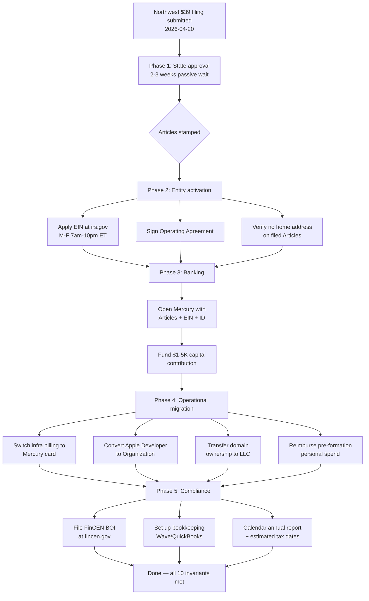
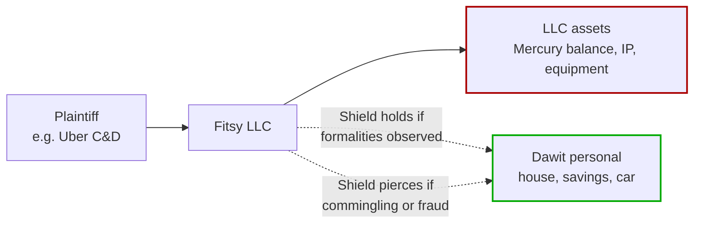

# LLC Formation & Operational Migration

## Problem

Fitsy currently operates as a sole proprietorship by default — no legal entity exists between Dawit personally and the business. This creates three concrete risks:

1. **Personal liability exposure.** The preload pipeline pulls menu data from Uber Eats via the unauth `getFeedV1` endpoint using a non-authenticated `uev2.loc` cookie. While this fact pattern sits closer to *Meta v. Bright Data* (permissible public scraping) than *hiQ v. LinkedIn* (ToS breach via fake accounts), legal exposure is non-zero. A ToS-breach or tortious-interference claim today would target Dawit personally — house, car, savings all at risk.
2. **Unsellable business.** Fitsy is planned for acquisition in <2 years. No acquirer buys a sole proprietorship; they buy entities. Without an LLC, an acquisition requires restructuring *during* deal negotiation, weakening price and timeline.
3. **Commingled finances.** All Fitsy infra (AWS, Vercel, GitHub, OpenAI, Apple Developer, domain) currently bills Dawit's personal card. This makes tax accounting sloppy and eliminates any liability separation even after an LLC is formed, unless cleanly migrated.

## Solution

Form **Fitsy LLC** in Dawit's home state via Northwest Registered Agent ($39 + state fee, includes 1 year of registered agent service). Migrate all operations into the entity — banking, infra billing, Apple Developer account, domain ownership — within 14 days of state approval. File FinCEN BOI report within 90 days.

**Entity choice rationale:** LLC chosen over C-Corp because:
- Exit horizon <3 years means zero QSBS (Section 1202) benefit — the main C-Corp tax advantage evaporates.
- Most sub-$50M acquisitions are structured as asset sales. LLC asset sale = single layer of capital gains tax (~20%). C-Corp asset sale = 21% corporate + ~20% on distribution (~37% effective). Saves ~$3-5M on a $20M exit.
- No VC planned. C-Corp's investor-readiness is irrelevant.
- LLC pass-through is simpler year-to-year.

**Registered agent rationale:** Northwest chosen over Bizee/ZenBusiness/LegalZoom because:
- "Privacy by Default" policy — doesn't sell contact info to marketers (competitors do).
- Same-day mail scanning (legal response windows are tight).
- No dark-pattern upsells at checkout.
- $125/yr ongoing is mid-market ($119-299 range); quality justifies the price.

## Edge Cases

1. **Home address leak via non-RA fields.** Most common failure mode: founder hires Northwest for RA but still puts home address in the "principal office," "organizer," or "member" fields of Articles. All four must use Northwest's address where state law permits.
2. **Strict states (CA, NY) requiring physical in-state principal office.** If state blocks using Northwest's address for principal office, fall back to a CMRA (UPS Store / iPostal1) at ~$20/mo rather than exposing home address.
3. **EIN application during IRS downtime.** Online EIN tool is M-F 7am-10pm ET only. Weekend/holiday attempts silently fail.
4. **Apple Developer account conversion friction.** Individual → Organization conversion is possible but painful after an App Store listing has traction. Must be done early.
5. **FinCEN BOI enforcement flux.** CTA enforcement for US-owned domestic entities has been paused/reinstated multiple times in 2025-2026. File defensively regardless of current status — penalties if reinstated retroactively are $591/day.
6. **Pre-formation personal spend.** Already paid for Fitsy infra on personal card. Must be reimbursed via a single Mercury→personal transfer with itemized receipts, or recorded as capital contribution. Mixing without documentation compromises veil.
7. **Post-formation commingling.** Single biggest veil-piercing risk. One slip (personal card at dinner charged to AWS) is forgivable if documented and reimbursed; repeated mixing is fatal.
8. **Multi-LLC future.** If a second Fitsy-adjacent LLC is formed, Northwest charges another $39 + $125/yr — not reusable. Volume discount ($100/yr each) kicks in only at 5+ entities.

## Out of Scope

- **C-Corp conversion.** Revisit only if VC fundraising becomes plausible or exit horizon extends past 3 years.
- **S-Corp tax election (Form 2553).** Revisit only if net profit projects >$80K/yr. Pre-revenue it adds overhead without tax savings.
- **Trademark filing for "Fitsy".** Tracked separately in backlog (USPTO, ~$350 + optional attorney).
- **Cyber/E&O insurance.** Follow-up ticket. Relevant given scraping exposure but non-blocking.
- **Multi-member / co-founder equity structure.** Solo LLC only.
- **Operating Agreement customization beyond Northwest's template.** Boilerplate is sufficient for single-member LLC.
- **State tax registration beyond Articles filing.** Handled separately if/when Fitsy generates in-state revenue triggering sales tax obligations.

---

## Diagrams

### End-to-end migration flow



### Liability shield model



---

## Approach

### Phased execution

**Phase 1 — State approval (passive, 2-3 weeks)**
Wait for Northwest email with stamped Articles of Organization. No action required. Continue logging personal-card Fitsy expenses in a reimbursement spreadsheet (date, vendor, amount, purpose).

**Phase 2 — Entity activation (day 1-3 after approval)**
- Apply for EIN at `irs.gov/ein`. Select LLC → state → 1 member → "Started a new business." Save CP 575 PDF as `records/EIN-Confirmation.pdf`.
- Review and sign Northwest's auto-generated Operating Agreement. Save as `records/Operating-Agreement.pdf`.
- Verify all four address fields on the filed Articles use Northwest's address. If home address leaked into any field, file an amendment immediately.

**Phase 3 — Banking (day 3-7)**
- Open Mercury at `mercury.com`. Upload Articles PDF, EIN letter, driver's license.
- Upon approval, fund with $1-5K initial capital contribution. Memo: "Member capital contribution — [name]." Book as equity in Wave.
- Order debit card (arrives 5-7 days).

**Phase 4 — Operational migration (day 7-14)**
- Switch billing to Mercury card on: AWS, Vercel, GitHub, OpenAI, Apple Developer, domain registrar, Firecrawl, any other Fitsy infra subscriptions.
- Apple Developer Program: convert account from Individual to Organization using EIN. Apple requires a D-U-N-S number — obtain free at `developer.apple.com/enroll`.
- Transfer domain ownership: move registrar account ownership to LLC name, update WHOIS to LLC (or registrar privacy under LLC account).
- Total all pre-formation Fitsy expenses. Transfer that amount Mercury→personal via ACH. Memo: "Reimbursement — pre-formation startup costs." Attach receipt spreadsheet in Wave.

**Phase 5 — Compliance (day 14-90)**
- File FinCEN BOI report at `fincen.gov/boi`. ~20 min. Free. Save confirmation.
- Set up bookkeeping in Wave (free tier). Import Mercury transactions.
- Calendar: state annual report due date (varies by state), quarterly estimated tax dates (Apr 15, Jun 15, Sep 15, Jan 15) if profitable.

### Verification checklist

Before marking this spec complete, all 10 invariants below must be independently checkable:

- [ ] Articles of Organization PDF saved to `records/`
- [ ] EIN CP 575 PDF saved to `records/`
- [ ] Operating Agreement signed PDF saved to `records/`
- [ ] Mercury account approved, funded ≥$1K, debit card in hand
- [ ] Zero personal-card charges on Fitsy infra for ≥7 consecutive days (proves migration complete)
- [ ] Pre-formation reimbursement transaction visible in Mercury with receipt spreadsheet attached
- [ ] Apple Developer portal shows Organization name, not individual
- [ ] Domain WHOIS shows LLC (or privacy-shielded under LLC-owned registrar account)
- [ ] FinCEN BOI confirmation email received (or deferral rationale documented with date to revisit)
- [ ] Public state business search for "Fitsy LLC" returns Northwest's address in all fields — not home address

## Interface

### External surfaces affected

| Surface | Change | Why |
|---|---|---|
| `App Store listing` | "Seller" changes from individual name to "Fitsy LLC" | Acquirability + liability separation |
| `Domain WHOIS` | Owner changes to LLC | Acquirability |
| `Terms of Service` / `Privacy Policy` | "operated by Fitsy LLC" instead of personal name | Contract formation in entity's name |
| `Vendor contracts` (AWS, Vercel, etc.) | Billing entity changes | Liability separation |
| `Tax filings` | New business return (Schedule C for single-member LLC) | Federal compliance |
| `State business search` | "Fitsy LLC" appears as registered entity with Northwest as agent | Legal existence |

### Records directory structure

```
records/
├── Articles-of-Organization.pdf
├── EIN-Confirmation.pdf
├── Operating-Agreement.pdf
├── Mercury-Account-Docs.pdf
├── FinCEN-BOI-Confirmation.pdf
├── Pre-Formation-Expenses.xlsx
└── Annual-Reports/
    └── 2027-Annual-Report.pdf
```

## Constraints

- **LLC chosen, C-Corp ruled out** until exit horizon extends past 3 years or VC becomes plausible. QSBS math does not pay off under current plan.
- **Dawit's legal name must be used accurately on all state and federal filings.** Northwest serves as organizer to keep Dawit's name off public Articles where state law permits, but FinCEN BOI requires accurate beneficial-ownership disclosure. Lying on government filings is fraud and voids the LLC.
- **Home address must not appear on any public state filing.** All four address slots (registered agent, principal office, organizer, member) must use Northwest's address where state permits. Fallback to CMRA only if state blocks.
- **No commingling post-formation.** Every Fitsy infra charge must bill Mercury. Every Fitsy revenue deposit must land in Mercury. One-off exceptions must be documented and reimbursed within 7 days.
- **Apple Developer must be Organization, not Individual.** Non-negotiable for acquisition — App Store listings owned by individuals cannot transfer cleanly.
- **FinCEN BOI filed within 90 days of formation** regardless of current enforcement posture. Retroactive penalty exposure ($591/day) dwarfs the 20-minute filing cost.
- **Operating Agreement signed and retained** even though single-member LLC. Without it, some courts treat the LLC as indistinguishable from the owner — a piercing factor.
- **Single domain ownership.** This spec is cross-cutting (business/legal/ops) — not owned by any engineering agent. Execution is Dawit's responsibility; no code changes required.
