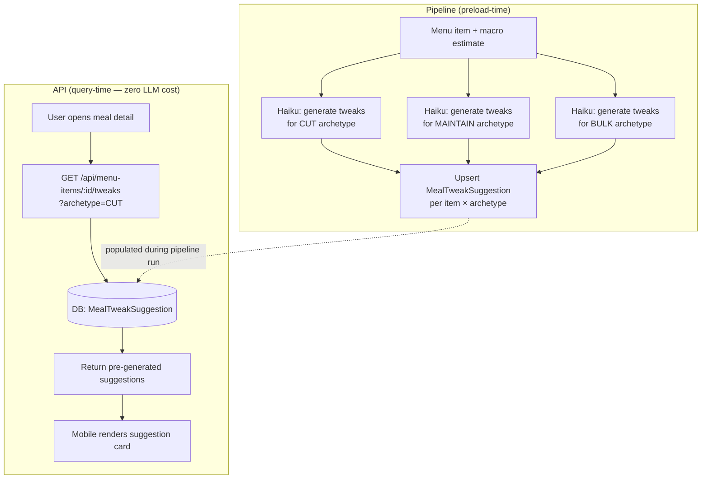

# Meal Tweak Suggestions

> **Status:** Proposed spec · **Last verified:** 2026-06-12

**Phase:** 2 (see `docs/product/roadmap.md`)
**Owner:** Product / Backend + Frontend
**Entitlement:** Candidate `pro` feature — see `docs/product/business-model.md`

---

## Problem

A user opens Fitsy, finds a restaurant they want to visit, and sees a menu item
that is "close but not quite" for their macro targets. There is currently no
guidance on what to do about it. The app shows the delta but offers no
actionable path to closing it.

Users who track macros know that small swaps make a big difference — swap fries
for a side salad, skip the dressing, ask for extra chicken. But identifying the
right swap requires effort and nutritional knowledge that most users don't have
at the moment of ordering.

---

## Solution

An **AI suggestion card** on the meal detail and restaurant detail screens that
proposes specific, macro-aware tweaks to a menu item to better fit the user's
targets.

Example:
> "Swap fries → side salad: −38g carbs, −12g fat. Fits your cut target."

> "Add a side of grilled chicken (+28g protein). Puts you over your protein
> target for this meal."

Suggestions are generated by the same Claude Haiku pipeline already used for
macro estimation — no new AI infrastructure is needed.

---

## UX

### Suggestion card

Appears on the **meal detail screen** below the macro breakdown, and as a
collapsible section on the **restaurant detail screen** for the highlighted
best-match item.

```
┌─────────────────────────────────────────┐
│  💡 Tweak to fit your targets           │
│                                         │
│  Swap fries → side salad                │
│  −38g carbs  −12g fat  ≈ same protein  │
│                                         │
│  Swap dressing → on the side            │
│  −14g fat  (ask when ordering)          │
└─────────────────────────────────────────┘
```

- Maximum 3 suggestions per item (ranked by macro impact toward target).
- Each suggestion shows: swap description, macro delta, and a plain-language
  ordering note ("ask when ordering", "standard option at this chain").
- Suggestions are read-only — they do not modify the saved macro estimate.
- A "Why?" link expands the LLM reasoning for each suggestion.

### Entry points

1. **Meal detail screen** — primary surface; shown after the macro breakdown.
2. **Restaurant detail screen** — shown on the best-match card as a teaser
   ("See how to make it fit →") that deep-links to meal detail.
3. **Saved meals** — shown when a saved meal drifts from the user's current
   targets (targets changed after saving).

---

## Engineering: preload-time vs runtime generation

This is the key architecture decision for this feature.

### Option A: Preload-time generation (recommended)

Generate suggestions during the pipeline run, keyed by `(menuItemId, goalArchetype)`.

Goal archetypes are the three macro presets Fitsy already defines:
`cut` (high protein, low carbs/fat), `maintain` (balanced), `bulk` (high protein + carbs).

**How it works:**
- During preload, after macro estimation, run a second Haiku call per item per
  archetype: "Given these macros and this menu item description, what are the
  top 3 swaps that would move it toward a [cut / maintain / bulk] goal?"
- Store results in a new `MealTweakSuggestion` table:
  `(menuItemId, goalArchetype, suggestions JSON, generatedAt)`.
- At query time, the API reads the pre-generated suggestions for the user's
  goal archetype — zero additional LLM cost per request.

**Tradeoffs:**

| | Preload-time | Runtime |
|--|--|--|
| Cost per suggestion | ~$0.0001 (Haiku) × N items × 3 archetypes | ~$0.0001 per request (per user per meal view) |
| Personalization | Goal-archetype level (3 buckets) | Per-user target (exact grams) |
| Freshness | Regenerated on pipeline run (weekly/monthly) | Always current |
| Latency | Zero (pre-generated) | +200–800ms per meal detail load |
| Scale risk | Fixed cost per pipeline run | Cost grows with DAUs × meal views |

**Recommendation: preload-time.** At Fitsy's current scale, the user's exact
macro target rarely differs meaningfully from the archetype bucket. Preload-
time generation keeps the API a pure read path with no per-request LLM cost,
consistent with the existing architecture principle ("The API backend is a read-
only query layer — no runtime external API calls"). Personalization to exact
targets can be added in v2 if archetype bucketing proves too coarse.

### Data model

```prisma
model MealTweakSuggestion {
  id            String        @id @default(cuid())
  menuItemId    String
  menuItem      MenuItem      @relation(fields: [menuItemId], references: [id])
  goalArchetype GoalArchetype
  suggestions   Json          // Array of { swap, macroDelta, orderingNote, reasoning }
  generatedAt   DateTime      @default(now())

  @@unique([menuItemId, goalArchetype])
  @@index([menuItemId])
}

enum GoalArchetype {
  CUT
  MAINTAIN
  BULK
}
```

> **Prerequisite:** Stable MenuItem IDs (see `docs/product/roadmap.md`
> data-model prerequisites). If IDs regenerate on each pipeline run, stored
> suggestions are orphaned exactly like SavedItems. Fix stable IDs first.

### Suggestion generation (preload pipeline addition)

```typescript
// Pseudocode — added to the pipeline after macro estimation
for (const item of menuItems) {
  for (const archetype of ['CUT', 'MAINTAIN', 'BULK']) {
    const suggestions = await generateTweaks(item, archetype); // Haiku call
    await upsertMealTweakSuggestion(item.id, archetype, suggestions);
  }
}
```

Estimated pipeline cost increase: ~3 Haiku calls per menu item.
At 6,791 items (current LA seed): ~20,000 additional calls ≈ $2/run.
Acceptable at current scale; re-evaluate at 100K+ items.

---

## Suggestion generation flow



---

## `pro` entitlement gating

Meal tweak suggestions are a candidate `pro`-only feature — a concrete,
high-value differentiator that justifies the subscription cost.

- Free users (if Fitsy ever introduces a trial-expired or free tier): see
  a teaser card ("Upgrade to see how to make this meal fit your targets →")
  that opens the paywall.
- `pro` users: see full suggestions inline.

At current model (paid-only, no freemium), all users are `pro` by definition.
This gating becomes relevant if a free tier is introduced, or as a paywall
re-engagement hook for churned users during the re-subscription flow.

---

## API endpoint

| Method | Path | Auth | Description |
|--------|------|------|-------------|
| `GET` | `/api/menu-items/:id/tweaks` | JWT + `pro` entitlement | Return pre-generated suggestions for the user's goal archetype |

Query params:
- `archetype`: `CUT | MAINTAIN | BULK` — resolved from the user's stored
  `goal` field (same as the onboarding preset selection).

Response:
```json
{
  "menuItemId": "...",
  "goalArchetype": "CUT",
  "suggestions": [
    {
      "swap": "Swap fries → side salad",
      "macroDelta": { "calories": -180, "carbs": -38, "fat": -12, "protein": 1 },
      "orderingNote": "Ask to substitute at the counter",
      "reasoning": "Fries add 38g carbs and 12g fat with minimal protein. A side salad covers the same volume for 4g carbs."
    }
  ],
  "generatedAt": "2026-06-10T14:00:00Z"
}
```

---

## Constraints

- Suggestions are advisory only — they do not modify any macro estimate in the DB.
- Pipeline must not generate suggestions for items with very low confidence
  estimates (source = `llm_estimate` with low confidence score) — suggestions
  on uncertain base data compound uncertainty.
- Maximum 3 suggestions per item per archetype — prevents suggestion overload.
- Suggestions must reference real menu options or standard substitution
  patterns (not invented toppings). Haiku prompt must constrain output to items
  that appear on the menu or are standard request modifications.

---

## Out of scope (MVP)

- Runtime generation with exact user macro targets (vs. archetype buckets)
- User feedback on suggestion quality ("Was this helpful?")
- Suggestions for build-your-own / customizable items (too many combinations)
- Calorie-only suggestions (Fitsy is macro-aware, not calorie-first)
- Integration with ordering systems to auto-apply the suggestion
