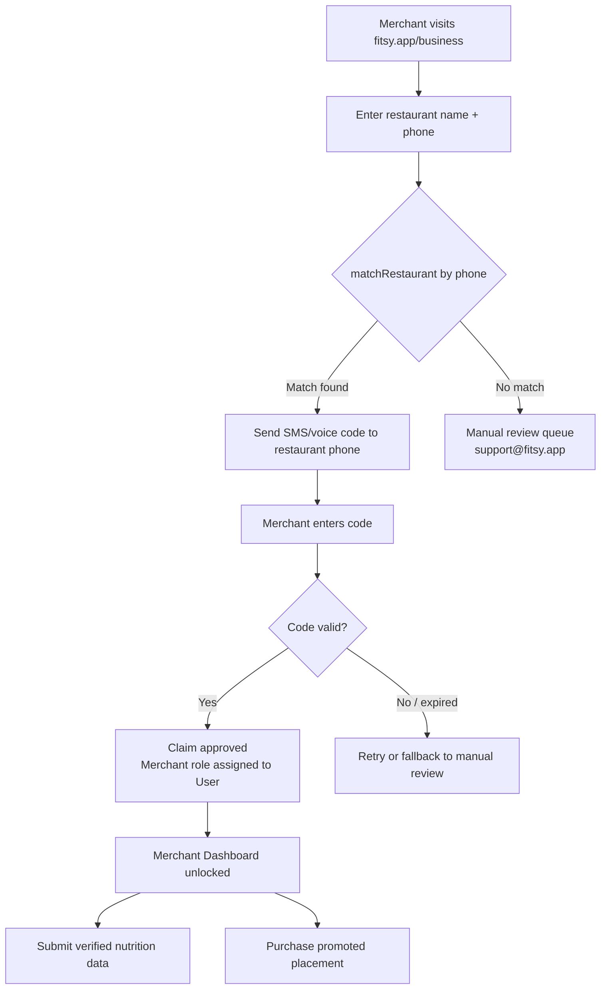

# Merchant Dashboard

> **Status:** Draft / Proposed spec · **Last verified:** 2026-06-12

**Phase:** 3 (see `docs/product/roadmap.md`)
**Owner:** Product / Backend + Frontend
**Revenue line:** First non-subscription revenue — see `docs/product/business-model.md#merchant-revenue-future`

---

## Problem

Fitsy's macro estimates for independent restaurants come from an LLM pipeline
(Claude Haiku) that estimates from menu descriptions and photos. These estimates
are useful but imprecise. Merchants — the restaurant operators themselves — have
the authoritative nutrition data for their own dishes. There is currently no
path for a merchant to provide that data.

Additionally, as Fitsy's user base grows, merchants will want to influence their
visibility. Promoted placement is the natural first paid product for merchants,
and it is the first Fitsy revenue line that does **not** pass through Apple's
30% IAP commission.

---

## Solution

A merchant-facing dashboard where restaurant operators can:

1. **Claim their restaurant** — verify ownership, become the authoritative
   data source for their menu.
2. **Submit verified nutrition data** — override LLM estimates with
   merchant-provided macros (shown with a "Verified" trust badge).
3. **Purchase promoted placement** — appear higher in search results for
   relevant macro targets.

---

## Prerequisites and dependencies

> These must land before any merchant dashboard work begins. From
> `docs/product/roadmap.md`:

| Prerequisite | Why needed | Estimated order |
|---|---|---|
| `phone` column + `matchRestaurant()` dedupe on `Restaurant` | Claim-matching key (see below) | 1st |
| Macro provenance / source tier on `MacroEstimate` | Verified-data precedence model (see below) | 2nd |
| Stable MenuItem IDs | Merchant nutrition submissions reference `menuItemId`; orphaned IDs break the mapping | 1st (shared with UGC) |

---

## Claim and verification flow

The core challenge is proving that the person claiming a restaurant actually
owns or operates it. Fitsy's planned multi-source matcher already adds a `phone`
column to `Restaurant` and a `matchRestaurant()` function for deduplication
across sources. This infrastructure is the natural claim-matching key:

1. Merchant enters their **restaurant phone number** in the dashboard.
2. `matchRestaurant(phone)` looks up the restaurant in Fitsy's DB.
3. If a match is found: Fitsy sends a **voice or SMS verification code** to
   that phone number.
4. Merchant enters the code — claim is approved.
5. If no match: fallback to manual review queue (support@fitsy.app).



---

## Verified data precedence model

Currently `MacroEstimate` is a 1:1 row per `MenuItem` with no source tracking.
The macro provenance prerequisite adds a `source` field (and eventually an audit
log). Once that exists, Fitsy uses a **source tier** to determine which estimate
is displayed:

| Tier | Source value | Trust badge | Beats |
|------|-------------|-------------|-------|
| 1 (highest) | `merchant_verified` | "Verified by restaurant" badge (green check) | All others |
| 2 | `fatsecret` / chain data | "Nutrition data from chain" | LLM estimates |
| 3 | `llm_estimate` | "AI-estimated" badge | Nothing |

The existing `ConfidenceBadge` component is extended to render the new
`merchant_verified` tier. No new badge component is required — only a new
tier value and copy.

**Merchant-submitted macros are not auto-applied.** They go through a
**moderation queue** before the source tier is promoted to
`merchant_verified`. Reason: bad actors could submit manipulated data to
game macro rankings.

```mermaid
flowchart LR
    A[Merchant submits macro data] --> B[Moderation queue\n~24h review]
    B --> C{Approved?}
    C -->|Yes| D[MacroEstimate.source = merchant_verified\nshows Verified badge]
    C -->|No| E[Rejected — merchant notified\nLLM estimate remains]
    D --> F[Restaurant detail shows\n"Verified by restaurant" badge\non affected menu items]
```

---

## Merchant auth and roles

Merchants are **Fitsy users** with an additional `MerchantProfile` record.
No separate auth system is needed.

```prisma
model MerchantProfile {
  id           String     @id @default(cuid())
  userId       String     @unique
  user         User       @relation(fields: [userId], references: [id])
  restaurantId String     @unique
  restaurant   Restaurant @relation(fields: [restaurantId], references: [id])
  claimedAt    DateTime   @default(now())
  verifiedAt   DateTime?  // null until claim approved
  status       MerchantStatus @default(PENDING)
}

enum MerchantStatus {
  PENDING    // claim submitted, not verified
  VERIFIED   // claim approved, can submit data + purchase placement
  SUSPENDED  // moderation action
}
```

Merchant-only API routes are gated on `MerchantProfile.status == VERIFIED`.

---

## Advertising / promoted placement

Promoted placement is the first Fitsy ad unit. A promoted restaurant appears
higher in the discovery feed for users whose macro targets match the
restaurant's best menu items — it is a **relevance-gated boost**, not a pure
bid-for-top-spot.

### Mechanics (MVP)

- Merchant sets a **daily budget** and a **bid per impression** (CPM).
- Fitsy ranks search results by macro fit. Promoted restaurants are eligible
  to appear in the top 3 slots if their macro fit score is within 20% of the
  top organic result (preventing irrelevant ads from degrading UX).
- Promoted cards are visually distinguished ("Sponsored" label) — required
  by Apple App Store guidelines.
- Billing: post-pay weekly; Stripe (web billing, not IAP — Apple's commission
  does not apply to merchant B2B billing).

### Why Stripe for merchant billing

Apple IAP rules apply to in-app purchases by **consumers**. Merchant ad spend
is a B2B transaction conducted on the web dashboard (not in the iOS app), so
Stripe is appropriate and avoids the 30% commission. This is the same model
used by Yelp Ads, Google Ads, and every other ad platform.

---

## API surface (new endpoints)

| Method | Path | Auth | Description |
|--------|------|------|-------------|
| `POST` | `/api/merchant/claim` | JWT required | Submit a claim (phone + restaurant match) |
| `POST` | `/api/merchant/claim/verify` | JWT required | Submit verification code |
| `GET` | `/api/merchant/dashboard` | Merchant JWT | Restaurant overview + pending review items |
| `POST` | `/api/merchant/nutrition` | Merchant JWT | Submit verified macro data for a menu item |
| `GET` | `/api/merchant/moderation` | Admin JWT | Moderation queue |
| `PATCH` | `/api/merchant/moderation/:id` | Admin JWT | Approve / reject a nutrition submission |

---

## Moderation

- All merchant nutrition submissions go through a moderation queue before
  `merchant_verified` tier is applied.
- Moderation is initially manual (internal review). Tooling: a simple admin
  UI at `/admin/moderation` (authenticated with admin role).
- Automated checks (sanity bounds on macro values, obvious outliers) run
  before the human queue to filter clear bad data.
- Merchants are notified by email on approval or rejection.

---

## Out of scope (MVP)

- Self-serve menu editing (adding / removing items) — merchants can only
  update macros for existing items in Fitsy's DB
- Merchant analytics dashboard (impressions, clicks, conversion)
- Multi-location merchant accounts (franchise support)
- Android / Google Play merchant billing
- Merchant response to user reviews
