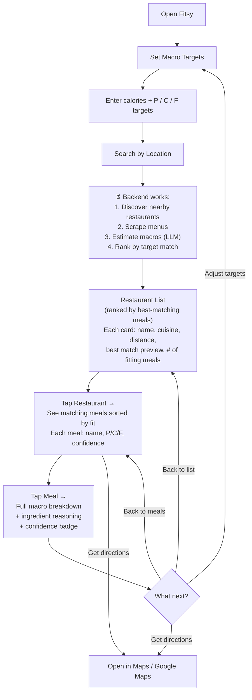
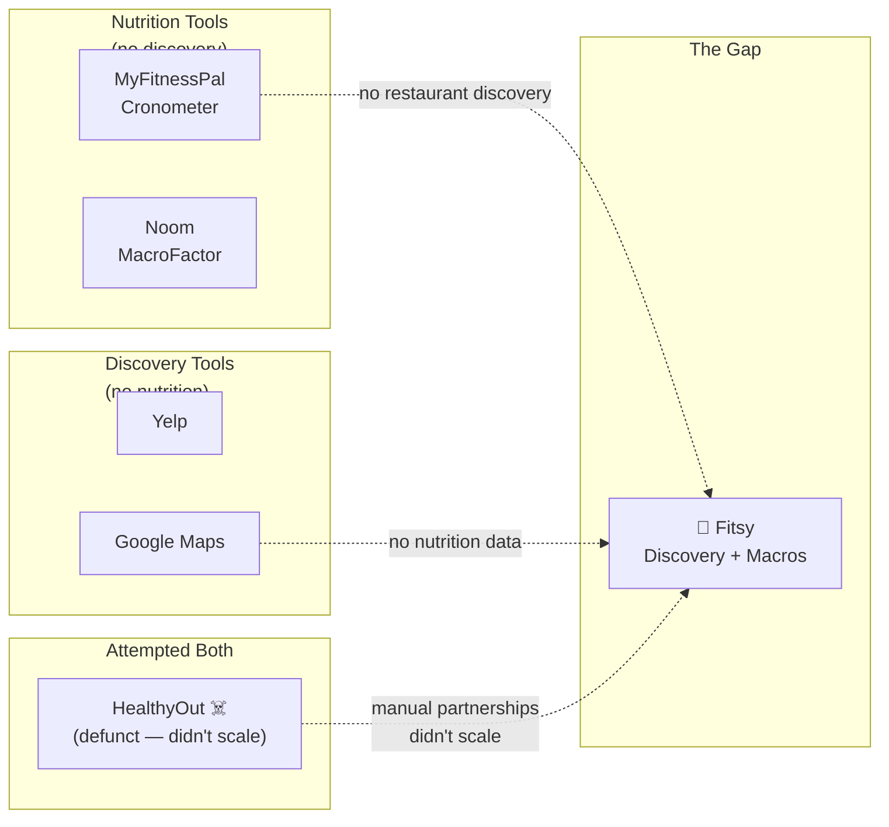

# Fitsy Vision PRD

> **Status:** OUTLINE — awaiting human review before full write-up.

---

## Problem

- People who track macros (protein, carbs, fat) struggle to eat out
  because restaurant nutrition data is unreliable, incomplete, or
  nonexistent.
- Existing tools force users to choose: track macros OR discover
  restaurants. No product does both.
- Chain restaurants sometimes publish nutrition info; independent
  restaurants almost never do. Users default to chains or skip eating
  out entirely.
- Manual estimation is tedious and inaccurate — users resort to
  guessing or logging generic entries ("grilled chicken plate, 8 oz").

### Target Users

- **Macro-Tracking Regular** — Tracks macros daily (bodybuilding,
  weight loss, athletic performance). Uses MFP or similar. Eats out
  2-4x/week. Pain: spends 10+ minutes per meal trying to estimate
  restaurant food; avoids new restaurants because of uncertainty.
- **Health-Conscious Explorer** — Wants to eat well but also try new
  spots. Doesn't rigidly track but wants meals "in the ballpark"
  (e.g., high-protein, under 600 cal). Pain: no way to filter
  restaurant results by nutrition.
- **Meal-Prep Escapee** — Meal-preps most days but wants to eat out
  without blowing their plan. Pain: all-or-nothing mentality because
  restaurant data is a black box.

### Competitive Landscape

- **MyFitnessPal / Cronometer** — Logging-first. Strong food
  databases, but restaurant coverage is user-submitted and unreliable.
  No restaurant discovery. No location awareness.
- **Yelp / Google Maps** — Discovery-first. No nutrition data at all.
  Filters are cuisine, price, rating — never macros.
- **Noom / MacroFactor** — Coaching + tracking. Same database
  limitations as MFP. No restaurant-specific features.
- **HealthyOut (defunct)** — Attempted this space but relied on
  manual restaurant partnerships. Did not scale.
- **Gap:** No product combines location-based restaurant discovery
  with per-meal macro estimation. Fitsy sits at this intersection.

---

## Solution

### Product Vision

Fitsy is the first app that answers: *"Where can I eat nearby that
fits my macros?"* — by combining restaurant discovery with an
AI-powered macro estimation pipeline.

### Mission

Make eating out compatible with any nutrition goal, for every
restaurant, not just chains.

### Core Value Proposition

- Search by location, get restaurants ranked/filtered by how well
  their menu items match your macro targets.
- Works for chains (verified data) and independents (AI-estimated).
- Transparent confidence levels — users always know how reliable the
  estimate is and can see the ingredient reasoning.

### Key Features (MVP Scope)

1. **Macro target setup** — User manually enters per-meal targets:
   protein, carbs, fat (grams) and calories.
2. **Restaurant discovery** — Location-based search returning nearby
   restaurants with menu items that match or are close to targets.
3. **LLM macro estimation pipeline:**
   - Single Claude API call per menu item: name + description +
     optional photo → returns total macros + ingredient breakdown.
   - Ingredient breakdown shown to users for transparency.
4. **Match scoring** — Each menu item gets a match score against the
   user's targets. Restaurants are ranked by their best-matching items.
5. **Confidence display** — Every estimate shows its confidence
   level and ingredient reasoning. No false precision.
6. **Basic filtering** — Cuisine type, chain vs. independent,
   distance radius.
7. **Meal detail view** — Per-item macro breakdown, ingredients,
   estimation source, confidence band.

---

## Diagrams

### User Journey Flow

### Competitive Landscape Map

---

## Edge Cases

1. Restaurant has no online menu and no photos — fallback to "no data
   available" with option for user to submit menu photo.
2. Menu item is highly customizable (bowls, build-your-own) —
   estimate base item, note customization uncertainty.
3. Shared/family-style dishes — estimate per-serving with stated
   assumption on portion count.
4. Seasonal/rotating menus — cached estimates may go stale; define
   re-estimation cadence.
5. User's macro targets are unrealistic (e.g., 200g protein in a
   single meal under 300 cal) — show closest matches with delta, do
   not silently return zero results.
6. LLM ingredient breakdown doesn't sum to stated totals —
   accept LLM totals, flag breakdown as approximate.

---

## Out of Scope (MVP)

- Preset macro templates (cutting, bulking, maintenance) — requires
  height/weight/age/activity input flow to calculate targets. Post-MVP.
- User accounts and saved history (post-MVP).
- Social features (sharing meals, reviews).
- Ordering or reservation integration.
- Micronutrient tracking (vitamins, minerals).
- Dietary restriction filters beyond macros (allergens, halal, kosher)
  — planned for v2.
- Restaurant-side portal for claiming/updating nutrition data.
- Offline mode.

---

## Approach

### Phased Rollout

- **Phase 0 (current):** Scaffolding, architecture, spec alignment.
- **Phase 1 (MVP):** LLM macro pipeline, restaurant
  discovery (Google Places), basic search UI, match scoring.
- **Phase 2:** User accounts, saved targets, meal history.
- **Phase 3:** Filtering expansion (allergens, dietary labels),
  community-submitted corrections, restaurant partnerships.

### Technical Approach (summary)

- React Native (Expo) mobile client + Next.js API backend, TypeScript strict, Prisma + Postgres. Monorepo with apps/mobile/ and apps/api/.
- Service wrappers for all external APIs (Google Places, Claude API).
- Macro cache: per-menu-item estimates stored with confidence,
  ingredient breakdown, timestamp. Re-estimated on-demand when stale.
- Full details in `docs/engineering/`.

---

## Interface

### Primary Surfaces

- **Search / Home Screen** — Location input (or auto-detect), macro targets
  displayed, restaurant results list ranked by match quality.
- **Restaurant Detail Screen** — Menu items with macro breakdowns, match
  scores, confidence tiers.
- **Meal Detail Screen** — Full ingredient-level breakdown, estimation
  source, confidence range.
- **Target Setup Screen** — Set or adjust macro targets (per-meal or daily).

### API Surface

- `GET /api/restaurants?lat=&lng=&radius=&protein=&carbs=&fat=`
- `GET /api/restaurants/:id/menu`
- `GET /api/menu-items/:id/macros`
- `POST /api/targets` — set macro targets (session or account-based)

---

## Constraints

- **Data accuracy:** LLM-estimated macros are approximate. Must always
  display confidence level and range. Never present low-confidence
  estimates as precise values.
- **API rate limits:** Google Places and Claude
  all have rate limits. Must cache aggressively and queue estimation work.
- **Latency:** First search should return results in under 3 seconds.
  Macro estimation for uncached items may be async (show placeholder,
  backfill).
- **Cost:** Claude API calls have per-request costs. Caching and
  batching are mandatory to keep unit economics viable.
- **Legal/liability:** Nutrition estimates are not medical advice. App
  must display disclaimers. All estimates are LLM-generated.

---

## North Star Metrics

- **Primary:** Weekly active searches (user searches with macro
  targets set) — measures core loop engagement.
- **Secondary:**
  - Menu items with cached macro estimates (pipeline coverage).
  - Photo availability rate (% of estimates that had photo input).
  - Match-to-visit rate (user taps a restaurant after seeing macro
    match — proxy for trust and utility).

## Success Criteria (MVP)

- [ ] User can enter a location and macro targets and receive a ranked
      list of nearby restaurants with matching menu items.
- [ ] LLM estimation pipeline operational (returns macros + ingredient breakdown).
- [ ] Every macro estimate displays its confidence tier.
- [ ] Search results return in under 3 seconds for cached restaurants.
- [ ] Structural tests, type checks, and unit tests pass in CI.
