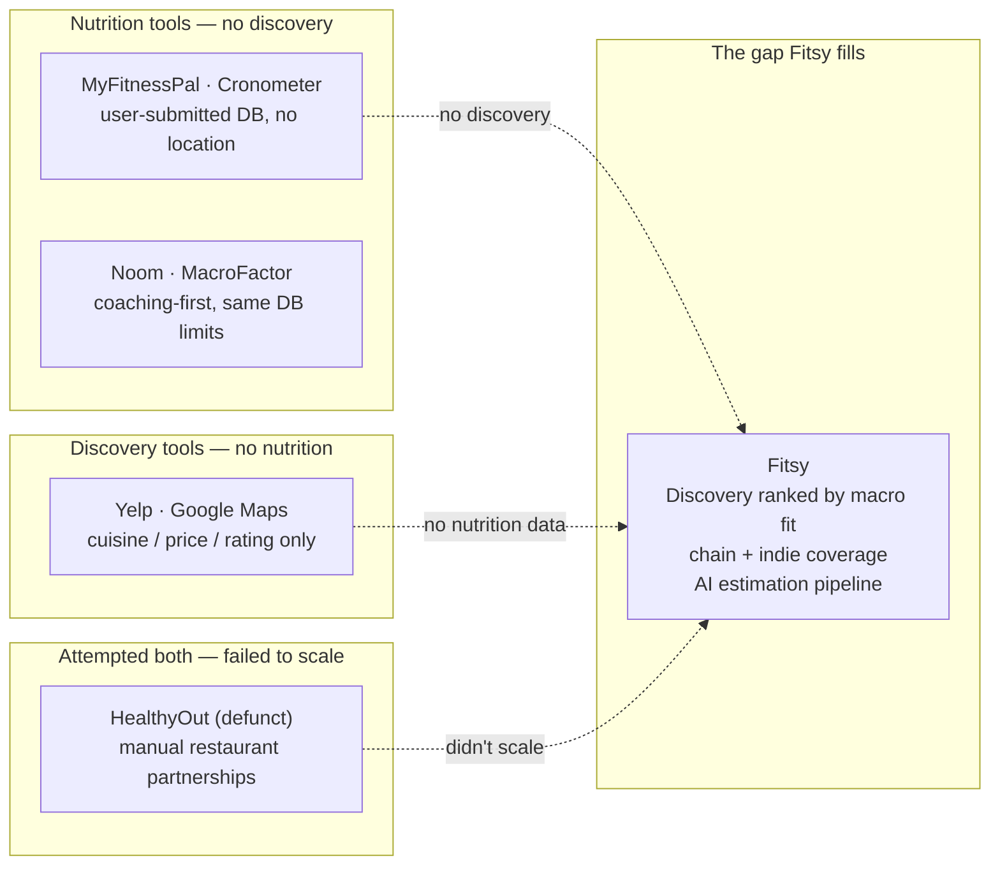
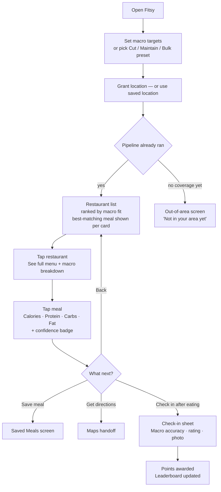

# Fitsy — Product Vision

> **Status:** Living document · **Last verified:** 2026-06-12

---

## Problem

People who track macros (protein, carbs, fat) struggle to eat out. Restaurant
nutrition data is unreliable, incomplete, or nonexistent for independent
restaurants. The tools that exist force a choice: track macros **or** discover
restaurants. No product does both.

Chain restaurants sometimes publish nutrition info. Independent restaurants
almost never do. The result: users default to chains, skip eating out entirely,
or spend 10+ minutes per meal guessing — often logging generic entries
("grilled chicken plate, 8 oz") that undermine their tracking.

---

## Target users

| Persona | Description | Core pain |
|---------|-------------|-----------|
| **Macro-Tracking Regular** | Tracks daily (bodybuilding, weight loss, performance). Uses MFP. Eats out 2–4×/week. | 10+ min per meal trying to estimate restaurant food; avoids new spots |
| **Health-Conscious Explorer** | Wants to eat well and try new places. Doesn't rigidly track but wants meals "in the ballpark" (high-protein, under 600 cal). | No way to filter restaurant results by nutrition |
| **Meal-Prep Escapee** | Meal-preps most days; wants to eat out occasionally without blowing the plan. | All-or-nothing mentality because restaurant data is a black box |

**Primary launch market:** Los Angeles — Silver Lake / 90029 seed geography.

---

## Core value proposition

> "Where can I eat nearby that fits my macros?"

Fitsy answers that question by combining location-based restaurant discovery
with an AI-powered macro estimation pipeline:

- Restaurants are **ranked by macro fit** — not rating or distance. A match
  2 miles away ranks above a poor match 0.5 miles away.
- Works for **chains** (verified data) and **independents** (AI-estimated from
  menu descriptions, portions, and photos).
- Transparent **confidence tiers** — users always know whether a number is
  verified, AI-estimated from description, or rough from dish name. No false
  precision.

---

## Competitive gap

See `docs/product/competitors.md` for the live competitive tracker.

---

## Core user journey

---

## What's shipped (as of 2026-06-12)

| Feature | Status |
|---------|--------|
| 15-screen editorial onboarding | Shipped |
| Macro target setup (manual + Cut/Maintain/Bulk presets) | Shipped |
| GPS-based restaurant discovery (H3 hex bucketing) | Shipped |
| Restaurant list ranked by macro fit | Shipped |
| LLM macro estimation pipeline (Claude Haiku, preload-time) | Shipped |
| Restaurant + meal detail with confidence badge | Shipped |
| Saved meals | Shipped |
| Apple Sign-In + Google Sign-In | Shipped |
| RevenueCat paywall (wired on Test Store) | Shipped — prod blocked |
| Landing page at fitsy.app | Shipped |
| Out-of-area screen (returns 0 restaurants) | Shipped |

**Distribution:** TestFlight track, LA-only (Silver Lake / 90029 seed data).

---

## Roadmap

See `docs/product/roadmap.md` for the phased plan.

**Phase 2 features in spec:**
- Check-in + Local Legend neighborhood leaderboard →
  `docs/product/specs/check-in-local-legend.md`
- Community feedback forum →
  `docs/product/specs/community-feedback-forum.md`
- Meal tweak suggestions (AI) →
  `docs/product/specs/meal-tweak-suggestions.md`

**Phase 3 features in spec:**
- Merchant dashboard (verified nutrition + advertising) →
  `docs/product/specs/merchant-dashboard.md`

---

## North star metric

**Weekly active searches** — users who open the app and search with macro
targets set. Measures whether the core loop (set targets → find food → eat out)
is working.

**Secondary:** match-to-visit rate (user taps a restaurant after seeing the
macro match — proxy for trust and utility).

---

## Principles

1. **Accuracy over coverage.** Show a confidence tier. Never present a low-
   confidence estimate as a precise number.
2. **Independent restaurants first.** Chains have data. Fitsy's moat is indie
   coverage — the taco spot, the ramen shop, the bowl place by the gym.
3. **Paid-only.** No freemium. Every user who signs up should be a paying user.
4. **LA first, then expand.** Nail one city's data quality before scaling.

---

## Business model

Paid subscription with 7-day free trial — RevenueCat + Apple IAP.
See `docs/product/business-model.md` for pricing, entitlement flow, and the
Pricing Decision Record.
