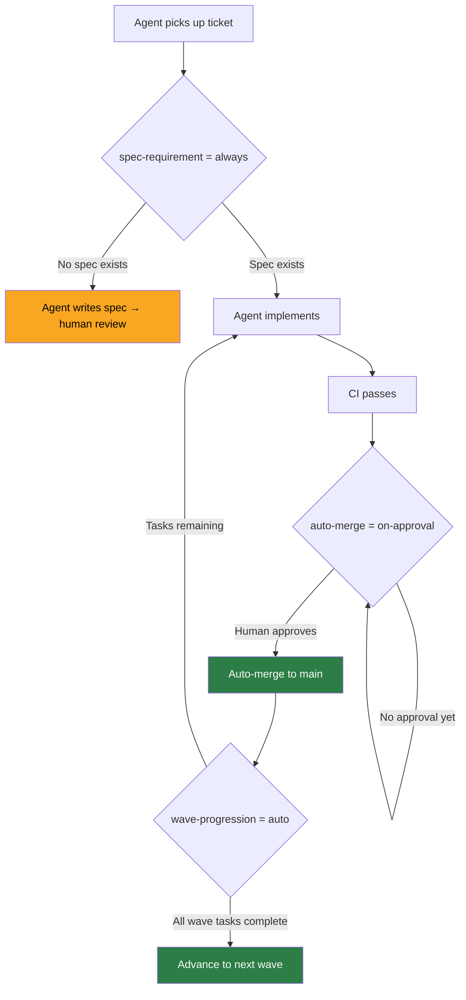

# Shipyard Settings Tuning Guide

> **Status:** Living · **Last verified:** 2026-06-12
> **Owner:** CTO

This file documents every Shipyard Settings knob in `CLAUDE.md`. It explains what each knob does, what values it accepts, what the current value is, and when to change it.

Shipyard Settings are the harness-level controls that govern how the Claude Code agent team operates on this project: how much human oversight is required, what spec discipline is enforced, and how the sprint machinery moves forward. They are not runtime feature flags — they control the development process itself.

---

## Current Settings (as of 2026-06-12)

| Knob | Current value |
|------|--------------|
| `human-review-gate` | `cruise` |
| `spec-requirement` | `always` |
| `auto-merge` | `on-approval` |
| `active-roles` | `all` |
| `wave-progression` | `auto` |

---

## Knob Reference

### `human-review-gate`

Controls how much human review is required before agents can proceed with significant actions (merges, deploys, sprint transitions).

| Value | Behavior |
|-------|----------|
| `strict` | Every PR and sprint-phase transition requires explicit human approval before the agent team proceeds. Use when the product or codebase is fragile, or when onboarding a new agent role. |
| `cruise` | Agents proceed autonomously on approved work. Human approval is still required for production deploys and anything touching the Danger Zones (auth, nutrition data, external APIs). This is the normal operating mode. **(current)** |
| `off` | No human gate; agents merge and deploy without waiting. Not recommended — use only for trivial batch work (e.g., mass doc reformatting) where every change is reversible. |

**When to change:**
- Tighten to `strict` when landing a new critical system (e.g., payment integration, first production data), or when a rogue agent produced a bad merge.
- Loosen to `off` temporarily for mechanical batch tasks. Reset to `cruise` immediately after.

---

### `spec-requirement`

Governs whether a spec document must exist before implementation work begins on a new feature.

| Value | Behavior |
|-------|----------|
| `always` | No implementation starts without a written spec in `docs/`. Agents will refuse to begin coding work and instead produce a spec for review. This prevents spec-implementation gaps. **(current)** |
| `on-new-features` | Spec required for net-new features; bug fixes and refactors can proceed without one. |
| `off` | No spec requirement. Fastest iteration, but increases the risk of misalignment between intent and implementation. Not recommended except in early exploration. |

**When to change:**
- Stay at `always` throughout normal sprints.
- Consider `on-new-features` for hotfix sprints where there's no time to write specs for small bug fixes.
- Never set to `off` for features that touch auth, nutrition data, or payment flows.

---

### `auto-merge`

Controls when the harness automatically merges a PR after CI passes.

| Value | Behavior |
|-------|----------|
| `on-approval` | PR is auto-merged once it has received the required human approval and all CI checks pass. This is the standard mode — human stays in the loop but doesn't need to click merge manually. **(current)** |
| `on-green` | PR is auto-merged as soon as CI passes, without waiting for human approval. Fastest path; appropriate only for doc-only or trivially safe PRs. |
| `off` | Auto-merge is disabled. All merges require a manual merge action. Use when you want to batch-review a set of PRs before any land. |

**When to change:**
- `on-approval` is the right default for feature work.
- Temporarily set to `off` when preparing a release and you want to review and land PRs in a specific order.

---

### `active-roles`

Specifies which agent roles are active and permitted to pick up work.

| Value | Behavior |
|-------|----------|
| `all` | All defined agent roles (CTO, backend, frontend, designer, product-manager, GTM) are active. **(current)** |
| A comma-separated list of role names (e.g., `backend,frontend`) | Only the listed roles are active. Useful when focus is needed on a specific domain and you don't want off-domain agents consuming sprint capacity. |
| `none` | No agents pick up work autonomously. Human-only sprint. Useful for strategic planning sprints or when the codebase is in a broken state. |

**When to change:**
- Narrow to specific roles during domain-focused sprints (e.g., `backend,devops` during an infrastructure sprint).
- Set to `none` during a sprint retrospective or OKR planning session.
- Keep at `all` for normal feature sprints.

---

### `wave-progression`

Controls how the sprint machinery advances from one wave of tasks to the next.

| Value | Behavior |
|-------|----------|
| `auto` | The harness advances to the next wave automatically once all tasks in the current wave are marked complete and their gates pass. No human action needed to start the next wave. **(current)** |
| `manual` | A human must explicitly advance to the next wave. Gives the team a natural pause point between waves to review completed work before the next batch begins. |
| `blocked` | Wave progression is paused. The harness will not advance regardless of task completion. Use when a dependency outside the codebase (e.g., App Store review, external API provisioning) must be resolved before work can continue. |

**When to change:**
- Switch to `manual` during high-stakes sprints (e.g., the TestFlight submission sprint) where you want to review each wave before proceeding.
- Set to `blocked` when a known external blocker (e.g., S-207 Apple Developer account setup) prevents any wave from proceeding usefully.
- Keep at `auto` for normal development velocity.

---

## Mermaid: Gate Flow Under Current Settings

---

## Quick Reference: Tighten vs. Loosen

| Situation | Recommended change |
|-----------|-------------------|
| Landing payments / auth / nutrition data | `human-review-gate` → `strict` |
| Mechanical batch work (doc reformats, renames) | `human-review-gate` → `off` (temporary) |
| Bug-fix sprint with no time for full specs | `spec-requirement` → `on-new-features` |
| Infrastructure-only sprint | `active-roles` → `backend,devops` |
| External blocker (e.g., Apple Developer account) | `wave-progression` → `blocked` |
| High-stakes release review | `wave-progression` → `manual` |
| Normal feature sprint | All knobs at current defaults |
